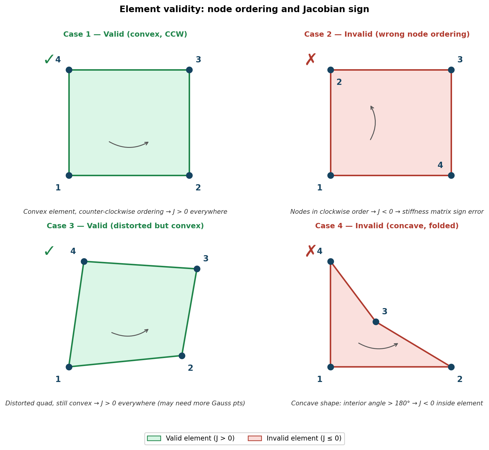

## Mathematical Preliminaries

Looking at the following equation:

$$
\text{div}(\mathbf{K}\cdot \text{grad}(T))
$$

if $\mathbf{K}$ is a constant multiplied by the identity matrix, we can write it as:

$$
\text{div}(\mathbf{K}\cdot \text{grad}(T))  = \text{div}(\mathbf{K} \left [\frac{\partial T}{\partial x} \mathbf{e}_1 +\frac{\partial T}{\partial y} \mathbf{e}_2+\frac{\partial T}{\partial z} \mathbf{e}_3 \right ]) = \mathbf{K} \left ( \frac{\partial^2 T}{\partial x^2}+\frac{\partial^2 T}{\partial y^2}+\frac{\partial^2 T}{\partial z^2} \right) = \mathbf{K}\nabla^2T
$$

### Temperature as a Scalar Field

$$
T \text{ - Scalar} \Rightarrow \text{grad}(T) = \left(\frac{\partial T}{\partial x}\mathbf{e_1} + \frac{\partial T}{\partial y}\mathbf{e_2} + \frac{\partial T}{\partial z}\mathbf{e_3}\right) \text{ - vector}
$$

### Conductivity Matrix Operation

$$
\mathbf{K} \cdot \text{grad}(T) = \begin{bmatrix} K_{11} & K_{12} & K_{13} \\ K_{21} & K_{22} & K_{23} \\ K_{31} & K_{32} & K_{33} \end{bmatrix} \text{transpose}\left(\left(\frac{\partial T}{\partial x}\mathbf{e_1} + \frac{\partial T}{\partial y}\mathbf{e_2} + \frac{\partial T}{\partial z}\mathbf{e_3}\right)\right)
$$

### Heat Flux Vector

Let's define $\mathbf{q} = -\mathbf{K} \cdot \text{grad}(T)$ as the heat flux vector.

Divergence of heat flux:

$$
\text{div}(\mathbf{q}) = \frac{\partial q_x}{\partial x} + \frac{\partial q_y}{\partial y} + \frac{\partial q_z}{\partial z}
$$

## The Product Rule for Divergence

To answer the question "What happens when we multiply the heat conduction equation by a test function V?", we need to use the **product rule for divergence**:

$$
\text{div}(V \mathbf{K} \text{ grad}(T)) = \text{grad}(V) \cdot \mathbf{K} \cdot \text{grad}(T) + V \text{ div}(\mathbf{K} \cdot \text{grad}(T))
$$

However, if $\mathbf{K}=k$ is constant, we can simplify this to:

$$
\text{div}(V \mathbf{K} \text{ grad}(T))=k\text{div}(V \text{ grad}(T))=k(\text{grad}(V) \cdot \text{grad}(T) + V \nabla^2(T))
$$

### Detailed Expansion

Let's expand $\text{div}(V \mathbf{K} \text{ grad}(T))$ step by step:

$$\text{div}(V \mathbf{K} \text{ grad}(T)) = \frac{\partial}{\partial x}\left(V K \frac{\partial T}{\partial x}\right) + \frac{\partial}{\partial y}\left(V K \frac{\partial T}{\partial y}\right) + \frac{\partial}{\partial z}\left(V K \frac{\partial T}{\partial z}\right)$$

Applying the product rule to each term:

$$
= \frac{\partial V}{\partial x} K \frac{\partial T}{\partial x} + \frac{\partial V}{\partial y} K \frac{\partial T}{\partial y} + \frac{\partial V}{\partial z} K \frac{\partial T}{\partial z} + V K \frac{\partial^2 T}{\partial x^2} + V K \frac{\partial^2 T}{\partial y^2} + V K \frac{\partial^2 T}{\partial z^2}
$$

We can group these terms into two parts:

**Gradient Terms:**

$$
\text{grad}(V) \cdot \mathbf{K} \cdot \text{grad}(T) = \left(\frac{\partial V}{\partial x}, \frac{\partial V}{\partial y}, \frac{\partial V}{\partial z}\right) \cdot \mathbf{K} \cdot \left(\frac{\partial T}{\partial x}, \frac{\partial T}{\partial y}, \frac{\partial T}{\partial z}\right)
$$

For constant K, this becomes:

$$
= K\left(\frac{\partial V}{\partial x} \frac{\partial T}{\partial x} + \frac{\partial V}{\partial y} \frac{\partial T}{\partial y} + \frac{\partial V}{\partial z} \frac{\partial T}{\partial z}\right) = A
$$

**Second Derivative Terms:**

$$
V \text{ div}(\mathbf{K} \cdot \text{grad}(T)) = V K \left(\frac{\partial^2 T}{\partial x^2} + \frac{\partial^2 T}{\partial y^2} + \frac{\partial^2 T}{\partial z^2}\right) = B
$$

### The Key Relationship

From the product rule, we have:

$$
\text{div}(V \mathbf{K} \text{ grad}(T)) = A + B
$$

Therefore:

$$
B = \text{div}(V \mathbf{K} \text{ grad}(T)) - A
$$

Which gives us:

$$
\text{div}(\mathbf{K} \text{ grad}(T)) V = \text{div}(V \mathbf{K} \text{ grad}(T)) - \text{grad}(V) \cdot \mathbf{K} \cdot \text{grad}(T)
$$

### Physical Interpretation

This mathematical identity is the foundation for:

1. **Integration by parts** in the weak formulation
2. **Converting strong form to weak form** in finite element methods
3. **Moving derivatives from the solution to the test function**

The term $\text{div}(V \mathbf{K} \text{ grad}(T))$ will become a boundary integral when integrated over the domain, while $\text{grad}(V) \cdot \mathbf{K} \cdot \text{grad}(T)$ becomes the bilinear form in the finite element formulation.

### Weak Form Foundation

When integrated over a domain $\Omega$, this relationship becomes:

$$\int_\Omega V \text{ div}(\mathbf{K} \text{ grad}(T)) \, d\Omega = \int_\Omega \text{div}(V \mathbf{K} \text{ grad}(T)) \, d\Omega - \int_\Omega \text{grad}(V) \cdot \mathbf{K} \cdot \text{grad}(T) \, d\Omega$$

Using the divergence theorem, the first integral on the right becomes a boundary integral, leading to the standard weak form used in finite element analysis.

## FEM in 2D/3D: Heat Equation

### Problem Setup

**Governing equation:** $\text{div}(\mathbf{q}) = 0$
where we assumed that there is no source term for simplicity.

**Constitutive equation (Fourier's law):** $\mathbf{q} = -\mathbf{K} \cdot \text{grad}(T)$

**Boundary conditions:**

- $\Gamma_{T_0}: T = T_0$ (Essential BC)
- $\Gamma_{T_1}: T = T_1$ (Essential BC)
- $\Gamma_q: \mathbf{q} = \mathbf{q}^*_n$ (Natural BC)

where $\mathbf{q}^*_n$ is the prescribed heat flux on the boundary $\Gamma_q$ in the direction of the (outwards) normal to the surface.

**Combined form:** $\text{div}(\mathbf{q}) = -\text{div}(\mathbf{K} \cdot \text{grad}(T)) = 0$

## Weak Form Derivation

**Step 1:** Multiply by test function V and integrate over domain

$$\int_\Omega \text{div}(\mathbf{K} \cdot \text{grad}(T)) V \, d\Omega = 0$$

**Step 2:** Apply the product rule result

$$\int_\Omega \text{div}(V \mathbf{K} \cdot \text{grad}(T)) \, d\Omega - \int_\Omega \text{grad}(V) \cdot \mathbf{K} \cdot \text{grad}(T) \, d\Omega = 0$$

**Step 3:** Apply divergence theorem to first integral

$$\int_\Omega \text{div}(V \mathbf{K} \cdot \text{grad}(T)) \, d\Omega = \int_\Omega \text{div}(V \mathbf{q}) \, d\Omega = \int_{\partial\Omega} V \mathbf{q} \cdot \mathbf{n} \, d\Gamma$$

**Final weak form:**

$$\int_{\partial\Omega} V \mathbf{q} \cdot \mathbf{n} \, d\Gamma - \int_\Omega \text{grad}(V) \cdot \mathbf{K} \cdot \text{grad}(T) \, d\Omega = 0$$

**Finite element approximation:**

$$V_h = \sum_{i=1}^N b_i \phi_i(x,y), \quad T_h = \sum_{j=1}^N a_j \phi_j(x,y) \Rightarrow \{a_j\}$$

## 2D/3D Finite Elements: Geometry and Shape Functions

### Transition from 1D to 2D/3D

**Key differences:**

- **1D:** Geometric description is simpler - element domain is simply a line
- **2D/3D:** Geometry plays a crucial role and complexity increases significantly

**Most common finite element geometries:**

- **2D:** Triangular elements and Rectangular elements
- **3D:** Tetrahedron elements and Hexahedron elements

### 2D Rectangular Elements: Linear Shape Functions

**Design requirements for shape functions:**

- **Simplicity:** Describe change in the element's domain with minimal complexity
- **Local support:** Each shape function corresponds to one node, value of "1" at one node, "0" at all other nodes

**1D analogy:** $u^e = a_i \phi_i^g + a_{i+1} \phi_{i+1}^g$ (where $u^e \in [x_i, x_{i+1}]$)

**2D extension:** For a linear rectangular element, we need **four shape functions** to describe $u^e$

### Rectangular Element with Linear Shape Functions

Consider a rectangular element with nodes numbered as follows:

```
4 ────── 3
│        │  b
│   ue   │
│        │
1 ────── 2
    a
```

**Shape functions for specific rectangular element:**

$$\phi_1^g = \frac{1}{ab}(a-x)(b-y)$$

$$\phi_2^g = \frac{1}{ab}x(b-y)$$

$$\phi_3^g = \frac{1}{ab}xy$$

$$\phi_4^g = \frac{1}{ab}(a-x)y$$

**Verification:**

- $\phi_1^g(0,0) = 1$, $\phi_1^g(a,0) = 0$, $\phi_1^g(0,b) = 0$, $\phi_1^g(a,b) = 0$ ✓
- $\phi_2^g(0,0) = 0$, $\phi_2^g(a,0) = 1$, $\phi_2^g(0,b) = 0$, $\phi_2^g(a,b) = 0$ ✓

**Element solution:** $u^e = a_1 \phi_1^g + a_2 \phi_2^g + a_3 \phi_3^g + a_4 \phi_4^g = u^e(x,y)$

## Master Element Concept in 2D

### Mapping to Master Element

**Purpose:** Map general elements to a standardized **master element** for easier computation

**Coordinate transformation:** $[x,y] \rightarrow [\zeta_1, \zeta_2] \in [-1,1] \times [-1,1]$

**Master element node numbering convention:**

```
4 ────── 3   z2
│        │    ^
│        │    |
│        │    |
1 ────── 2    +-> z1
```

**Master element shape functions:**

$$\hat{\phi}_1 = \phi_1^e(\zeta_1, \zeta_2) = \frac{1}{4}(1-\zeta_1)(1-\zeta_2)$$

$$\hat{\phi}_2 = \phi_2^e(\zeta_1, \zeta_2) = \frac{1}{4}(1+\zeta_1)(1-\zeta_2)$$

$$\hat{\phi}_3 = \phi_3^e(\zeta_1, \zeta_2) = \frac{1}{4}(1+\zeta_1)(1+\zeta_2)$$

$$\hat{\phi}_4 = \phi_4^e(\zeta_1, \zeta_2) = \frac{1}{4}(1-\zeta_1)(1+\zeta_2)$$

**Bi-linear nature:** Each $\hat{\phi}_i$ equals "1" at the $i$-th node and "0" at other nodes, creating **bi-linear** shape functions.

**Example expansion:** $\hat{\phi}_1 = \frac{1}{4}(1-\zeta_1)(1-\zeta_2) = \frac{1}{4}(1-\zeta_1-\zeta_2+\zeta_1\zeta_2)$

The term $\zeta_1\zeta_2$ makes it bi-linear (linear in both coordinates).

![Isoparametric mapping from the master element $\hat{\Omega}=[-1,1]^2$ in reference coordinates $(\zeta_1,\zeta_2)$ to a physical element $\Omega_e$ in global coordinates $(x,y)$ via the interpolation $\mathbf{x}=\sum_i N_i(\boldsymbol{\zeta})\,\mathbf{x}_i$.](images/GLmap.png){#fig-isoparametric-map}

## Jacobian and Coordinate Transformation

### Jacobian Matrix

**Definition:**

$$\mathbf{F} = \begin{bmatrix} \frac{\partial x}{\partial \zeta_1} & \frac{\partial x}{\partial \zeta_2} \\ \frac{\partial y}{\partial \zeta_1} & \frac{\partial y}{\partial \zeta_2} \end{bmatrix}, \quad J = \text{Det}(\mathbf{F}) = \frac{\partial x}{\partial \zeta_1}\frac{\partial y}{\partial \zeta_2} - \frac{\partial x}{\partial \zeta_2}\frac{\partial y}{\partial \zeta_1}$$

**Critical requirement:** $J > 0$ throughout the element for a "good" mapping

### Isoparametric Mapping

We will use **isoparametric** mapping, where the same shape functions are used for both geometry and field variables.

**Coordinate transformation:**

$$x (\chi_1,\chi_2)= \sum_{i=1}^4 \chi_{1i} \hat{\phi}_i = \chi_{11}\hat{\phi}_1 + \chi_{12}\hat{\phi}_2 + \chi_{13}\hat{\phi}_3 + \chi_{14}\hat{\phi}_4$$

$$y(\chi_1, \chi_2) = \sum_{i=1}^4 \chi_{2i} \hat{\phi}_i$$

Where $\chi_{1i}$ are global x-coordinates and $\chi_{2i}$ are global y-coordinates of element nodes.

## Element Quality: Good vs Bad Elements

### Acceptable Elements

**Case 1 - Rectangular element:** $0 < J(\zeta_1, \zeta_2) < \infty$ throughout element

- Jacobian is constant
- Acceptable

**Case 3 - Distorted but convex:** $0 < J(\zeta_1, \zeta_2) < \infty$ throughout element

- Jacobian varies but remains positive and bounded
- Acceptable

### Unacceptable Elements

**Case 2 - Incorrect node numbering:** $J(\zeta_1, \zeta_2) < 0$ throughout element

- Nodes numbered incorrectly, turning element "inside out"
- Unacceptable

**Case 4 - Partially negative Jacobian:** $J(\zeta_1, \zeta_2) < 0$ in some regions

- Can cause singularities in stiffness matrix
- Unacceptable

{#fig-element-cases}

**Key insight for linear elements:** The primary indicator of problematic elements is **non-convexity**, even with correct numbering.

## Bookkeeping in 2D Finite Elements

### Difference from 1D

**1D:** Node numbering is intuitive and element connectivity is straightforward

```
1 ── 2 ── 3 ── 4 ── 5 ── 6 ── 7 ── 8 ── 9
```

**2D:** More complex connectivity patterns require systematic bookkeeping

### Element Connectivity Tables

**Element-to-node connectivity:**

| Element | Node 1 | Node 2 | Node 3 | Node 4 |
|---------|--------|--------|--------|--------|
| 1       | 20     | 21     | 2      | 1      |
| 2       | 21     | 22     | 3      | 2      |

**Node coordinate table:**

| Node | X-coord | Y-coord |
|------|---------|---------|
| 1    | X₁      | Y₁      |
| 2    | X₂      | Y₂      |
| ...  | ...     | ...     |

**Importance:** Essential for assembling the global stiffness matrix $[K_{ij}^g]$ and load vector $\{F_i^g\}$, and for enforcing boundary conditions.

## Shape Functions: Differential Properties

### Coordinate Transformation Relations

**Forward transformation (ζ → x):**

$$\frac{\partial}{\partial \zeta_1} = \frac{\partial}{\partial x}\frac{\partial x}{\partial \zeta_1} + \frac{\partial}{\partial y}\frac{\partial y}{\partial \zeta_1}$$

$$\frac{\partial}{\partial \zeta_2} = \frac{\partial}{\partial x}\frac{\partial x}{\partial \zeta_2} + \frac{\partial}{\partial y}\frac{\partial y}{\partial \zeta_2}$$

**Inverse transformation (x → ζ):**

$$\frac{\partial}{\partial x} = \frac{\partial}{\partial \zeta_1}\frac{\partial \zeta_1}{\partial x} + \frac{\partial}{\partial \zeta_2}\frac{\partial \zeta_2}{\partial x}$$

$$\frac{\partial}{\partial y} = \frac{\partial}{\partial \zeta_1}\frac{\partial \zeta_1}{\partial y} + \frac{\partial}{\partial \zeta_2}\frac{\partial \zeta_2}{\partial y}$$

**Matrix form:**

$$\begin{bmatrix} dx \\ dy \end{bmatrix} = \mathbf{F} \begin{bmatrix} d\zeta_1 \\ d\zeta_2 \end{bmatrix}, \quad \begin{bmatrix} d\zeta_1 \\ d\zeta_2 \end{bmatrix} = \mathbf{F}^{-1} \begin{bmatrix} dx \\ dy \end{bmatrix}$$

### Gradient Calculation in Master Element

**For test function V:**

$$\text{grad}(V) = \begin{bmatrix} \frac{\partial V}{\partial x} \\ \frac{\partial V}{\partial y} \end{bmatrix} = \begin{bmatrix} \frac{\partial \zeta_1}{\partial x} & \frac{\partial \zeta_2}{\partial x} \\ \frac{\partial \zeta_1}{\partial y} & \frac{\partial \zeta_2}{\partial y} \end{bmatrix}^T \begin{bmatrix} \frac{\partial V}{\partial \zeta_1} \\ \frac{\partial V}{\partial \zeta_2} \end{bmatrix}$$

**For temperature field T:**

$$\text{grad}(T) = \begin{bmatrix} \frac{\partial T}{\partial x} \\ \frac{\partial T}{\partial y} \end{bmatrix} = \begin{bmatrix} \frac{\partial \zeta_1}{\partial x} & \frac{\partial \zeta_2}{\partial x} \\ \frac{\partial \zeta_1}{\partial y} & \frac{\partial \zeta_2}{\partial y} \end{bmatrix}^T \begin{bmatrix} \frac{\partial T}{\partial \zeta_1} \\ \frac{\partial T}{\partial \zeta_2} \end{bmatrix}$$
