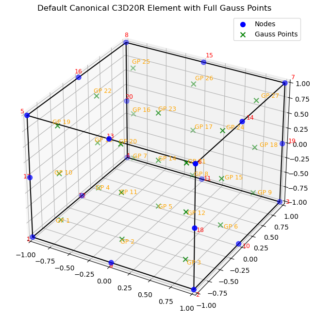

::: {.content-visible when-format="html"}
::: {.callout-tip}
## Companion notebooks
Work through these hands-on notebooks alongside this chapter:

- [05 – Reference Element Gallery](notebooks/05_reference_element_gallery.html)
- [07 – Manual 2D Assembly](notebooks/07_manual_assembly_2d.html)
:::
:::

## Extension to 3D Vector Problems

### Linear Elasticity Example

**Governing equation:** $\text{div}(\boldsymbol{\sigma}) + \mathbf{f} = 0$

**Constitutive relation:** $\boldsymbol{\sigma} = \mathbf{E} \cdot \boldsymbol{\varepsilon} = \mathbf{E} \cdot \text{grad}^s(\mathbf{u})$

**Divergence theorem in 3D:**

$$\int_\Omega \text{div}(\boldsymbol{\sigma}) \, d\Omega = \int_{\partial\Omega} \boldsymbol{\sigma} \cdot \mathbf{n} \, da$$

**Key extensions for 3D:**

- **Vector unknowns:** Displacement field $\mathbf{u} = [u_x, u_y, u_z]^T$
- **Matrix operations:** Stress and strain tensors
- **Global/local transformations:** More complex connectivity
- **Vector problem connectivity:** Multiple DOFs per node

## 3D Element Example

## The B Matrix: Relating Nodal Values to Field Gradients

In the Finite Element Method, we approximate a continuous field (like temperature T or displacement u) within an element using shape functions $N_j$ and nodal values. For example, the temperature T(x,y) at any point within an element can be approximated as:

$$T(x,y) \approx \sum_{j=1}^{n_{\text{nodes}}} N_j(x,y) a_j = \mathbf{N} \mathbf{a}^e$$

where $N_j(x,y)$ are the shape functions, $a_j$ are the nodal temperatures for the element, $\mathbf{N}$ is the row vector of shape functions, and $\mathbf{a}^e$ is the column vector of nodal temperatures for the element.

The physical behavior of the system (e.g., heat flux, stress/strain) often depends on the gradient of this field. The B matrix is a cornerstone of FEM as it directly relates the nodal values of an element to the gradient of the field (or its derivatives) within that element.

## For Scalar Field Problems (Heat Conduction)

In heat conduction, the heat flux $\mathbf{q}$ is related to the temperature gradient $\text{grad}(T)$ by Fourier's Law: $\mathbf{q} = -\mathbf{K} \cdot \text{grad}(T)$.

The weak form integral that leads to the stiffness matrix, $\int_{\Omega^e} \text{grad}(V) \cdot \mathbf{K} \cdot \text{grad}(T) \, d\Omega$, requires evaluating these gradients.

Let $T = \mathbf{N} \mathbf{a}^e$. The temperature gradient in 2D is:

$$\text{grad}(T) = \begin{Bmatrix} \frac{\partial T}{\partial x} \\ \frac{\partial T}{\partial y} \end{Bmatrix} = \begin{Bmatrix} \frac{\partial(\sum N_j a_j)}{\partial x} \\ \frac{\partial(\sum N_j a_j)}{\partial y} \end{Bmatrix} = \sum_{j=1}^{n_{\text{nodes}}} \begin{bmatrix} \frac{\partial N_j}{\partial x} \\ \frac{\partial N_j}{\partial y} \end{bmatrix} a_j$$

This can be written in matrix form as:

$$\text{grad}(T) = \mathbf{B} \mathbf{a}^e$$

Where the B matrix for a 2D scalar problem (like heat conduction) for an element with $n_{\text{nodes}}$ is:

$$\mathbf{B} = \begin{bmatrix}
\frac{\partial N_1}{\partial x} & \frac{\partial N_2}{\partial x} & \ldots & \frac{\partial N_{n_{\text{nodes}}}}{\partial x} \\
\frac{\partial N_1}{\partial y} & \frac{\partial N_2}{\partial y} & \ldots & \frac{\partial N_{n_{\text{nodes}}}}{\partial y}
\end{bmatrix}$$

Each column j of the B matrix corresponds to node j and contains the partial derivatives of its shape function $N_j$ with respect to the global coordinates. For a 3D scalar problem, another row for $\frac{\partial N_j}{\partial z}$ would be added.

## Role in Element Stiffness Matrix

The element stiffness matrix for heat conduction, derived from the weak form, is given by:

$$[\mathbf{k}^e] = \int_{\Omega^e} \mathbf{B}^T \mathbf{K} \mathbf{B} \, d\Omega$$

Here, $\mathbf{K}$ is the material property matrix (thermal conductivity tensor). For an isotropic material in 2D with scalar conductivity k, $\mathbf{K} = \begin{bmatrix} k & 0 \\ 0 & k \end{bmatrix}$. The integration is performed over the volume (or area in 2D) of the element $\Omega^e$.

## Calculation of B Matrix using Master Element Coordinates

Shape functions $N_j$ are typically defined in local (master element) coordinates $(\zeta_1, \zeta_2)$ (often denoted $\xi, \eta$). Their derivatives with respect to global coordinates (x,y) are found using the chain rule and the Jacobian matrix $\mathbf{F}$ of the coordinate transformation:

$$\begin{Bmatrix} \frac{\partial N_j}{\partial x} \\ \frac{\partial N_j}{\partial y} \end{Bmatrix} = \mathbf{F}^{-T} \begin{Bmatrix} \frac{\partial N_j}{\partial \zeta_1} \\ \frac{\partial N_j}{\partial \zeta_2} \end{Bmatrix}$$

where $\mathbf{F}^{-T} = (\mathbf{F}^{-1})^T$.

The Jacobian matrix $\mathbf{F}$ is defined as $\mathbf{F} = \begin{bmatrix} \frac{\partial x}{\partial \zeta_1} & \frac{\partial x}{\partial \zeta_2} \\ \frac{\partial y}{\partial \zeta_1} & \frac{\partial y}{\partial \zeta_2} \end{bmatrix}$.

The derivatives $\frac{\partial N_j}{\partial \zeta_1}$ and $\frac{\partial N_j}{\partial \zeta_2}$ are easily computed from the master element shape function definitions. The components of $\mathbf{F}^{-T}$ depend on the specific element geometry.

## For Vector Field Problems (Elasticity)

The concept of the B matrix is fundamental in structural mechanics (elasticity), where it relates nodal displacements to strains within an element.

The displacement field $\mathbf{u}$ is approximated as $\mathbf{u} = \mathbf{N} \mathbf{d}^e$, where $\mathbf{d}^e$ is the vector of all nodal displacements for the element, and $\mathbf{N}$ is the matrix of shape functions arranged appropriately for a vector field.

The strain $\boldsymbol{\varepsilon}$ is obtained by differentiating the displacement field: $\boldsymbol{\varepsilon} = \mathbf{L} \mathbf{u}$, where $\mathbf{L}$ is a differential operator matrix. Combining these gives:

$$\boldsymbol{\varepsilon} = \mathbf{L}(\mathbf{N} \mathbf{d}^e) = (\mathbf{L} \mathbf{N}) \mathbf{d}^e = \mathbf{B} \mathbf{d}^e$$

The B matrix in elasticity thus contains derivatives of shape functions. The element stiffness matrix is then computed as:

$$[\mathbf{k}^e] = \int_{\Omega^e} \mathbf{B}^T \mathbf{D} \mathbf{B} \, d\Omega$$

where $\mathbf{D}$ is the material elasticity matrix (constitutive matrix relating stress to strain).

## B Matrix for 2D Elasticity (Plane Stress / Plane Strain)

For a 2D elasticity problem, the displacement at any point within an element is $\mathbf{u}(x,y) = \begin{Bmatrix} u(x,y) \\ v(x,y) \end{Bmatrix}$.

The nodal displacement vector for a node i is $\mathbf{d}_i = \begin{Bmatrix} u_i \\ v_i \end{Bmatrix}$.

The displacement field is interpolated as:

$$\begin{Bmatrix} u \\ v \end{Bmatrix} = \sum_{i=1}^{n_{\text{nodes}}} \begin{bmatrix} N_i(x,y) & 0 \\ 0 & N_i(x,y) \end{bmatrix} \begin{Bmatrix} u_i \\ v_i \end{Bmatrix}$$

The strain vector in 2D is:

$$\boldsymbol{\varepsilon} = \begin{Bmatrix} \varepsilon_x \\ \varepsilon_y \\ \gamma_{xy} \end{Bmatrix} = \begin{Bmatrix} \frac{\partial u}{\partial x} \\ \frac{\partial v}{\partial y} \\ \frac{\partial u}{\partial y} + \frac{\partial v}{\partial x} \end{Bmatrix}$$

The B matrix contribution for node i is:

$$\mathbf{B}_i = \begin{bmatrix}
\frac{\partial N_i}{\partial x} & 0 \\
0 & \frac{\partial N_i}{\partial y} \\
\frac{\partial N_i}{\partial y} & \frac{\partial N_i}{\partial x}
\end{bmatrix}$$

$$\mathbf{B} = [\mathbf{B}_1 \quad \mathbf{B}_2 \quad \ldots \quad \mathbf{B}_{n_{\text{nodes}}}]$$

So, if an element has $n_{\text{nodes}}$ nodes, the B matrix will have 3 rows (for $\varepsilon_x, \varepsilon_y, \gamma_{xy}$) and $2 \times n_{\text{nodes}}$ columns.

## B Matrix for 3D Elasticity

For a 3D elasticity problem, the displacement at any point is $\mathbf{u}(x,y,z) = \begin{Bmatrix} u(x,y,z) \\ v(x,y,z) \\ w(x,y,z) \end{Bmatrix}$.

The nodal displacement vector for node i is $\mathbf{d}_i = \begin{Bmatrix} u_i \\ v_i \\ w_i \end{Bmatrix}$.

The displacement field is interpolated as:

$$\begin{Bmatrix} u \\ v \\ w \end{Bmatrix} = \sum_{i=1}^{n_{\text{nodes}}} \begin{bmatrix} N_i(x,y,z) & 0 & 0 \\ 0 & N_i(x,y,z) & 0 \\ 0 & 0 & N_i(x,y,z) \end{bmatrix} \begin{Bmatrix} u_i \\ v_i \\ w_i \end{Bmatrix}$$

The strain vector (engineering strains) in 3D is:

$$\boldsymbol{\varepsilon} = \begin{Bmatrix} \varepsilon_x \\ \varepsilon_y \\ \varepsilon_z \\ \gamma_{xy} \\ \gamma_{yz} \\ \gamma_{zx} \end{Bmatrix} = \begin{Bmatrix}
\frac{\partial u}{\partial x} \\
\frac{\partial v}{\partial y} \\
\frac{\partial w}{\partial z} \\
\frac{\partial u}{\partial y} + \frac{\partial v}{\partial x} \\
\frac{\partial v}{\partial z} + \frac{\partial w}{\partial y} \\
\frac{\partial w}{\partial x} + \frac{\partial u}{\partial z}
\end{Bmatrix}$$

For each node, its contribution to the strain is related to the nodal displacements of that node:

$$\mathbf{B}_i = \begin{bmatrix}
\frac{\partial N_i}{\partial x} & 0 & 0 \\
0 & \frac{\partial N_i}{\partial y} & 0 \\
0 & 0 & \frac{\partial N_i}{\partial z} \\
\frac{\partial N_i}{\partial y} & \frac{\partial N_i}{\partial x} & 0 \\
0 & \frac{\partial N_i}{\partial z} & \frac{\partial N_i}{\partial y} \\
\frac{\partial N_i}{\partial z} & 0 & \frac{\partial N_i}{\partial x}
\end{bmatrix}$$

The full element B matrix is assembled as $\mathbf{B} = [\mathbf{B}_1 \quad \mathbf{B}_2 \quad \ldots \quad \mathbf{B}_{n_{\text{nodes}}}]$.

If an element has $n_{\text{nodes}}$ nodes, the B matrix will have 6 rows and $3 \times n_{\text{nodes}}$ columns. The derivatives $\frac{\partial N_i}{\partial x}$, $\frac{\partial N_i}{\partial y}$, and $\frac{\partial N_i}{\partial z}$ are again found using the Jacobian transformation from the master element coordinates.

## Key Takeaway (B Matrix)

The B matrix is a crucial component in finite element analysis.

It contains the spatial derivatives of the element shape functions, effectively translating the discrete nodal degrees of freedom into continuous gradient fields (like temperature gradients) or deformation measures (like mechanical strains) within an element.

This matrix is essential for forming the element stiffness matrix and, consequently, for solving the overall system of equations that describes the physical problem.

The components of B are generally functions of position within the element (unless using simple elements like constant strain triangles), and are evaluated numerically during the integration process to form the element stiffness matrix.

## Shape Functions: Differential Properties

To evaluate terms like $\text{grad}(V)$ and $\text{grad}(T)$ in the weak form, we need the derivatives of shape functions (and consequently, field variables) with respect to global coordinates (x,y).

However, shape functions $N(\zeta_1, \zeta_2)$ are defined in the master element coordinates $(\zeta_1, \zeta_2)$.

We use the chain rule and the Jacobian of the coordinate mapping to transform these derivatives.

### Coordinate Transformation and the Jacobian Matrix

Recall the isoparametric mapping from master coordinates $(\zeta_1, \zeta_2)$ to global coordinates (x,y):

$$x = \sum_{i=1}^{n_{\text{nodes}}} N_i(\zeta_1, \zeta_2) x_i$$

$$y = \sum_{i=1}^{n_{\text{nodes}}} N_i(\zeta_1, \zeta_2) y_i$$

The Jacobian matrix of this transformation is:

$$\mathbf{F} = \begin{bmatrix} \frac{\partial x}{\partial \zeta_1} & \frac{\partial x}{\partial \zeta_2} \\ \frac{\partial y}{\partial \zeta_1} & \frac{\partial y}{\partial \zeta_2} \end{bmatrix}$$

The determinant of this matrix, $J = \det(\mathbf{F})$, is used in changing variables for integration: $dx \, dy = J \, d\zeta_1 \, d\zeta_2$.

Differentials are related by:

$$\begin{Bmatrix} dx \\ dy \end{Bmatrix} = \mathbf{F} \begin{Bmatrix} d\zeta_1 \\ d\zeta_2 \end{Bmatrix}$$

$$\begin{Bmatrix} d\zeta_1 \\ d\zeta_2 \end{Bmatrix} = \mathbf{F}^{-1} \begin{Bmatrix} dx \\ dy \end{Bmatrix}$$

$$\mathbf{F}^{-1} = \begin{bmatrix} \frac{\partial \zeta_1}{\partial x} & \frac{\partial \zeta_1}{\partial y} \\ \frac{\partial \zeta_2}{\partial x} & \frac{\partial \zeta_2}{\partial y} \end{bmatrix}$$

### Transformation of Derivatives

We need to express derivatives with respect to global coordinates (x,y) in terms of derivatives with respect to master coordinates $(\zeta_1, \zeta_2)$, since our shape functions $N_i$ are given as $N_i(\zeta_1, \zeta_2)$.

Consider a function $V(\zeta_1, \zeta_2)$. Its derivatives with respect to $\zeta_1$ and $\zeta_2$ can be related to its derivatives with respect to x and y using the chain rule:

$$\frac{\partial V}{\partial \zeta_1} = \frac{\partial V}{\partial x} \frac{\partial x}{\partial \zeta_1} + \frac{\partial V}{\partial y} \frac{\partial y}{\partial \zeta_1}$$

$$\frac{\partial V}{\partial \zeta_2} = \frac{\partial V}{\partial x} \frac{\partial x}{\partial \zeta_2} + \frac{\partial V}{\partial y} \frac{\partial y}{\partial \zeta_2}$$

$$\begin{Bmatrix} \frac{\partial V}{\partial \zeta_1} \\ \frac{\partial V}{\partial \zeta_2} \end{Bmatrix} = \begin{bmatrix} \frac{\partial x}{\partial \zeta_1} & \frac{\partial y}{\partial \zeta_1} \\ \frac{\partial x}{\partial \zeta_2} & \frac{\partial y}{\partial \zeta_2} \end{bmatrix} \begin{Bmatrix} \frac{\partial V}{\partial x} \\ \frac{\partial V}{\partial y} \end{Bmatrix} = \mathbf{F}^T \begin{Bmatrix} \frac{\partial V}{\partial x} \\ \frac{\partial V}{\partial y} \end{Bmatrix}$$

$$\begin{Bmatrix} \frac{\partial V}{\partial x} \\ \frac{\partial V}{\partial y} \end{Bmatrix} = (\mathbf{F}^T)^{-1} \begin{Bmatrix} \frac{\partial V}{\partial \zeta_1} \\ \frac{\partial V}{\partial \zeta_2} \end{Bmatrix} = \mathbf{F}^{-T} \begin{Bmatrix} \frac{\partial V}{\partial \zeta_1} \\ \frac{\partial V}{\partial \zeta_2} \end{Bmatrix}$$

$$\mathbf{F}^{-T} = \left(\begin{bmatrix} \frac{\partial x}{\partial \zeta_1} & \frac{\partial x}{\partial \zeta_2} \\ \frac{\partial y}{\partial \zeta_1} & \frac{\partial y}{\partial \zeta_2} \end{bmatrix}\right)^T = \begin{bmatrix} \frac{\partial x}{\partial \zeta_1} & \frac{\partial y}{\partial \zeta_1} \\ \frac{\partial x}{\partial \zeta_2} & \frac{\partial y}{\partial \zeta_2} \end{bmatrix}$$

### Gradient Calculation in Master Element Coordinates

Using the relationship derived above, the gradient of a test function V (or temperature field T) in global coordinates is:

$$\text{grad}(V) = \begin{Bmatrix} \frac{\partial V}{\partial x} \\ \frac{\partial V}{\partial y} \end{Bmatrix} = \mathbf{F}^{-T} \begin{Bmatrix} \frac{\partial V}{\partial \zeta_1} \\ \frac{\partial V}{\partial \zeta_2} \end{Bmatrix} = \begin{bmatrix} \frac{\partial x}{\partial \zeta_1} & \frac{\partial y}{\partial \zeta_1} \\ \frac{\partial x}{\partial \zeta_2} & \frac{\partial y}{\partial \zeta_2} \end{bmatrix} \begin{Bmatrix} \frac{\partial V}{\partial \zeta_1} \\ \frac{\partial V}{\partial \zeta_2} \end{Bmatrix}$$

$$\frac{\partial V}{\partial x} = \frac{\partial x}{\partial \zeta_1} \frac{\partial V}{\partial \zeta_1} + \frac{\partial x}{\partial \zeta_2} \frac{\partial V}{\partial \zeta_2}$$

$$\frac{\partial V}{\partial y} = \frac{\partial y}{\partial \zeta_1} \frac{\partial V}{\partial \zeta_1} + \frac{\partial y}{\partial \zeta_2} \frac{\partial V}{\partial \zeta_2}$$

### Implementation Steps

To implement this:

1. For each shape function $N_i(\zeta_1, \zeta_2)$, calculate its derivatives $\frac{\partial N_i}{\partial \zeta_1}$ and $\frac{\partial N_i}{\partial \zeta_2}$ analytically in the master element.

2. At each integration point $(\zeta_1, \zeta_2)$ within the master element:
   - Calculate the Jacobian matrix $\mathbf{F}$ using the derivatives of the mapping functions $x(\zeta_1, \zeta_2)$ and $y(\zeta_1, \zeta_2)$.
   - Compute $\mathbf{F}^{-1}$ and then $\mathbf{F}^{-T}$.
   - Use $\mathbf{F}^{-T}$ to transform the local derivatives $\begin{Bmatrix} \frac{\partial N_i}{\partial \zeta_1} \\ \frac{\partial N_i}{\partial \zeta_2} \end{Bmatrix}$ into global derivatives $\begin{Bmatrix} \frac{\partial N_i}{\partial x} \\ \frac{\partial N_i}{\partial y} \end{Bmatrix}$.
   - These global derivatives form the columns of the B matrix for scalar problems, or parts of the columns for vector problems.

## Summary: Key Concepts

### Mathematical Foundation

- Product rule for divergence enables weak form derivation
- Divergence theorem converts domain integrals to boundary integrals
- Integration by parts transfers derivatives to test functions

### Geometric Considerations

- Master element concept simplifies integration
- Jacobian must be positive for valid elements
- Element quality depends on convexity and node ordering

### Implementation Details

- Shape functions provide local approximation
- Connectivity tables manage global assembly
- Coordinate transformations enable numerical integration

### Extension to Higher Dimensions

- Same mathematical principles apply
- Increased complexity in bookkeeping and assembly
- Vector problems require multiple DOFs per node
