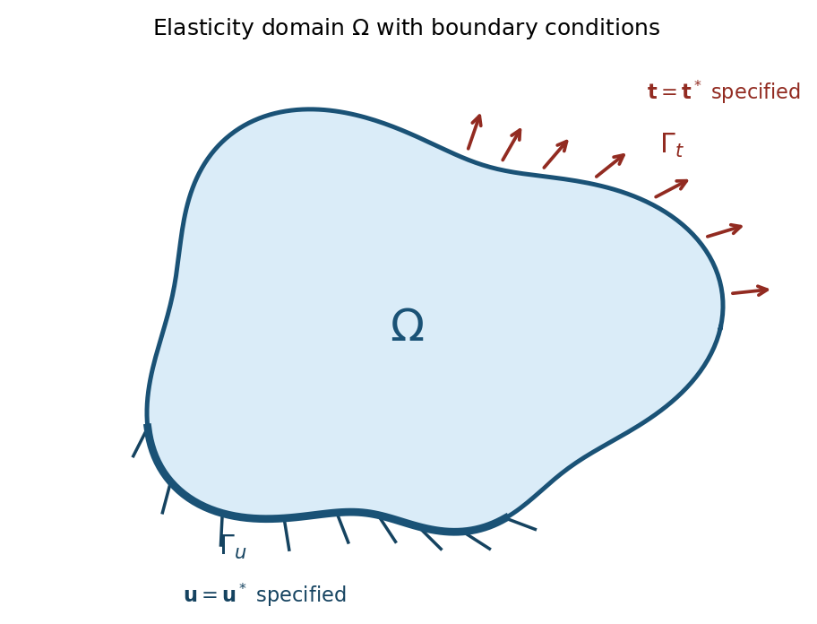

::: {.content-visible when-format="html"}
::: {.callout-tip}
## Companion notebooks
Work through these hands-on notebooks alongside this chapter:

- [10 – 2D Elasticity](notebooks/10_2d_elasticity.html)
- [11 – 3D Elasticity](notebooks/11_3d_elasticity.html)
:::
:::

## Strong Form and Method of Weighted Residuals

Starting from the equation of motion in the quasi-static case:

$$\nabla \cdot \boldsymbol{\sigma} + \mathbf{f} =  0$$

We multiply by a test function $\mathbf{v}$ and integrate over the domain $\Omega$. This is the method of weighted residuals, where $\boldsymbol{r}$ is the residual:

$$\int_{\Omega} \left(\nabla\cdot \boldsymbol{\sigma}+\boldsymbol{f}\right)\cdot\mathbf{v} \, d\Omega = 0=\int_{\Omega}\boldsymbol{r}\cdot\boldsymbol{v}d\Omega$$

{#fig-elasticity-domain}

## Product Rule and Integration by Parts

Recall the product rule for the divergence of a tensor contracted with a vector:

$$\nabla \cdot (\boldsymbol{\sigma}\mathbf{v}) = (\nabla \cdot \boldsymbol{\sigma}) \cdot \mathbf{v} + \boldsymbol{\sigma} : \nabla\mathbf{v}$$

We can write:

$$(\nabla \cdot \boldsymbol{\sigma}) \cdot \mathbf{v} = \nabla \cdot (\boldsymbol{\sigma}\mathbf{v}) - \boldsymbol{\sigma} : \nabla\mathbf{v}$$

Substituting this into our integrated equation and applying the divergence theorem:

$$\int_{\Omega} \nabla \cdot (\boldsymbol{\sigma}\mathbf{v}) d\Omega - \int_{\Omega} \boldsymbol{\sigma} : \nabla\mathbf{v} d\Omega + \int_{\Omega} \mathbf{f} \cdot \mathbf{v} d\Omega = 0$$

$$\implies \int_{\partial\Omega} (\boldsymbol{\sigma}\mathbf{v}) \cdot \mathbf{n} d\Gamma - \int_{\Omega} \boldsymbol{\sigma} : \nabla\mathbf{v} d\Omega + \int_{\Omega} \mathbf{f} \cdot \mathbf{v} d\Omega = 0$$

The term ($\boldsymbol{\sigma}\boldsymbol{n}$) is the traction vector $\boldsymbol{t}$. The term $\nabla \boldsymbol{v}$ is the gradient of the test function, and its symmetric part is the strain tensor for the test function, $\boldsymbol{\varepsilon}(\boldsymbol{v})$.

## Boundary Conditions and Natural Boundary Terms

The boundary $\partial \Omega$ is composed of two parts:

- $\Gamma_u$ (where displacements are prescribed)
- $\Gamma_t$ (where tractions are prescribed)

On $\Gamma_u$ we enforce Dirichlet boundary conditions, meaning the displacement field $\mathbf{u}$ is prescribed as $\mathbf{u}^*$.

On $\Gamma_t$ we enforce Neumann boundary conditions, meaning the traction vector $\boldsymbol{\sigma n}=\boldsymbol{t}$ is prescribed as $\boldsymbol{t}^*$.

This is the natural boundary condition that will be incorporated into the weak form. The boundary integral becomes:

$$\int_{\partial\Omega} \mathbf{t} \cdot \mathbf{v} d\Gamma = \int_{\Gamma_t} \mathbf{t}^* \cdot \mathbf{v} d\Gamma + \int_{\Gamma_u} \mathbf{t} \cdot \underbrace{\mathbf{v}}_{=0} d\Gamma = \int_{\Gamma_t} \mathbf{t}^* \cdot \mathbf{v} d\Gamma$$

## Final Weak Form

We can now state our problem in its final weak form:

Find the displacement field $\boldsymbol{u} \in H^1(\Omega)$ such that $\boldsymbol{u} = \boldsymbol{u}^*$ on the Dirichlet boundary $\Gamma_u$ for all test functions $\boldsymbol{v}\in H^1$ for which  $\boldsymbol{v}|_{\Gamma_u}=0$ satisfying the weak form:

$$\int_{\Omega} \boldsymbol{\sigma}(\mathbf{u}) : \boldsymbol{\varepsilon}(\mathbf{v}) d\Omega = \int_{\Omega} \mathbf{f} \cdot \mathbf{v} d\Omega + \int_{\Gamma_t} \mathbf{t}^* \cdot \mathbf{v} d\Gamma$$

## Constitutive Law and Elasticity Tensor

In the weak form, we have the stress tensor $\boldsymbol{\sigma}$ expressed in terms of the strain tensor $\boldsymbol{\varepsilon}$ and the displacement field $\mathbf{u}$.

We use the constitutive law for linear elasticity $\boldsymbol{\sigma}=\boldsymbol{L}:\boldsymbol{\varepsilon}$, where $\boldsymbol{L}$ is the fourth-order elasticity tensor. For an isotropic material, the matrix form of $\boldsymbol{L}$ (in Voigt notation) is given by:

$$\mathbf{L} = \frac{E}{(1+\nu)(1-2\nu)}
\begin{pmatrix}
1-\nu & \nu & \nu & 0 & 0 & 0 \\
\nu & 1-\nu & \nu & 0 & 0 & 0 \\
\nu & \nu & 1-\nu & 0 & 0 & 0 \\
0 & 0 & 0 & \frac{1-2\nu}{2} & 0 & 0 \\
0 & 0 & 0 & 0 & \frac{1-2\nu}{2} & 0 \\
0 & 0 & 0 & 0 & 0 & \frac{1-2\nu}{2}
\end{pmatrix}$$

where E is Young's modulus and ν is Poisson's ratio.

The term $\boldsymbol{\sigma}=\boldsymbol{L}:\boldsymbol{\varepsilon}$ refers to the double contraction of the elasticity tensor with the strain tensor, which can be expressed in index notation as:

$$\sigma_{ij} = L_{ijkl} \varepsilon_{kl}$$

where $\sigma_{ij}$ are the components of the stress tensor, $L_{ijkl}$ are the components of the elasticity tensor, and $\varepsilon_{kl}$ are the components of the strain tensor.

## Voigt Notation for Strain and Stress

In Voigt notation, the strain tensor is represented as a vector:

$$\boldsymbol{\varepsilon} = \begin{bmatrix}
\varepsilon_{11} \\ \varepsilon_{22} \\ \varepsilon_{33} \\ 2\varepsilon_{23} \\ 2\varepsilon_{31} \\ 2\varepsilon_{12} \end{bmatrix}$$

and the stress tensor is represented as:

$$\boldsymbol{\sigma} = \begin{bmatrix}
\sigma_{11} \\ \sigma_{22} \\ \sigma_{33} \\ \sigma_{23} \\ \sigma_{31} \\ \sigma_{12} \end{bmatrix}$$

## Bilinear and Linear Forms

We continue from our weak form:

$$\int_{\Omega} \boldsymbol{\sigma}(\mathbf{u}) : \boldsymbol{\varepsilon}(\mathbf{v}) \, d\Omega = \int_{\Omega} \mathbf{f} \cdot \mathbf{v} \, d\Omega + \int_{\Gamma_t} \mathbf{t}^* \cdot \mathbf{v} \, d\Gamma$$

Now, we substitute the constitutive law into the left-hand side:

$$\int_{\Omega} (\boldsymbol{L}\cdot\boldsymbol{\varepsilon}(\mathbf{u})) \cdot \boldsymbol{\varepsilon}(\mathbf{v}) \, d\Omega = \int_{\Omega} \mathbf{f} \cdot \mathbf{v} \, d\Omega + \int_{\Gamma_t} \mathbf{t}^* \cdot \mathbf{v} \, d\Gamma$$

Where we dropped the double contraction ($:$) and replaced it with $\cdot$ since we use Voigt notation for the strain and stress tensors.

This equation has a standard structure. The left side is linear with respect to both the solution u and the test function v. The right side is linear only with respect to the test function v.

We can define a **bilinear form** $B(u,v)$ from the left-hand side, which represents the internal virtual work:

$$B(\mathbf{u}, \mathbf{v}) := \int_{\Omega} \boldsymbol{\varepsilon}(\mathbf{v}) \cdot \boldsymbol{L} \cdot \boldsymbol{\varepsilon}(\mathbf{u}) \, d\Omega$$

And we define a **linear form** $F(v)$ from the right-hand side, which represents the external virtual work done by body forces and applied tractions:

$$F(\mathbf{v}) := \int_{\Omega} \mathbf{f} \cdot \mathbf{v} \, d\Omega + \int_{\Gamma_t} \mathbf{t}^* \cdot \mathbf{v} \, d\Gamma$$

The problem is now stated in its abstract form: Find the displacement u (satisfying Dirichlet BCs) such that for all valid test functions v:

$$B(\mathbf{u}, \mathbf{v}) = F(\mathbf{v})$$

This abstract form is the direct starting point for the Finite Element discretization, where we will replace the infinite-dimensional function spaces with finite-dimensional approximations.

Recalling the definition of the strain tensor:

$$\boldsymbol{\varepsilon}(\mathbf{v}) = \frac{1}{2}(\nabla \mathbf{v} + \nabla \mathbf{v}^T)$$

We can express the bilinear form in terms of the gradient of the test function:

$$B(\mathbf{u}, \mathbf{v}) = \int_{\Omega} \boldsymbol{\varepsilon}(\mathbf{v}) \cdot \boldsymbol{L} \cdot \boldsymbol{\varepsilon}(\mathbf{u}) \, d\Omega = \int_{\Omega} \left(\frac{1}{2}(\nabla \mathbf{v} + \nabla \mathbf{v}^T)\right) : \boldsymbol{L} : \left(\frac{1}{2}(\nabla \mathbf{u} + \nabla \mathbf{u}^T)\right) \, d\Omega$$

## Function Spaces for Test and Trial Functions

To ensure our weak form is mathematically well-posed, the solution (trial) function $\boldsymbol{u}$ and the test function $\boldsymbol{v}$ can't be just any function. They must belong to specific function spaces.

Why do we need restrictions? The bilinear form **B(u,v)** involves integrals of derivatives of the functions. For these integrals to be well-defined and finite, the functions must have a certain degree of smoothness.

### Hilbert-Sobolev Spaces

A function u belongs to $H^1$ if both the function and its first derivatives are square-integrable over the domain Ω:

$$H^1(\Omega) = \left( \mathbf{u} \in L^2(\Omega) \; \middle| \; \nabla\mathbf{u} \in L^2(\Omega) \right)$$

In other words:

$$\int_{\Omega}\nabla \boldsymbol{u} \cdot\nabla \boldsymbol{u} \, d\Omega + \int_{\Omega} \boldsymbol{u} \cdot \boldsymbol{u} \, d\Omega < \infty$$

This ensures that the energy norm is finite.

### Handling Dirichlet Conditions

The test functions $\boldsymbol{v}$ must also respect the homogeneous Dirichlet boundary conditions. This leads us to the space $H^1_0(\Omega)$, which is a subspace of $H^1(\Omega)$.

It contains all functions that are zero on the Dirichlet boundary $\Gamma_u$:

$$H^1_0(\Omega) = \left[ \mathbf{v} \in H^1(\Omega) \; \middle| \; \mathbf{v} = \mathbf{0} \text{ on } \Gamma_u \right]$$

## The Lifting Technique for Non-Zero Displacements

If our prescribed displacement $\boldsymbol{u}^*$ on the boundary $\Gamma_u$ is not zero, we must handle this carefully using the **lifting** technique.

Mathematically, we handle this by splitting the solution u into two parts:

$$\mathbf{u} = \mathbf{u}_0 + \mathbf{u}_D$$

where $\boldsymbol{u}_D$ is a known function (aka "lifting function") that satisfies the Dirichlet boundary condition on $\Gamma_u$, and $\boldsymbol{u}_0$ is the unknown part of the solution that we seek.

### Modified Weak Form

We substitute this decomposition into our weak form:

$$B(\mathbf{u}_0 + \mathbf{u}_D, \mathbf{v}) = F(\mathbf{v})$$

Using the linearity of B(⋅,v):

$$B(\mathbf{u}_0, \mathbf{v}) + B(\mathbf{u}_D, \mathbf{v}) = F(\mathbf{v})$$

We then move all the known quantities to the right-hand side:

$$B(\mathbf{u}_0, \mathbf{v}) = F(\mathbf{v}) - B(\mathbf{u}_D, \mathbf{v})$$

Our new problem is to find the homogeneous component $\boldsymbol{u}_0 \in H^1_0(\Omega)$ that satisfies this modified equation for all test functions $\boldsymbol{v} \in H^1_0(\Omega)$:

$$B(\mathbf{u}_0, \mathbf{v}) = F(\mathbf{v}) - B(\mathbf{u}_D, \mathbf{v})$$

This means we are looking for a solution $\boldsymbol{u}_0$ that satisfies the weak form with respect to the homogeneous space $H^1_0(\Omega)$, while $\boldsymbol{u}_D$ is already known and satisfies the Dirichlet boundary condition.

Once $\boldsymbol{u}_0$ is found, the final solution is simply $\boldsymbol{u} = \boldsymbol{u}_0 + \boldsymbol{u}_D$. In practice, this is handled during the assembly of the finite element system.

## Principle of Minimum Potential Energy

An alternative but equivalent way to derive the weak form for elasticity problems is by minimizing a potential energy functional. This principle states that the exact solution to an elastic problem is the one that minimizes the total potential energy.

### Total Potential Energy

The total potential energy of the system is the sum of the internal strain energy and the potential energy of the external loads:

$$\Pi(\mathbf{u}) = \underbrace{\frac{1}{2} \int_{\Omega} \boldsymbol{\sigma}(\mathbf{u}) : \boldsymbol{\varepsilon}(\mathbf{u}) \, d\Omega}_{\text{Strain Energy}} - \underbrace{\left( \int{\Omega} \mathbf{f} \cdot \mathbf{u} \, d\Omega + \int_{\Gamma_t} \bar{\mathbf{t}} \cdot \mathbf{u} \, d\Gamma \right)}_{\text{Potential of External Loads}}$$

### Finding the Minimum

The solution u that minimizes the functional $\Pi$ is found by setting its directional derivative to zero for any arbitrary perturbation (test function) v. This is analogous to setting the first derivative to zero in standard calculus:

$$\lim_{\epsilon \to 0} \frac{\Pi(\mathbf{u} + \epsilon\mathbf{v}) - \Pi(\mathbf{u})}{\epsilon} = 0$$

Calculating this derivative (which is the first variation of the functional) yields:

$$\delta\Pi = \int_{\Omega} \boldsymbol{\sigma}(\mathbf{u}) : \boldsymbol{\varepsilon}(\mathbf{v}) \, d\Omega - \int_{\Omega} \mathbf{f} \cdot \mathbf{v} \, d\Omega - \int_{\Gamma_t} \bar{\mathbf{t}} \cdot \mathbf{v} \, d\Gamma = 0$$

Rearranging this gives us our familiar weak form:

$$\int_{\Omega} \boldsymbol{\sigma}(\mathbf{u}) : \boldsymbol{\varepsilon}(\mathbf{v}) \, d\Omega = \int_{\Omega} \mathbf{f} \cdot \mathbf{v} \, d\Omega + \int_{\Gamma_t} \bar{\mathbf{t}} \cdot \mathbf{v} \, d\Gamma$$

This shows that the solution satisfying the weak form is also the one that minimizes the total potential energy of the system.

## Proof that Weak Form Solution Minimizes Energy

We previously showed that minimizing the potential energy functional leads to the weak form. Now we will prove the converse: the unique solution u to the weak form is the unique minimizer of the potential energy functional $L(\mathbf{w})$.

Define the Energy Functional:

$$L(\mathbf{w}) \overset{\text{def}}{=} \frac{1}{2} B(\mathbf{w}, \mathbf{w}) - F(\mathbf{w})$$

The Goal: We want to show that $J(u)\leq J(w)$ for any other admissible function $\boldsymbol{w}$ (a function that satisfies the same Dirichlet boundary conditions as $\boldsymbol{u}$).

Let's evaluate the energy of any admissible function w: We can write any such w as the sum of the true solution u and an error function e, so w=u+e.

Since u and w both satisfy the same Dirichlet boundary conditions, the error function e must be zero on the Dirichlet boundary $\Gamma_u$ and thus belongs to the space $H^1_0(\Omega)$, which is the space of functions that are square-integrable and have square-integrable first derivatives, and are zero on the Dirichlet boundary.

Let's substitute w=u+e into the energy functional:

$$L(\mathbf{w}) = L(\mathbf{u}+\mathbf{e}) = \frac{1}{2}B(\mathbf{u}+\mathbf{e}, \mathbf{u}+\mathbf{e}) - F(\mathbf{u}+\mathbf{e})$$

Using the linearity of the forms, this expands to:

$$L(\mathbf{w}) = \frac{1}{2}\left( B(\mathbf{u},\mathbf{u}) + 2B(\mathbf{u},\mathbf{e}) + B(\mathbf{e},\mathbf{e}) \right) - \left( F(\mathbf{u}) + F(\mathbf{e}) \right)$$

Now, we rearrange the expression:

$$L(\mathbf{w}) = \underbrace{\left( \frac{1}{2}B(\mathbf{u},\mathbf{u}) - F(\mathbf{u}) \right)}_{L(\mathbf{u})} + \underbrace{\left( B(\mathbf{u},\mathbf{e}) - F(\mathbf{e}) \right)}_{=0} + \underbrace{\frac{1}{2}B(\mathbf{e},\mathbf{e})}_{\frac{1}{2}|\mathbf{e}|_E^2}$$

The middle term is zero because u is the true solution, so it satisfies the weak form $B(u,v)=F(v)$ for any test function v, including our error function e.

The Final Result: This simplifies to a fundamental relationship:

$$L(\mathbf{w}) = L(\mathbf{u}) + \frac{1}{2} | \mathbf{w} - \mathbf{u} |_E^2$$

Since the energy norm $||w-u||_E^2$ is always greater than or equal to zero, this proves that $L(w)\geq L(u)$.

The energy of any admissible function is greater than or equal to the energy of the true solution. The minimum is achieved only when $||w-u||_E^2=0$, which means $w=u$.

## FEM Approximation and Error Estimates

The Finite Element Method does not find the exact solution, but rather an approximate solution $u_h$. **The accuracy of this approximation is a central concern.**

Discretization: We divide our domain Ω into smaller elements of characteristic size h. We then approximate the solution using simple polynomial functions (e.g., linear, quadratic) on each element.

Error Measurement: The error is the difference between the exact solution $u$ and the finite element solution $u_h$. We often measure this error using the energy norm:

$$|| \mathbf{e} ||^2_E = || \mathbf{u} - \mathbf{u}_h ||^2_E = B(\mathbf{u} - \mathbf{u}_h, \mathbf{u} - \mathbf{u}_h)$$

This norm is physically meaningful as it represents the strain energy of the error.

### A Priori Error Estimate

For well-posed problems, we can estimate the error before solving. The error in the energy norm is bounded by a constant $C$ (independent of the mesh) times terms involving the element size h and the polynomial order p of the shape functions:

$$|| \mathbf{u} - \mathbf{u}_h ||^2_E \le C^2(u,p) h^{2\gamma}$$

Where $\gamma=\text{min}(r-1,p)$, with r being the regularity of the solution and p being the polynomial order of the finite element shape functions.

Key Takeaway: The error decreases as the mesh is refined (as h gets smaller) or as the polynomial order of the elements (p) is increased. We can compare the solutions for two different meshes or polynomial orders to estimate the convergence rate of the method.
