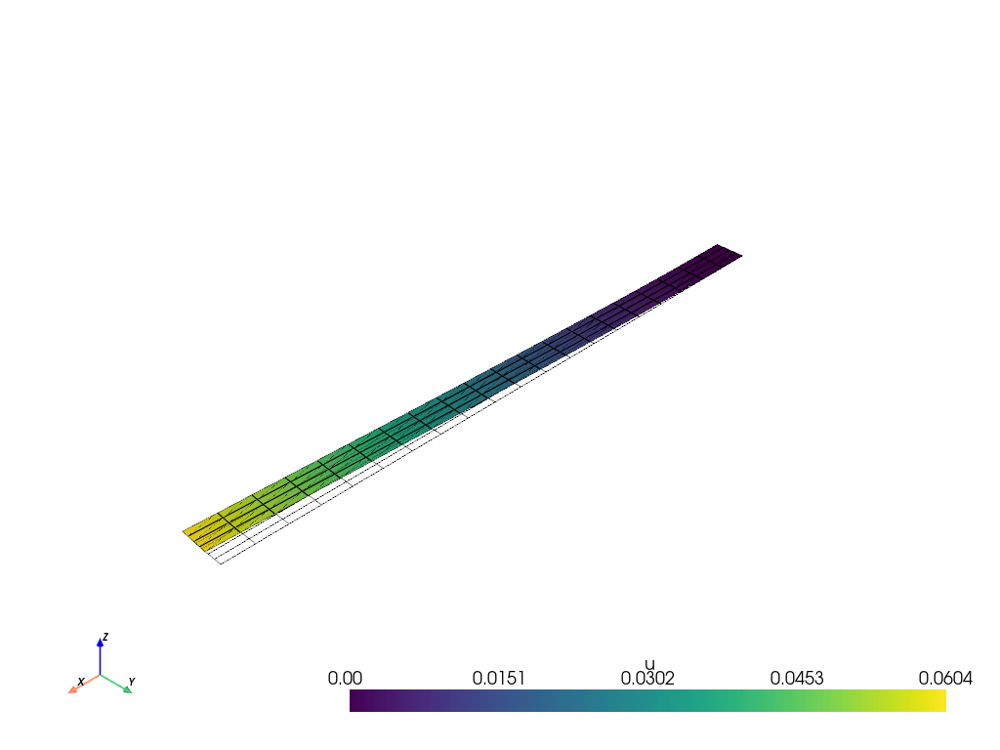
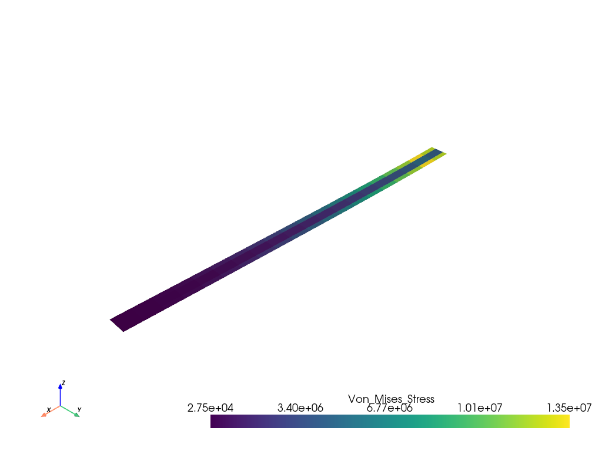

## FEniCSx
* Modern computational platform for solving partial differential equations using the finite element method
* Fully open-source and free to use
* Developed by a large community of researchers and engineers
* Written in C++ with Python bindings
* Designed for complex engineering problems you'll encounter in practice
* Can be used for both academic research and industrial applications
* Runs on laptops, workstations, and High-Performance Computers ("supercomputers")

## FEniCSx for Mechanical Engineers
**What you've learned**:

Derivvation of the weak form
Simple linear problems
Simple geometries
Theoretical foundations
Matrix formulations
Direct solvers

**Real engineering**:

Complex 3D geometries
Nonlinear materials
Coupled physics
Large-scale systems
Complex boundary conditions
Sophisticated solvers

**FEniCSx bridges this gap!**

## From Theory to Practice
* Once you developed the weak form in its algebric form: 

    $$K \mathbf{u} = \mathbf{f}$$

* FEniCSx handles:

    - Automatic mesh handling and partitioning

    - Assembly of $K$ and $\mathbf{f}$
    
    - Efficient solvers (through external libraries like PETSc)

    - Post-processing

**You focus on: Physics, boundary conditions, and engineering insight**

## Key Advantages
* High-level interface - Express problems in mathematical notation

* Automatic (symbolic) differentiation 

* Access to advanced solvers and preconditioners

* Parallel computing - Scales from laptop to supercomputer

* Extensible - Custom materials, elements, and physics

## Workflow Overview
1. Define the problem in mathematical terms (weak form)
2. Create a mesh of the geometry 
    - simple geometries can be created directly in FEniCSx
    - complex geometries can be imported from external mesh generators (e.g. GMSH,Tetgen, ...)
3. Define function spaces (element types, polynomial orders)
4. Apply boundary conditions
5. Write the weak form using FEniCSx's UFL (Unified Form Language)
6. Solve the system of equations
7. Post-process results (visualization, data extraction)

In the following slides  we will go through this workflow step by step.

The full code is available as a python file at the end of this presentation.

## Simple Example - Problem Definition
The problem on which we will demonstrate the workflow is a simple 2D beam bending problem. 

The strong form of the problem is given as:

$$
- \nabla \cdot \sigma(u) = f \quad \text{in } \Omega 
$$

where $\sigma$ is the stress tensor, $u$ are the displacements $\Omega$ the domain and $f$ the body forces. 

The constitutive relation, relating the displacements to the stress tensor is given as:

$$
\begin{aligned}
\sigma(u) &= \lambda \text{tr}(\epsilon(u)) I + 2\mu \epsilon(u) \\
\epsilon(u) &= \nabla^s u 
\end{aligned}
$$

with:

$$
\begin{aligned}
\lambda &= \frac{E \nu}{(1+\nu)(1-2\nu)} \text{Lame's first parameter} \\
\mu &=  \frac{E}{2(1+\nu)} \text{Lame's second parameter} \\
E &= \text{Young's modulus} \\
\nu &= \text{Poisson's ratio} \\
\nabla^s u &= \frac{1}{2}(\nabla u + \nabla^T u) \text{the symmetric gradient}
\end{aligned}
$$

The weak form of the problem is given as:

$$
\underbrace{\int_{\Omega} \sigma(u) : \epsilon(v) \, d\Omega}_{a(u,v)} = \underbrace{\int_{\Omega} f\cdot v \, d\Omega + \int_{\partial \Omega_T}T\cdot v \, d\partial \Omega_T}_{L(v)}
$$

where $v \in V$ is the test function (with $V$ being the vector test function space), $\partial \Omega_T$ is the part of the boundary on which tractions ($T=\sigma \cdot n$) are applied. 

Rewriting the weak forms in terms of a linear and bilinear forms we can phrase the problem as:

::: {.callout-note icon=false}

## Problem Statement

Find $u \in V$ such that:

$$
a(u,v) = L(v) \quad \forall v \in V
$$

## Simple Example: Setup
To run this example you will need to have FEniCSx installed on your system. 

You can find the installation instructions on the [FEniCSx website](https://fenicsproject.org/download/).

You can also use google's Colab to run FEniCSx notebooks without having to install anything on your local machine.

Simply open a new notebook and run the following code to install FEniCSx:

```{python}
#| eval: false
#| code-fold: true
try:
    import dolfinx
except ImportError:
    !wget "https://fem-on-colab.github.io/releases/fenicsx-install-release-real.sh" \
    -O "/tmp/fenicsx-install.sh" && bash "/tmp/fenicsx-install.sh"
    import dolfinx
```

::: {.callout-note }
We are using the python interface to FEniCSx - "dolfinx"

However, the same concepts apply to the C++ interface as well.

## Simple Example: Mesh generation
We will make use of the built-in meshe generator in FEniCSx to create a simple rectangular mesh for our beam.

We also import numpy and mpi4py for numerical operations and parallel computing, respectively.
```{python}
#| eval: false
#| code-fold: true
from dolfinx import mesh   
import ufl
import numpy as np
from mpi4py import MPI 
# Define the geometry of the beam
Length = 20.0  # Length of the beam
Height = 1.0  # Height of the beam

Nx = 20  # Number of elements in the x-direction
Ny = 4  # Number of elements in the y-direction
#create the rectangular mesh
domain = mesh.create_rectangle(MPI.COMM_WORLD,
                            [np.array([0, 0]), np.array([Length, Height])],
                            [Nx, Ny],
                            cell_type=mesh.CellType.quadrilateral)
gdim = domain.geometry.dim # dimension 
```

## Simple Example: Define function space
Next, we define the function space for our problem.

We will use a vector function space with Lagrange elements of degree 1 (P1) for the displacements with gdim=2 since this is a 2D problem and we have $u_x,u_y$.

```{python}
#| eval: false
#| code-fold: true
from dolfinx import fem

# Define function space
Vdegree = 1  # Degree of the polynomial
V = fem.functionspace(domain, ("P", Vdegree, (gdim,)))
# V is a vector function space with gdim=2
# Vdegree=1 means linear elements (P1)

#Define the test and trial functions
u = ufl.TrialFunction(V)
v = ufl.TestFunction(V)
```

## Simple Example: Define boundary conditions
We need to define the boundary conditions for our problem.

1. We will fix the left edge of the beam (x=0).
    
    We do so by defining a function that identifies the left boundary and applying a Dirichlet boundary condition with zero displacement.

```{python}
#| eval: false
#| code-fold: true
# Define Dirichlet boundary condition (fixed left edge)
def left_boundary(x):
    return np.isclose(x[0], 0)
#locate the dofs on the left boundary
fixed_side = fem.locate_dofs_geometrical(V, left_boundary)
# Define Dirichlet boundary condition
bc = [fem.dirichletbc(np.zeros(gdim), fixed_side, V)]
```

2. We apply body force of $f=(0,-\rho g)$ on the beam, where $\rho$ is the density and $g$ is the gravitational acceleration.

```{python}
#| eval: false
#| code-fold: true
from dolfinx import default_scalar_type
# Define body force (gravity)
rho = fem.Constant(domain, 2700.) # density of the material 
g = fem.Constant(domain, 9.81) # gravitational acceleration
# Define body force vector
f = fem.Constant(domain, default_scalar_type((0, -rho * g)))
```

3. In our problem definition we did not define any traction boundary conditions. 
   
   However, as an example, we show how to apply a spatially varying traction on the bottom surface of the beam.

```{python}
#| eval: false
#| code-fold: true
def bottom_boundary(x):
    return np.isclose(x[1], 0.0)
# Mark the boundaries with unique tags
fdim = gdim - 1  # The boundary dimension for 2D problems
bottom_facet = mesh.locate_entities_boundary(domain, fdim, bottom_boundary)
# Create a MeshTag: we tag the bottom boundary with a unique tag
bottom_tag = np.full_like(bottom_facet, 1)
facet_tag = mesh.meshtags(domain, fdim, bottom_facet, bottom_tag)
# Define a function for the tracitons
Traction_Function = fem.Function(V,name="Traction_Function")
# Define the traction function
tractions = lambda x: np.vstack((np.zeros_like(x[0], 
                        dtype=default_scalar_type), -1.5 * x[0]))
# Assign the traction function to the Traction_Function
Traction_Function.interpolate(tractions)
# Define facet normal vector
n_vector = ufl.FacetNormal(domain)
```

## Simple Example: Construct the weak form
Now we can construct the weak form of the problem using the UFL (Unified Form Language) in FEniCSx which we prevously imported.

First, we need to define the integration measure for the boundary

```{python}
#| eval: false
#| code-fold: true
# Define the integration measure for the boundary
ds = ufl.Measure("ds", domain=domain, subdomain_data=facet_tag)
```

Now we are almost ready to define the bilinear form $a(u,v)$ and the linear form $L(v)$.

In the bilinear form, we have the integral of the stress tensor $\sigma(u)$ multiplied by the symmetric gradient $\epsilon(v)$ 

So we will use the `ufl` module to define the stress tensor and the symmetric gradient.

Since we did not define the elastic properties of the material yet, we will do so now.

```{python}
#| eval: false
#| code-fold: true
# Define material properties
E = fem.Constant(domain, 70e9)  # Young's modulus in Pa
nu = fem.Constant(domain, 0.3)  # Poisson's ratio
# Define Lame's parameters
lame = E * nu / ((1 + nu) * (1 - 2 * nu))  # Lame's first parameter
mu = E / (2 * (1 + nu))  # Lame's second parameter - shear modulus

def strain(v):
    """Define the strain tensor"""
    return ufl.sym(ufl.grad(v)) # the symmetric gradient

def stress(u):
     return lame * ufl.tr(strain(u))*ufl.Identity(gdim) + 2 * mu * strain(u)  
     # the stress tensor
```

We can now define the bilinear form $a(u,v)$ and the linear form $L(v)$.
```{python}
#| eval: false
#| code-fold: true
# Define the bilinear form a(u,v)
a = ufl.inner(stress(u), strain(v)) * ufl.dx 
# ufl.dx is the integration measure over the domain

# Define the linear form L(v)
# L = ufl.dot(f, v) * ufl.dx 

# if you wish to apply the traction boundary condition you can 
# add it to the linear form as follows:
L = ufl.dot(f, v) * ufl.dx  + ufl.dot(Traction_Function,v) * ds(1)  
# ds(1) is the integration measure over the bottom boundary
```

Note that we did not make use of the normal vector `n_vector` in the traction definition as we defined the traction as a vector operating in y direction and our boundary is straight in the x direction. for a curved boundary you would need to use the normal vector to define the traction in the correct direction.

## Simple Example: Solve the linear problem
FEniCSx contain has a "LinearProblem" class to handle the linear problem formulation.

```{python}
#| eval: false
#| code-fold: true
from dolfinx.fem.petsc import LinearProblem
```

We can now create a `LinearProblem` object and solve the problem.

```{python}
#| eval: false
#| code-fold: true
# Create the linear problem
problem = LinearProblem(a, L, bcs=bc, 
                petsc_options={"ksp_type": "preonly", "pc_type": "lu"})
```

In the above code, we pass the bilinear form `a`, the linear form `L`, and the boundary conditions `bc` to the `LinearProblem` constructor.

We also specify some PETSc options for the solver, such as using a direct solver (`ksp_type: preonly`) and a LU factorization (`pc_type: lu`).

PETSc is a powerful library for solving linear systems and provides various solvers and preconditioners.

We can now solve the problem by calling the `solve` method of the `LinearProblem` object.

```{python}
#| eval: false
#| code-fold: true
# Solve the linear problem
u_solution = problem.solve()
```

The `solve` method returns the solution vector `u_solution`, which contains the displacements at each node of the mesh.

## Simple Example: Postprocessing
After solving the problem, we can visualize the results and extract useful information.

First, let's visualize the displacements using the `pyvista` library, which is a powerful visualization library for Python.

```{python}
#| eval: false
#| code-fold: true
import pyvista as pv
pv.OFF_SCREEN = True
from dolfinx import plot
pv.set_jupyter_backend('trame')
# Create a PyVista plotter
plotter = pv.Plotter()
# Create a PyVista mesh from the FEniCSx mesh
topology, cell_types, geometry = plot.vtk_mesh(V)
grid = pv.UnstructuredGrid(topology, cell_types, geometry)
#Since Pyvista expects a 3D vector field, we need to reshape the solution
u_2d = u_solution.x.array.reshape(geometry.shape[0], gdim)
u_3d = np.zeros((geometry.shape[0], 3))
u_3d[:, :gdim] = u_2d  # Copy the x and y components
# Add the displacements ato the grid
grid["u"] = u_3d
# plot the undeformed mesh
undeformed = plotter.add_mesh(grid, style="wireframe", color="k")
# plot the deformed mesh
#create a warped mesh, and scale the displacements by a factor of your choice
factor = 10.
warped = grid.warp_by_vector("u",factor=factor)
#add the deformed mesh to the plotter
deformed = plotter.add_mesh(warped, show_edges=True)
plotter.show_axes()
#plot the two meshes. 
if not pv.OFF_SCREEN:
    plotter.show()
else:
    disp_figure = plotter.screenshot("displacements.png")
```



As you recall, the displacements are defined on the nodes of the mesh. 
To visualize the stress we need to project it onto the appropriate function space.

Let's plot the Von Mises (or equivalent) stress.

```{python}
#| eval: false
#| code-fold: true
# Compute the stress from the solution
stress_solution = stress(u_solution)
#transfer to deviatoric stress
deviatoric_stress = (stress_solution 
                    - ufl.tr(stress_solution) / gdim * ufl.Identity(gdim))
# Compute the Von Mises stress
von_mises_stress = ufl.sqrt(3.0 / 2.0 * 
                        ufl.inner(deviatoric_stress, deviatoric_stress))
# Create a FunctionSpace for the stress 
stress_space = fem.functionspace(domain, ("DG", 0))
# Create an expression for the Von Mises stress
Mises_expression = fem.Expression(von_mises_stress, 
                                stress_space.element.interpolation_points())
VM_stress = fem.Function(stress_space)
VM_stress.interpolate(Mises_expression)
```

Now we can visualize the Von Mises stress using the `pyvista` library.

Note that now we assign values to the cells of the mesh (elements) instead of the nodes.

```{python}
#| eval: false
#| code-fold: true
warped.cell_data["Von_Mises_Stress"] = VM_stress.x.array
warped.set_active_scalars("Von_Mises_Stress")
plotter = pv.Plotter()
plotter.add_mesh(warped)
plotter.show_axes()
if not pv.OFF_SCREEN:
    plotter.show()
else:
    VM_Stress_figure = plotter.screenshot(f"Von_Mises_Stress.png")
```



## All together
```{python}
#| eval: false
#| code-fold: true
#%%
from dolfinx import mesh
import ufl
import numpy as np
from mpi4py import MPI 
# Define the geometry of the beam
Length = 20.0  # Length of the beam
Height = 1.0  # Height of the beam
Nx = 20  # Number of elements in the x-direction
Ny = 4  # Number of elements in the y-direction
#create the rectangular mesh
domain = mesh.create_rectangle(MPI.COMM_WORLD,
                            [np.array([0, 0]), np.array([Length, Height])],
                            [Nx, Ny],
                            cell_type=mesh.CellType.quadrilateral)
gdim = domain.geometry.dim # dimension 
#%%
from dolfinx import fem

# Define function space
Vdegree = 1  # Degree of the polynomial
V = fem.functionspace(domain, ("P", Vdegree, (gdim,)))
# V is a vector function space with gdim=2
# Vdegree=1 means linear elements (P1)

#Define the test and trial functions
u = ufl.TrialFunction(V)
v = ufl.TestFunction(V)
#%%
# Define Dirichlet boundary condition (fixed left edge)
def left_boundary(x):
    return np.isclose(x[0], 0)
#locate the dofs on the left boundary
fixed_side = fem.locate_dofs_geometrical(V, left_boundary)
# Define Dirichlet boundary condition
bc = [fem.dirichletbc(np.zeros(gdim), fixed_side, V)]

#%%
from dolfinx import default_scalar_type
# Define body force (gravity)
rho = fem.Constant(domain, 2700.) # density of the material 
g = fem.Constant(domain, 9.81) # gravitational acceleration
# Define body force vector
f = fem.Constant(domain, default_scalar_type((0, -rho * g)))
#%%
def bottom_boundary(x):
    return np.isclose(x[1], 0.0)
# Mark the boundaries with unique tags
fdim = gdim - 1  # The boundary dimension for 2D problems
bottom_facet = mesh.locate_entities_boundary(domain, fdim, bottom_boundary)
# Create a MeshTag: we tag the bottom boundary with a unique tag
bottom_tag = np.full_like(bottom_facet, 1)
facet_tag = mesh.meshtags(domain, fdim, bottom_facet, bottom_tag)
# Define a function for the tracitons
Traction_Function = fem.Function(V,name="Traction_Function")
# Define the traction function
tractions = lambda x: np.vstack((np.zeros_like(x[0], dtype=default_scalar_type),
                                -1.5 * x[0]))
# Assign the traction function to the Traction_Function
Traction_Function.interpolate(tractions)
# Define facet normal vector
n_vector = ufl.FacetNormal(domain)
#%%
ds = ufl.Measure("ds", domain=domain, subdomain_data=facet_tag)
# Define material properties
E = fem.Constant(domain, 70e9)  # Young's modulus in Pa
nu = fem.Constant(domain, 0.3)  # Poisson's ratio
# Define Lame's parameters
lame = E * nu / ((1 + nu) * (1 - 2 * nu))  # Lame's first parameter
mu = E / (2 * (1 + nu))  # Lame's second parameter - shear modulus

def strain(v):
    """Define the strain tensor"""
    return ufl.sym(ufl.grad(v)) # the symmetric gradient

def stress(u):
     return lame * ufl.tr(strain(u))*ufl.Identity(gdim) + 2 * mu * strain(u)  
     # the stress tensor
#%%
# Define the bilinear form a(u,v)
a = ufl.inner(stress(u), strain(v)) * ufl.dx 
# ufl.dx is the integration measure over the domain

# Define the linear form L(v)
# L = ufl.dot(f, v) * ufl.dx 
# if you wish to apply the traction boundary condition you can 
# add it to the linear form as follows:
L = ufl.dot(f, v) * ufl.dx  + ufl.dot(Traction_Function,v) * ds(1)  
# ds(1) is the integration measure over the bottom boundary

#%%
from dolfinx.fem.petsc import LinearProblem
problem = LinearProblem(a, L, bcs=bc, 
                    petsc_options={"ksp_type": "preonly", "pc_type": "lu"})
u_solution = problem.solve()
#%%
import pyvista as pv
from dolfinx import plot
pv.set_jupyter_backend('trame')
# Create a PyVista plotter
plotter = pv.Plotter()
# Create a PyVista mesh from the FEniCSx mesh
topology, cell_types, geometry = plot.vtk_mesh(V)
grid = pv.UnstructuredGrid(topology, cell_types, geometry)
#Since Pyvista expects a 3D vector field, we need to reshape the solution
u_2d = u_solution.x.array.reshape(geometry.shape[0], gdim)
u_3d = np.zeros((geometry.shape[0], 3))
u_3d[:, :gdim] = u_2d  # Copy the x and y components
# Add the displacements ato the grid
grid["u"] = u_3d
# plot the undeformed mesh
undeformed = plotter.add_mesh(grid, style="wireframe", color="k")
# plot the deformed mesh
#create a warped mesh, and scale the displacements by a factor of your choice
factor = 10.
warped = grid.warp_by_vector("u",factor=factor)
#add the deformed mesh to the plotter
deformed = plotter.add_mesh(warped, show_edges=True)
plotter.show_axes()
#plot the two meshes. 
if not pv.OFF_SCREEN:
    plotter.show()
else:
    disp_figure = plotter.screenshot("displacements.png")
#%%
# Compute the stress from the solution
stress_solution = stress(u_solution)
#transfer to deviatoric stress
deviatoric_stress = (stress_solution 
                    - ufl.tr(stress_solution) / gdim * ufl.Identity(gdim))
# Compute the Von Mises stress
von_mises_stress = ufl.sqrt(3.0 / 2.0 * 
                        ufl.inner(deviatoric_stress, deviatoric_stress))
# Create a FunctionSpace for the stress 
stress_space = fem.functionspace(domain, ("DG", 0))
# Create an expression for the Von Mises stress
Mises_expression = fem.Expression(von_mises_stress, 
                                stress_space.element.interpolation_points())
VM_stress = fem.Function(stress_space)
VM_stress.interpolate(Mises_expression)
#%%
warped.cell_data["Von_Mises_Stress"] = VM_stress.x.array
warped.set_active_scalars("Von_Mises_Stress")
plotter = pv.Plotter()
plotter.add_mesh(warped)
plotter.show_axes()
if not pv.OFF_SCREEN:
    plotter.show()
else:
    VM_Stress_figure = plotter.screenshot(f"Von_Mises_Stress.png")
# %%
```

