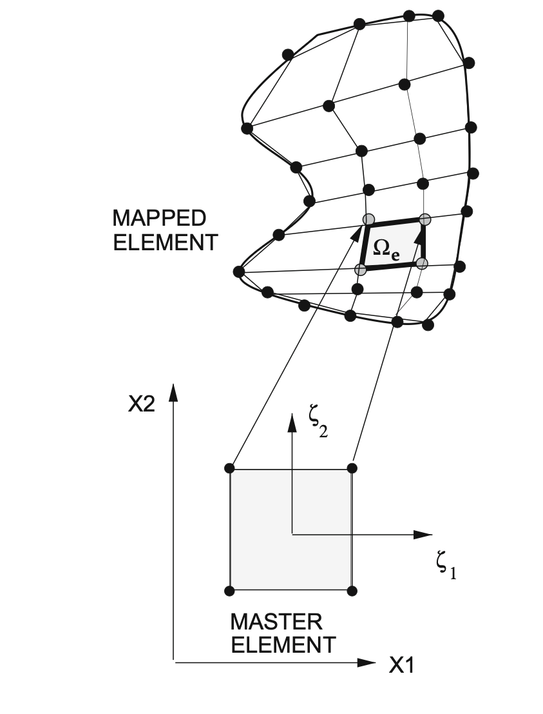
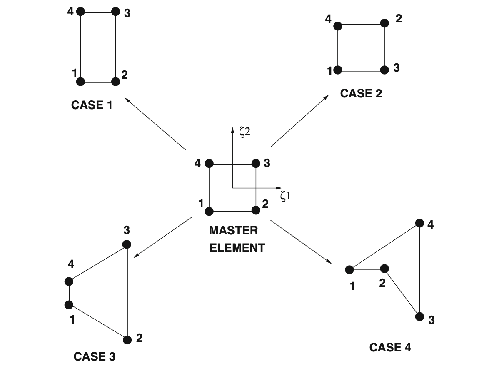
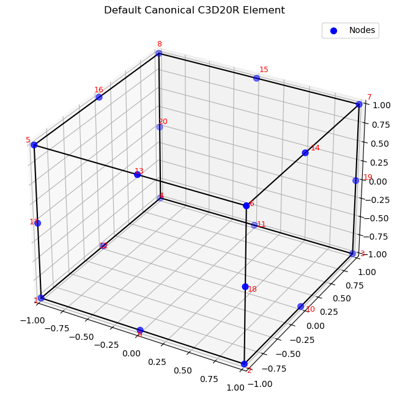
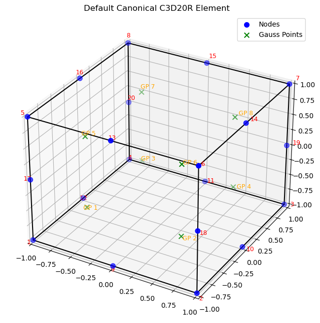
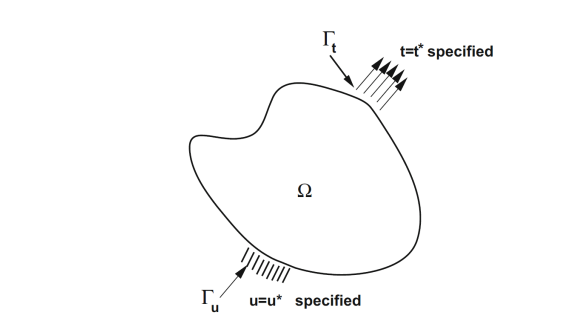
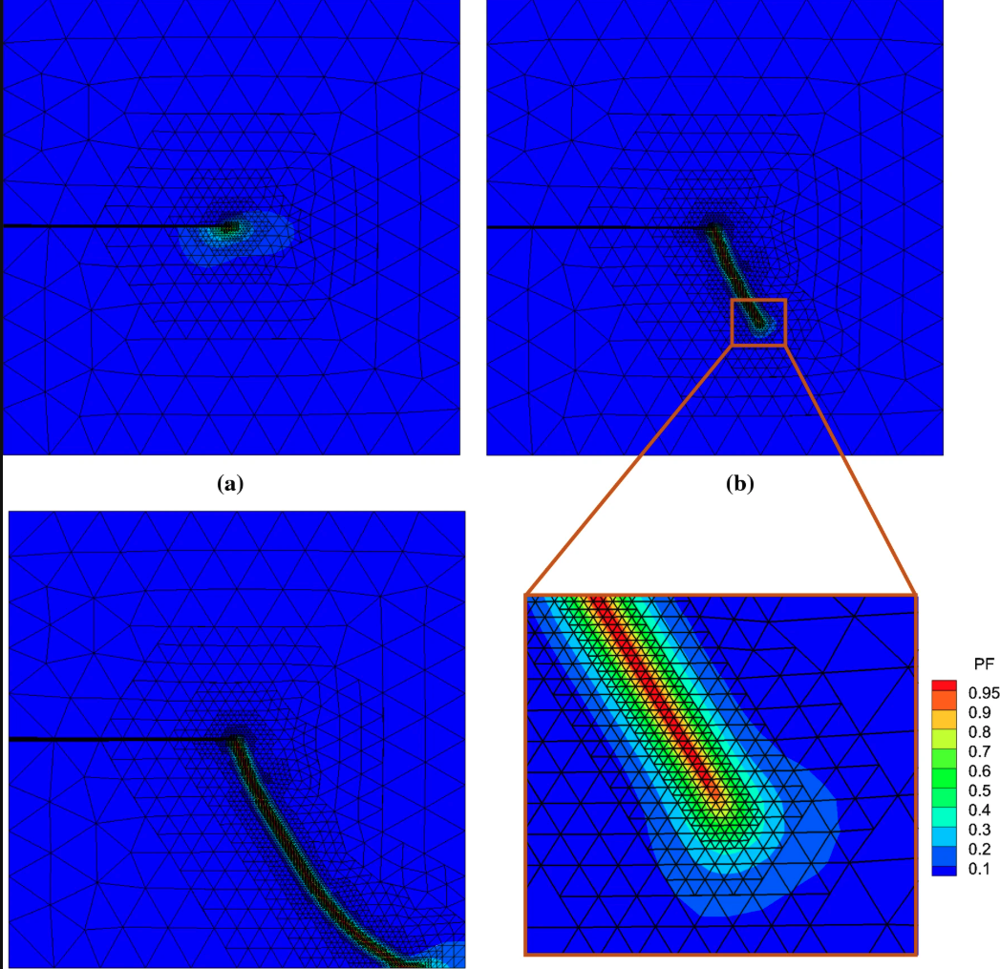

## Time Dependent 1D problems - Problem introduction { .scrollable .incremental .smaller auto-animate="true"}

In the following, we use the FEM methods for spatial discretization and the finite difference method for time discretization.

Consider the Balance of Linear momentum equation in 1D:
$$
\begin{aligned}
\text{grad} \cdot \sigma+f(x,t)&=\rho_0\frac{\partial^2u}{\partial t^2} \\
&=\rho_0\frac{\partial v}{\partial t} \\
&=\rho_0 a(x,t)
\end{aligned}
$$

where: 
- $\sigma(x,t)$ is the stress 

- $f(x,t)$ is the body force

- $\rho_0$ is the density

-  $u$ is the displacement

-  $v$ is the velocity

-  $a$ is the acceleration

## Time Dependent 1D problems - single point in space { .scrollable .incremental .smaller auto-animate="true"}

For a specific point in space, we can write the equation as:
$$
m\dot{v} = F = ma \quad (\text{I})
$$

where all the forces acting on the point are lumped into a single force $F$ and the mass is $m=\rho_0\Delta x$.

In the following, we will use the Taylor expansion around the time $t+\theta \Delta t$ to expand the quantities of interest at times $t$ and $t+\Delta t$
where $\theta$ is a parameter that can be chosen to optimize the time integration scheme.

* For the velocities:
$$
\begin{aligned}
v(t + \Delta t) &= v(t + \theta \Delta t) + \frac{dv}{dt}\bigg|_{t+\theta \Delta t} (1 - \theta) \Delta t + \frac{1}{2} \frac{d^2 v}{dt^2}\bigg|_{t+\theta \Delta t} (1 - \theta)^2 (\Delta t)^2 + O(\Delta t)^3 \quad (2.1)\\
v(t) &= v(t + \theta \Delta t) - \frac{dv}{dt}\bigg|_{t+\theta \Delta t} \theta \Delta t + \frac{1}{2} \frac{d^2 v}{dt^2}\bigg|_{t+\theta \Delta t} \theta^2 (\Delta t)^2 + O(\Delta t)^3 \quad (2.2)
\end{aligned}
$$

* For the position:
$$
\begin{aligned}
u(t + \Delta t) &= u(t + \theta \Delta t) + \frac{du}{dt}\bigg|_{t+\theta \Delta t} (1 - \theta) \Delta t + \frac{1}{2} \frac{d^2 u}{dt^2}\bigg|_{t+\theta \Delta t} (1 - \theta)^2 (\Delta t)^2 + O(\Delta t)^3 \quad (2.3) \\
u(t) &= u(t + \theta \Delta t) - \frac{du}{dt}\bigg|_{t+\theta \Delta t} \theta \Delta t + \frac{1}{2} \frac{d^2 u}{dt^2}\bigg|_{t+\theta \Delta t} \theta^2 (\Delta t)^2 + O(\Delta t)^3 \quad (2.4)
\end{aligned}
$$

* For the Force we obtain a weighted average of the forces at the two time steps:
$$
F(t+\theta \Delta t) = \theta F(t+\Delta t) + (1-\theta) F(t) \quad (2.5)
$$

* Substracting Equations (1) and (2) we obtain:

$$
\frac{dv}{dt}\bigg|_{t+\theta \Delta t} = \frac{v(t + \Delta t) - v(t)}{\Delta t} + \hat{O}(\Delta t) \quad (2.6)
$$

where $\hat{O}(\Delta t)$ is the error term that depends on the choice of $\theta$, for $\theta=1/2$ we obtain $\hat{O}=O(\Delta t)^2$ and otherwise we get $\hat{O}=O(\Delta t)$.

By using equation 6 and inserting it into equation (I) we obtain:
$$
v(t + \Delta t) = v(t) + \frac{\Delta t}{m} F(t + \theta \Delta t) + \hat{O}(\Delta t)^2 \quad (2.7)
$$

* If we take the weighted sum of (2.1) and (2.2) we obtain:
$$
v(t+\theta \Delta t) = \theta v(t+\Delta t) + (1-\theta) v(t) + O(\Delta t)^2 \quad (2.8)
$$

* We can do the same for the positions and obtain:

$$
\frac{u(t+\Delta t)-u(t)}{\Delta t} = v(t+\theta \Delta t) + \hat{O}(\Delta t) \quad (2.9)
$$

Which combined with equation (2.8) gives us:

$$
u(t + \Delta t) = u(t) + (\theta v(t + \Delta t) + (1 - \theta)v(t)) \Delta t + \hat{O}(\Delta t)^2 \quad (2.10)
$$

Now, we can use equations (2.10) and (2.7) to obtain 

$$
u(t + \Delta t) = u(t) + v(t) \Delta t + \frac{\theta (\Delta t)^2}{m} F(t + \theta \Delta t) + \hat{O}(\Delta t)^2 \quad(2.11)
$$


* When $\theta = 1$ we obtain an implicit integration scheme (backward Euler) and when $\theta = 0$ we obtain an explicit integration scheme (forward Euler).
* The backward Euler scheme is unconditionally stable, while the forward Euler scheme is conditionally stable and requires a small time step to ensure stability.
* For both we obtain $\hat{O}(\Delta t)^2 = O(\Delta t)^2$.
* For $\theta = 1/2$ we obtain the "midpoint"" rule which is unconditionally stable and $\hat{O}(\Delta t)^2 = O(\Delta t)^3$.

## Time Dependent 1D problems - FEM Formulation { .scrollable .incremental .smaller auto-animate="true"}

The continuum Equation we try to solve is:
$$
\rho_0\frac{\partial^2 u}{\partial t^2} = \rho_0\frac{\partial v}{\partial t} = \nabla \cdot \sigma + f(x,t) \quad (3.0)
$$

We will make our life easier by defining $F=\nabla \cdot \sigma + f(x,t)$

Using the equations we derived above we can reformulate the problem as 

$$
\rho_0v(t+\Delta t) = \rho_0v(t) + \Delta t(\theta F(t+\Delta t) + (1-\theta) F(t)) \quad (3.1)
$$

Multiplying by the test function and integrating by parts we obtain:
$$
\int_\Omega v \cdot \rho_0 v(t + \Delta t) \, d\Omega = \int_\Omega v \cdot \rho_0 v(t) \, d\Omega + \Delta t \int_\Omega v \cdot (\theta \Psi(t + \Delta t) + (1 - \theta) \Psi(t)) \, d\Omega \quad (3.2)
$$

And after applying the divergence theorem and enforing $v=0$ on the boundary we obtain:
$$
\begin{aligned}
\int_\Omega v \cdot \rho_0 v^{t+\Delta t} \, d\Omega &= \int_\Omega v \cdot \rho_0 v^{t} \, d\Omega \\
&+ \Delta t \theta \left( -\int_\Omega \nabla v : \sigma \, d\Omega + \int_{\Gamma_t} v \cdot (\sigma \cdot n) \, dA + \int_\Omega v \cdot f \, d\Omega \right)^{t+\Delta t} \\
&+ \Delta t (1 - \theta) \left( -\int_\Omega \nabla v : \sigma \, d\Omega + \int_{\Gamma_t} v \cdot t^* \, dA + \int_\Omega v \cdot f \, d\Omega \right)^{t} \qquad (3.3)
\end{aligned}
$$

Plugging in our shape function, and defining the standard matrices with $\{a\}$ being the coeeficients vector, we obtain:
$$
[M]\{a\}^{t+\Delta t} = [M]\{a\}^t + (\Delta t \theta) \left( -[K]\{a\}^{t+\Delta t} + \{R_f\}^{t+\Delta t} + \{R_t\}^{t+\Delta t} \right) \\
+ \Delta t (1 - \theta) \left( -[K]\{a\}^t + \{R_f\}^t + \{R_t\}^t \right) \qquad (3.4)
$$
where we use 
$$
\{a\}^{t+\Delta t} = \{a\}^{t}+\Delta t (\theta \{\dot{a}\})^{t+\Delta t} + (1 - \theta) \{\dot{a}\}^{t} \qquad (3.5)
$$

* For $\theta=1$ we get the implicit backward Euler scheme:
$$
\left( [M]\{\ddot{a}\}^{t+\Delta t} + \Delta t [K]\{a\}^{t+\Delta t} \right) = [M]\{\ddot{a}\}^t + \Delta t \left( \{R_t\}^{t+\Delta t} + \{R_f\}^{t+\Delta t} \right) \qquad (3.6)
$$
where we use 
$$
\{a\}^{t+\Delta t} = \{a\}^{t}+\Delta t (\{\dot{a}\})^{t+\Delta t}  \qquad (3.7)
$$

* For $\theta=0$ we get the explicit forward Euler scheme:
$$
\{ȧ\}^{t+\Delta t} = \{ȧ\}^t + \Delta t [M]^{-1} \left( -[K]\{a\}^t + \{R_f\}^t + \{R_t\}^t \right) \qquad (3.8)
$$
where we use
$$
\{a\}^{t+\Delta t} = \{a\}^t + \Delta t \{\dot{a}\}^t \qquad (3.9)
$$


## Some Mathematical preliminaries { .scrollable .incremental .smaller auto-animate="true"}

Looking at the following equation:
$$
div(\mathbf{K}\cdot grad(T)) 
$$

if $\mathbf{K}$ is a constant multiplied bu the identity matrix, we can write it as:
$$
div(\mathbf{K}\cdot grad(T))  = div(\mathbf{K} \left [\frac{\partial T}{\partial x} \mathbf{e}_1 +\frac{\partial T}{\partial y} \mathbf{e}_2+\frac{\partial T}{\partial z} \mathbf{e}_3 \right ]) = \mathbf{K} \left ( \frac{\partial^2 T}{\partial x^2}+\frac{\partial^2 T}{\partial y^2}+\frac{\partial^2 T}{\partial z^2} \right) = \mathbf{K}\nabla^2T \qquad 
$$

* Temperature as a scalar field:

$$
T \text{ - Scalar} \Rightarrow \text{grad}(T) = \left(\frac{\partial T}{\partial x}\mathbf{e_1} + \frac{\partial T}{\partial y}\mathbf{e_2} + \frac{\partial T}{\partial z}\mathbf{e_3}\right) \text{ - vector}
$$

* Conductivity matrix operation:

$$
\mathbf{K} \cdot \text{grad}(T) = \begin{bmatrix} K_{11} & K_{12} & K_{13} \\ K_{21} & K_{22} & K_{23} \\ K_{31} & K_{32} & K_{33} \end{bmatrix} \text{transpose}\left(\left(\frac{\partial T}{\partial x}\mathbf{e_1} + \frac{\partial T}{\partial y}\mathbf{e_2} + \frac{\partial T}{\partial z}\mathbf{e_3}\right)\right)
$$

* Defining the heat flux vector:

Let's define $\mathbf{q} = -\mathbf{K} \cdot \text{grad}(T)$ as the heat flux vector.

Divergence of heat flux:

$$
\text{div}(\mathbf{q}) = \frac{\partial q_x}{\partial x} + \frac{\partial q_y}{\partial y} + \frac{\partial q_z}{\partial z}
$$

:::{.fragment}
What happens when we multiply the heat conduction equation by a test function V?

$$
\text{div}(\mathbf{K} \text{ grad}(T)) \cdot V = 
$$

This question leads us to the development of the weak form, which is essential for finite element methods.
:::

:::{.fragment}
To answer this, we need to use the **product rule for divergence**:

$$
\text{div}(V \mathbf{K} \text{ grad}(T)) = \text{grad}(V) \cdot \mathbf{K} \cdot \text{grad}(T) + V \text{ div}(\mathbf{K} \cdot \text{grad}(T))
$$

However, if $\mathbf{K}=k$ is constant, we can simplify this to:
$$
\text{div}(V \mathbf{K} \text{ grad}(T))=k\text{div}(V \text{ grad}(T))=k(\text{grad}(V) \cdot \text{grad}(T) + V \nabla^2(T))
$$

:::

:::{.fragment}

**Detailed Expansion**

Let's expand $\text{div}(V \mathbf{K} \text{ grad}(T))$ step by step:

$$\text{div}(V \mathbf{K} \text{ grad}(T)) = \frac{\partial}{\partial x}\left(V K \frac{\partial T}{\partial x}\right) + \frac{\partial}{\partial y}\left(V K \frac{\partial T}{\partial y}\right) + \frac{\partial}{\partial z}\left(V K \frac{\partial T}{\partial z}\right)$$

Applying the product rule to each term:

$$
= \frac{\partial V}{\partial x} K \frac{\partial T}{\partial x} + \frac{\partial V}{\partial y} K \frac{\partial T}{\partial y} + \frac{\partial V}{\partial z} K \frac{\partial T}{\partial z} + V K \frac{\partial^2 T}{\partial x^2} + V K \frac{\partial^2 T}{\partial y^2} + V K \frac{\partial^2 T}{\partial z^2}
$$

* We can group these terms into two parts:

* Gradient Terms:
$$
\text{grad}(V) \cdot \mathbf{K} \cdot \text{grad}(T) = \left(\frac{\partial V}{\partial x}, \frac{\partial V}{\partial y}, \frac{\partial V}{\partial z}\right) \cdot \mathbf{K} \cdot \left(\frac{\partial T}{\partial x}, \frac{\partial T}{\partial y}, \frac{\partial T}{\partial z}\right)
$$

* For constant K, this becomes:
$$
= K\left(\frac{\partial V}{\partial x} \frac{\partial T}{\partial x} + \frac{\partial V}{\partial y} \frac{\partial T}{\partial y} + \frac{\partial V}{\partial z} \frac{\partial T}{\partial z}\right) = A
$$

* Second Derivative Terms
$$
V \text{ div}(\mathbf{K} \cdot \text{grad}(T)) = V K \left(\frac{\partial^2 T}{\partial x^2} + \frac{\partial^2 T}{\partial y^2} + \frac{\partial^2 T}{\partial z^2}\right) = B
$$
:::

:::{.fragment}
**The Key Relationship**

From the product rule, we have:

$$
\text{div}(V \mathbf{K} \text{ grad}(T)) = A + B
$$

Therefore:
$$
B = \text{div}(V \mathbf{K} \text{ grad}(T)) - A
$$

Which gives us:
$$
\text{div}(\mathbf{K} \text{ grad}(T)) V = \text{div}(V \mathbf{K} \text{ grad}(T)) - \text{grad}(V) \cdot \mathbf{K} \cdot \text{grad}(T)
$$

:::

:::{.fragment}

**Physical Interpretation**

This mathematical identity is the foundation for:

1. **Integration by parts** in the weak formulation
2. **Converting strong form to weak form** in finite element methods
3. **Moving derivatives from the solution to the test function**

The term $\text{div}(V \mathbf{K} \text{ grad}(T))$ will become a boundary integral when integrated over the domain, while $\text{grad}(V) \cdot \mathbf{K} \cdot \text{grad}(T)$ becomes the bilinear form in the finite element formulation.

:::

:::{.fragment}
**Weak Form Foundation**

When integrated over a domain $\Omega$, this relationship becomes:

$$\int_\Omega V \text{ div}(\mathbf{K} \text{ grad}(T)) \, d\Omega = \int_\Omega \text{div}(V \mathbf{K} \text{ grad}(T)) \, d\Omega - \int_\Omega \text{grad}(V) \cdot \mathbf{K} \cdot \text{grad}(T) \, d\Omega$$

Using the divergence theorem, the first integral on the right becomes a boundary integral, leading to the standard weak form used in finite element analysis.
:::

## FEM in 2/3D { .scrollable .incremental .smaller auto-animate="true"}
**2D/3D Linear Heat Equation: Strong Form to Weak Form**

**Problem Setup**

**Governing equation:** $\text{div}(\mathbf{q}) = 0$
where we assumed that there is no source term for simplicity.

**Constitutive equation (Fourier's law):** $\mathbf{q} = -\mathbf{K} \cdot \text{grad}(T)$

**Boundary conditions:**
- $\Gamma_{T_0}: T = T_0$ (Essential BC)
- $\Gamma_{T_1}: T = T_1$ (Essential BC)  
- $\Gamma_q: \mathbf{q} = \mathbf{q}^*_n$ (Natural BC)

where $\mathbf{q}^*_n$ is the prescribed heat flux on the boundary $\Gamma_q$ in the direction of the (outwards) normal to the surface.

**Combined form:** $\text{div}(\mathbf{q}) = -\text{div}(\mathbf{K} \cdot \text{grad}(T)) = 0$

## Weak Form Derivation { .scrollable .incremental .smaller auto-animate="true"}

**Step 1:** Multiply by test function V and integrate over domain
$$\int_\Omega \text{div}(\mathbf{K} \cdot \text{grad}(T)) V \, d\Omega = 0$$

**Step 2:** Apply the product rule result
$$\int_\Omega \text{div}(V \mathbf{K} \cdot \text{grad}(T)) \, d\Omega - \int_\Omega \text{grad}(V) \cdot \mathbf{K} \cdot \text{grad}(T) \, d\Omega = 0$$

**Step 3:** Apply divergence theorem to first integral
$$\int_\Omega \text{div}(V \mathbf{K} \cdot \text{grad}(T)) \, d\Omega = \int_\Omega \text{div}(V \mathbf{q}) \, d\Omega = \int_{\partial\Omega} V \mathbf{q} \cdot \mathbf{n} \, d\Gamma$$

**Final weak form:**
$$\int_{\partial\Omega} V \mathbf{q} \cdot \mathbf{n} \, d\Gamma - \int_\Omega \text{grad}(V) \cdot \mathbf{K} \cdot \text{grad}(T) \, d\Omega = 0$$

**Finite element approximation:**
$$V_h = \sum_{i=1}^N b_i \phi_i(x,y), \quad T_h = \sum_{j=1}^N a_j \phi_j(x,y) \Rightarrow \{a_j\}$$

---

## 2D/3D Finite Elements: Geometry and Shape Functions { .scrollable .incremental .smaller auto-animate="true"}

### Transition from 1D to 2D/3D

**Key differences:**

- **1D:** Geometric description is simpler - element domain is simply a line

- **2D/3D:** Geometry plays a crucial role and complexity increases significantly

**Most common finite element geometries:**

- **2D:** Triangular elements & Rectangular elements

- **3D:** Tetrahedron elements & Hexahedron elements

### 2D Rectangular Elements: Linear Shape Functions

**Design requirements for shape functions:**

- **Simplicity:** Describe change in the element's domain with minimal complexity

- **Local support:** Each shape function corresponds to one node, value of "1" at one node, "0" at all other nodes 


**1D analogy:** $u^e = a_i \phi_i^g + a_{i+1} \phi_{i+1}^g$ (where $u^e \in [x_i, x_{i+1}]$)

**2D extension:** For a linear rectangular element, we need **four shape functions** to describe $u^e$

### Rectangular Element with Linear Shape Functions

Consider a rectangular element with nodes numbered as follows:

```
4 ────── 3
│        │  b
│   ue   │
│        │
1 ────── 2
    a
```

**Shape functions for specific rectangular element:**
$$\phi_1^g = \frac{1}{ab}(a-x)(b-y)$$
$$\phi_2^g = \frac{1}{ab}x(b-y)$$
$$\phi_3^g = \frac{1}{ab}xy$$
$$\phi_4^g = \frac{1}{ab}(a-x)y$$

**Verification :**
- $\phi_1^g(0,0) = 1$, $\phi_1^g(a,0) = 0$, $\phi_1^g(0,b) = 0$, $\phi_1^g(a,b) = 0$ ✓
    
- $\phi_2^g(0,0) = 0$, $\phi_2^g(a,0) = 1$, $\phi_2^g(0,b) = 0$, $\phi_2^g(a,b) = 0$ ✓

**Element solution:** $u^e = a_1 \phi_1^g + a_2 \phi_2^g + a_3 \phi_3^g + a_4 \phi_4^g = u^e(x,y)$

---

## Master Element Concept in 2D { .scrollable .incremental .smaller auto-animate="true"}

### Mapping to Master Element

**Purpose:** Map general elements to a standardized **master element** for easier computation

**Coordinate transformation:** $[x,y] \rightarrow [\zeta_1, \zeta_2] \in [-1,1] \times [-1,1]$

**Master element node numbering convention:**
```
4 ────── 3   ζ₂
│        │    ↑
│        │    │
│        │    │
1 ────── 2    └─→ ζ₁
```

**Master element shape functions:**
$$\hat{\phi}_1 = \phi_1^e(\zeta_1, \zeta_2) = \frac{1}{4}(1-\zeta_1)(1-\zeta_2)$$
$$\hat{\phi}_2 = \phi_2^e(\zeta_1, \zeta_2) = \frac{1}{4}(1+\zeta_1)(1-\zeta_2)$$
$$\hat{\phi}_3 = \phi_3^e(\zeta_1, \zeta_2) = \frac{1}{4}(1+\zeta_1)(1+\zeta_2)$$
$$\hat{\phi}_4 = \phi_4^e(\zeta_1, \zeta_2) = \frac{1}{4}(1-\zeta_1)(1+\zeta_2)$$

## Symbolic Workbench: Reference Elements & 2D Local Tensors { .scrollable .incremental .smaller auto-animate="true"}

```{python}
#| code-fold: true
#| echo: fenced
import sys, os; sys.path.insert(0, os.path.abspath(".."))
import sympy as sp
from IPython.display import Math, display
from symbolic_fem_workbench import (
    ReferenceTriangleP1, ReferenceQuadrilateralQ1, AffineTriangleMap2D,
    build_poisson_triangle_p1_local_problem,
    grad_2d, pullback_gradient_2d,
)

xi, eta = sp.symbols("xi eta")

# Show Q1 quad shape functions from the workbench
quad = ReferenceQuadrilateralQ1(xi, eta)
print("Q1 Quadrilateral shape functions from the workbench:")
for i, N in enumerate(quad.shape_functions):
    display(Math(f"N_{i+1} = " + sp.latex(N)))
print("Partition of unity:", sp.simplify(sum(quad.shape_functions)))

# Show P1 triangle
tri = ReferenceTriangleP1(xi, eta)
print("\nP1 Triangle shape functions:")
for i, N in enumerate(tri.shape_functions):
    display(Math(f"N_{i+1} = " + sp.latex(N)))
```

## Symbolic Workbench: Gradient Pullback & P1 Stiffness { .scrollable .incremental .smaller auto-animate="true"}

```{python}
#| code-fold: true
#| echo: fenced
# Affine mapping and gradient pullback
x1, y1, x2, y2, x3, y3 = sp.symbols("x1 y1 x2 y2 x3 y3", real=True)
geom = AffineTriangleMap2D(xi=xi, eta=eta, x1=x1, y1=y1, x2=x2, y2=y2, x3=x3, y3=y3)

print("Jacobian J:")
display(Math(r"J = " + sp.latex(geom.jacobian)))
print("Inverse transpose J^{-T} (for gradient pullback):")
display(Math(r"J^{-T} = " + sp.latex(geom.inverse_transpose_jacobian)))

# Full P1 triangle local problem
data = build_poisson_triangle_p1_local_problem()
print("\nLocal stiffness matrix Ke for unit right triangle:")
display(Math(r"K_e = " + sp.latex(data["Ke_unit_right_triangle"])))
print("Local load vector fe (constant source f):")
display(Math(r"f_e = " + sp.latex(data["fe_unit_right_triangle"])))
```

**Bi-linear nature:** Each $\hat{\phi}_i$ equals "1" at the $i$-th node and "0" at other nodes, creating **bi-linear** shape functions.

**Example expansion:** $\hat{\phi}_1 = \frac{1}{4}(1-\zeta_1)(1-\zeta_2) = \frac{1}{4}(1-\zeta_1-\zeta_2+\zeta_1\zeta_2)$

The term $\zeta_1\zeta_2$ makes it bi-linear (linear in both coordinates).

:::{.fragment}
{width="50%"}
:::

---

## Jacobian and Coordinate Transformation { .scrollable .incremental .smaller auto-animate="true"}

### Jacobian Matrix

**Definition:**
$$\mathbf{F} = \begin{bmatrix} \frac{\partial x}{\partial \zeta_1} & \frac{\partial x}{\partial \zeta_2} \\ \frac{\partial y}{\partial \zeta_1} & \frac{\partial y}{\partial \zeta_2} \end{bmatrix}, \quad J = \text{Det}(\mathbf{F}) = \frac{\partial x}{\partial \zeta_1}\frac{\partial y}{\partial \zeta_2} - \frac{\partial x}{\partial \zeta_2}\frac{\partial y}{\partial \zeta_1}$$

**Critical requirement:** $J > 0$ throughout the element for a "good" mapping

### Global to Local Mapping

we will use **isoparametric** mapping, where the same shape functions are used for both geometry and field variables.

**Coordinate transformation:**
$$x (\chi_1,\chi_2)= \sum_{i=1}^4 \chi_{1i} \hat{\phi}_i = \chi_{11}\hat{\phi}_1 + \chi_{12}\hat{\phi}_2 + \chi_{13}\hat{\phi}_3 + \chi_{14}\hat{\phi}_4$$
$$y(\chi_1, \chi_2) = \sum_{i=1}^4 \chi_{2i} \hat{\phi}_i$$

Where $\chi_{1i}$ are global x-coordinates and $\chi_{2i}$ are global y-coordinates of element nodes.

---

## Element Quality: Good vs Bad Elements { .scrollable .incremental .smaller auto-animate="true"}
::::{.columns}
:::{.column width="50%"}

### Acceptable Elements

**Case 1 - Rectangular element:** $0 < J(\zeta_1, \zeta_2) < \infty$ throughout element
- Jacobian is constant
- ✅ **Acceptable**

**Case 3 - Distorted but convex:** $0 < J(\zeta_1, \zeta_2) < \infty$ throughout element  
- Jacobian varies but remains positive and bounded
- ✅ **Acceptable**

### Unacceptable Elements

**Case 2 - Incorrect node numbering:** $J(\zeta_1, \zeta_2) < 0$ throughout element
- Nodes numbered incorrectly, turning element "inside out"
- ❌ **Unacceptable**

**Case 4 - Partially negative Jacobian:** $J(\zeta_1, \zeta_2) < 0$ in some regions
- Can cause singularities in stiffness matrix
- ❌ **Unacceptable**
:::

::: {.column width="50%"}


:::
::::


**Key insight for linear elements:** The primary indicator of problematic elements is **non-convexity**, even with correct numbering.

---

## Bookkeeping in 2D Finite Elements { .scrollable .incremental .smaller auto-animate="true"}

### Difference from 1D

**1D:** Node numbering is intuitive and element connectivity is straightforward

```
1 ── 2 ── 3 ── 4 ── 5 ── 6 ── 7 ── 8 ── 9
```

**2D:** More complex connectivity patterns require systematic bookkeeping

### Element Connectivity Tables

**Element-to-node connectivity:**

| Element | Node 1 | Node 2 | Node 3 | Node 4 |
|---------|--------|--------|--------|--------|
| 1       | 20     | 21     | 2      | 1      |
| 2       | 21     | 22     | 3      | 2      |

**Node coordinate table:**

| Node | X-coord | Y-coord |
|------|---------|---------|
| 1    | X₁      | Y₁      |
| 2    | X₂      | Y₂      |
| ...  | ...     | ...     |

**Importance:** Essential for assembling the global stiffness matrix $[K_{ij}^g]$ and load vector $\{F_i^g\}$, and for enforcing boundary conditions.

---

## Shape Functions: Differential Properties { .scrollable .incremental .smaller auto-animate="true"}

### Coordinate Transformation Relations

**Forward transformation (ζ → x):**
$$\frac{\partial}{\partial \zeta_1} = \frac{\partial}{\partial x}\frac{\partial x}{\partial \zeta_1} + \frac{\partial}{\partial y}\frac{\partial y}{\partial \zeta_1}$$

$$\frac{\partial}{\partial \zeta_2} = \frac{\partial}{\partial x}\frac{\partial x}{\partial \zeta_2} + \frac{\partial}{\partial y}\frac{\partial y}{\partial \zeta_2}$$

**Inverse transformation (x → ζ):**

$$\frac{\partial}{\partial x} = \frac{\partial}{\partial \zeta_1}\frac{\partial \zeta_1}{\partial x} + \frac{\partial}{\partial \zeta_2}\frac{\partial \zeta_2}{\partial x}$$

$$\frac{\partial}{\partial y} = \frac{\partial}{\partial \zeta_1}\frac{\partial \zeta_1}{\partial y} + \frac{\partial}{\partial \zeta_2}\frac{\partial \zeta_2}{\partial y}$$

**Matrix form:**

$$\begin{bmatrix} dx \\ dy \end{bmatrix} = \mathbf{F} \begin{bmatrix} d\zeta_1 \\ d\zeta_2 \end{bmatrix}, \quad \begin{bmatrix} d\zeta_1 \\ d\zeta_2 \end{bmatrix} = \mathbf{F}^{-1} \begin{bmatrix} dx \\ dy \end{bmatrix}$$

### Gradient Calculation in Master Element

**For test function V:**

$$\text{grad}(V) = \begin{bmatrix} \frac{\partial V}{\partial x} \\ \frac{\partial V}{\partial y} \end{bmatrix} = \begin{bmatrix} \frac{\partial \zeta_1}{\partial x} & \frac{\partial \zeta_2}{\partial x} \\ \frac{\partial \zeta_1}{\partial y} & \frac{\partial \zeta_2}{\partial y} \end{bmatrix}^T \begin{bmatrix} \frac{\partial V}{\partial \zeta_1} \\ \frac{\partial V}{\partial \zeta_2} \end{bmatrix}$$

**For temperature field T:**

$$\text{grad}(T) = \begin{bmatrix} \frac{\partial T}{\partial x} \\ \frac{\partial T}{\partial y} \end{bmatrix} = \begin{bmatrix} \frac{\partial \zeta_1}{\partial x} & \frac{\partial \zeta_2}{\partial x} \\ \frac{\partial \zeta_1}{\partial y} & \frac{\partial \zeta_2}{\partial y} \end{bmatrix}^T \begin{bmatrix} \frac{\partial T}{\partial \zeta_1} \\ \frac{\partial T}{\partial \zeta_2} \end{bmatrix}$$

---

## Extension to 3D Vector Problems { .scrollable .incremental .smaller auto-animate="true"}

### Linear Elasticity Example

**Governing equation:** $\text{div}(\boldsymbol{\sigma}) + \mathbf{f} = 0$

**Constitutive relation:** $\boldsymbol{\sigma} = \mathbf{E} \cdot \boldsymbol{\varepsilon} = \mathbf{E} \cdot \text{grad}^s(\mathbf{u})$

**Divergence theorem in 3D:**
$$\int_\Omega \text{div}(\boldsymbol{\sigma}) \, d\Omega = \int_{\partial\Omega} \boldsymbol{\sigma} \cdot \mathbf{n} \, da$$

**Key extensions for 3D:**

- **Vector unknowns:** Displacement field $\mathbf{u} = [u_x, u_y, u_z]^T$

- **Matrix operations:** Stress and strain tensors

- **Global/local transformations:** More complex connectivity

- **Vector problem connectivity:** Multiple DOFs per node

---

## 3D element example { .scrollable .incremental .smaller auto-animate="true"}

:::{.fragment}

:::

:::{.fragment}

:::

:::{.fragment}

:::

---

## The B Matrix: Relating Nodal Values to Field Gradients{ .scrollable .incremental .smaller auto-animate="true"}

In the Finite Element Method, we approximate a continuous field (like temperature T or displacement u) within an element using shape functions $N_j$ and nodal values. For example, the temperature T(x,y) at any point within an element can be approximated as:

$$T(x,y) \approx \sum_{j=1}^{n_{\text{nodes}}} N_j(x,y) a_j = \mathbf{N} \mathbf{a}^e$$

where $N_j(x,y)$ are the shape functions, $a_j$ are the nodal temperatures for the element, $\mathbf{N}$ is the row vector of shape functions, and $\mathbf{a}^e$ is the column vector of nodal temperatures for the element.

The physical behavior of the system (e.g., heat flux, stress/strain) often depends on the gradient of this field. The B matrix is a cornerstone of FEM as it directly relates the nodal values of an element to the gradient of the field (or its derivatives) within that element.

## For Scalar Field Problems (e.g., Heat Conduction) { .scrollable .incremental .smaller auto-animate="true"}


In heat conduction, the heat flux $\mathbf{q}$ is related to the temperature gradient $\text{grad}(T)$ by Fourier's Law: $\mathbf{q} = -\mathbf{K} \cdot \text{grad}(T)$. 

The weak form integral that leads to the stiffness matrix, $\int_{\Omega^e} \text{grad}(V) \cdot \mathbf{K} \cdot \text{grad}(T) \, d\Omega$, requires evaluating these gradients.

:::{.fragment}

Let $T = \mathbf{N} \mathbf{a}^e$. The temperature gradient in 2D is:

$$\text{grad}(T) = \begin{Bmatrix} \frac{\partial T}{\partial x} \\ \frac{\partial T}{\partial y} \end{Bmatrix} = \begin{Bmatrix} \frac{\partial(\sum N_j a_j)}{\partial x} \\ \frac{\partial(\sum N_j a_j)}{\partial y} \end{Bmatrix} = \sum_{j=1}^{n_{\text{nodes}}} \begin{bmatrix} \frac{\partial N_j}{\partial x} \\ \frac{\partial N_j}{\partial y} \end{bmatrix} a_j$$
:::

:::{.fragment}
This can be written in matrix form as:

$$\text{grad}(T) = \mathbf{B} \mathbf{a}^e$$
:::

:::{.fragment}
Where the B matrix for a 2D scalar problem (like heat conduction) for an element with $n_{\text{nodes}}$ is:

$$\mathbf{B} = \begin{bmatrix} 
\frac{\partial N_1}{\partial x} & \frac{\partial N_2}{\partial x} & \ldots & \frac{\partial N_{n_{\text{nodes}}}}{\partial x} \\
\frac{\partial N_1}{\partial y} & \frac{\partial N_2}{\partial y} & \ldots & \frac{\partial N_{n_{\text{nodes}}}}{\partial y}
\end{bmatrix}$$


Each column j of the B matrix corresponds to node j and contains the partial derivatives of its shape function $N_j$ with respect to the global coordinates. For a 3D scalar problem, another row for $\frac{\partial N_j}{\partial z}$ would be added.
:::

---

## Role in Element Stiffness Matrix: { .scrollable .incremental .smaller auto-animate="true"}

The element stiffness matrix for heat conduction, derived from the weak form, is given by:

$$[\mathbf{k}^e] = \int_{\Omega^e} \mathbf{B}^T \mathbf{K} \mathbf{B} \, d\Omega$$

Here, $\mathbf{K}$ is the material property matrix (thermal conductivity tensor). For an isotropic material in 2D with scalar conductivity k, $\mathbf{K} = \begin{bmatrix} k & 0 \\ 0 & k \end{bmatrix}$. The integration is performed over the volume (or area in 2D) of the element $\Omega^e$.

:::{.fragment}

### Calculation of B Matrix using Master Element Coordinates:

Shape functions $N_j$ are typically defined in local (master element) coordinates $(\zeta_1, \zeta_2)$ (often denoted $\xi, \eta$). Their derivatives with respect to global coordinates (x,y) are found using the chain rule and the Jacobian matrix $\mathbf{F}$ of the coordinate transformation:

$$\begin{Bmatrix} \frac{\partial N_j}{\partial x} \\ \frac{\partial N_j}{\partial y} \end{Bmatrix} = \mathbf{F}^{-T} \begin{Bmatrix} \frac{\partial N_j}{\partial \zeta_1} \\ \frac{\partial N_j}{\partial \zeta_2} \end{Bmatrix}$$

:::

:::{.fragment}
where $\mathbf{F}^{-T}$ is the inverse transpose of the Jacobian matrix $\mathbf{F}$, defined as:

where $\mathbf{F}^{-T} = (\mathbf{F}^{-1})^T$. 

The Jacobian matrix $\mathbf{F}$ is defined as $\mathbf{F} = \begin{bmatrix} \frac{\partial x}{\partial \zeta_1} & \frac{\partial x}{\partial \zeta_2} \\ \frac{\partial y}{\partial \zeta_1} & \frac{\partial y}{\partial \zeta_2} \end{bmatrix}$. 

The derivatives $\frac{\partial N_j}{\partial \zeta_1}$ and $\frac{\partial N_j}{\partial \zeta_2}$ are easily computed from the master element shape function definitions. The components of $\mathbf{F}^{-T}$ depend on the specific element geometry.
:::

---

## For Vector Field Problems (e.g., Elasticity) { .scrollable .incremental .smaller auto-animate="true"}

The concept of the B matrix is fundamental in structural mechanics (elasticity), where it relates nodal displacements to strains within an element.

The displacement field $\mathbf{u}$ is approximated as $\mathbf{u} = \mathbf{N} \mathbf{d}^e$, where $\mathbf{d}^e$ is the vector of all nodal displacements for the element, and $\mathbf{N}$ is the matrix of shape functions arranged appropriately for a vector field.

 The strain $\boldsymbol{\varepsilon}$ is obtained by differentiating the displacement field: $\boldsymbol{\varepsilon} = \mathbf{L} \mathbf{u}$, where $\mathbf{L}$ is a differential operator matrix. Combining these gives:

$$\boldsymbol{\varepsilon} = \mathbf{L}(\mathbf{N} \mathbf{d}^e) = (\mathbf{L} \mathbf{N}) \mathbf{d}^e = \mathbf{B} \mathbf{d}^e$$

The B matrix in elasticity thus contains derivatives of shape functions. The element stiffness matrix is then computed as:

$$[\mathbf{k}^e] = \int_{\Omega^e} \mathbf{B}^T \mathbf{D} \mathbf{B} \, d\Omega$$

where $\mathbf{D}$ is the material elasticity matrix (constitutive matrix relating stress to strain).

## B Matrix for 2D Elasticity (Plane Stress / Plane Strain) { .scrollable .incremental .smaller auto-animate="true"}

For a 2D elasticity problem, the displacement at any point within an element is $\mathbf{u}(x,y) = \begin{Bmatrix} u(x,y) \\ v(x,y) \end{Bmatrix}$.

The nodal displacement vector for a node i is $\mathbf{d}_i = \begin{Bmatrix} u_i \\ v_i \end{Bmatrix}$.

The displacement field is interpolated as:

$$\begin{Bmatrix} u \\ v \end{Bmatrix} = \sum_{i=1}^{n_{\text{nodes}}} \begin{bmatrix} N_i(x,y) & 0 \\ 0 & N_i(x,y) \end{bmatrix} \begin{Bmatrix} u_i \\ v_i \end{Bmatrix}$$

$$\boldsymbol{\varepsilon} = \begin{Bmatrix} \varepsilon_x \\ \varepsilon_y \\ \gamma_{xy} \end{Bmatrix} = \begin{Bmatrix} \frac{\partial u}{\partial x} \\ \frac{\partial v}{\partial y} \\ \frac{\partial u}{\partial y} + \frac{\partial v}{\partial x} \end{Bmatrix}$$

$$\mathbf{B}_i = \begin{bmatrix}
\frac{\partial N_i}{\partial x} & 0 \\
0 & \frac{\partial N_i}{\partial y} \\
\frac{\partial N_i}{\partial y} & \frac{\partial N_i}{\partial x}
\end{bmatrix}$$

$$\mathbf{B} = [\mathbf{B}_1 \quad \mathbf{B}_2 \quad \ldots \quad \mathbf{B}_{n_{\text{nodes}}}]$$

So, if an element has $n_{\text{nodes}}$ nodes, the B matrix will have 3 rows (for $\varepsilon_x, \varepsilon_y, \gamma_{xy}$) and $2 \times n_{\text{nodes}}$ columns.

## B Matrix for 3D Elasticity { .scrollable .incremental .smaller auto-animate="true"}

For a 3D elasticity problem, the displacement at any point is $\mathbf{u}(x,y,z) = \begin{Bmatrix} u(x,y,z) \\ v(x,y,z) \\ w(x,y,z) \end{Bmatrix}$.

The nodal displacement vector for node i is $\mathbf{d}_i = \begin{Bmatrix} u_i \\ v_i \\ w_i \end{Bmatrix}$.

The displacement field is interpolated as:

$$\begin{Bmatrix} u \\ v \\ w \end{Bmatrix} = \sum_{i=1}^{n_{\text{nodes}}} \begin{bmatrix} N_i(x,y,z) & 0 & 0 \\ 0 & N_i(x,y,z) & 0 \\ 0 & 0 & N_i(x,y,z) \end{bmatrix} \begin{Bmatrix} u_i \\ v_i \\ w_i \end{Bmatrix}$$

The strain vector (engineering strains) in 3D is:

$$\boldsymbol{\varepsilon} = \begin{Bmatrix} \varepsilon_x \\ \varepsilon_y \\ \varepsilon_z \\ \gamma_{xy} \\ \gamma_{yz} \\ \gamma_{zx} \end{Bmatrix} = \begin{Bmatrix}
\frac{\partial u}{\partial x} \\
\frac{\partial v}{\partial y} \\
\frac{\partial w}{\partial z} \\
\frac{\partial u}{\partial y} + \frac{\partial v}{\partial x} \\
\frac{\partial v}{\partial z} + \frac{\partial w}{\partial y} \\
\frac{\partial w}{\partial x} + \frac{\partial u}{\partial z}
\end{Bmatrix}$$

For each node, its contribution to the strain is through. The matrix relates the strains to the nodal displacements of node:

$$\mathbf{B}_i = \begin{bmatrix}
\frac{\partial N_i}{\partial x} & 0 & 0 \\
0 & \frac{\partial N_i}{\partial y} & 0 \\
0 & 0 & \frac{\partial N_i}{\partial z} \\
\frac{\partial N_i}{\partial y} & \frac{\partial N_i}{\partial x} & 0 \\
0 & \frac{\partial N_i}{\partial z} & \frac{\partial N_i}{\partial y} \\
\frac{\partial N_i}{\partial z} & 0 & \frac{\partial N_i}{\partial x}
\end{bmatrix}$$

The full element B matrix is assembled as $\mathbf{B} = [\mathbf{B}_1 \quad \mathbf{B}_2 \quad \ldots \quad \mathbf{B}_{n_{\text{nodes}}}]$.

If an element has $n_{\text{nodes}}$ nodes, the B matrix will have 6 rows and $3 \times n_{\text{nodes}}$ columns. The derivatives $\frac{\partial N_i}{\partial x}$, $\frac{\partial N_i}{\partial y}$, and $\frac{\partial N_i}{\partial z}$ are again found using the Jacobian transformation from the master element coordinates.

## Key Takeaway (B Matrix) { .scrollable .incremental .smaller auto-animate="true"}

The B matrix is a crucial component in finite element analysis. 

It contains the spatial derivatives of the element shape functions, effectively translating the discrete nodal degrees of freedom into continuous gradient fields (like temperature gradients) or deformation measures (like mechanical strains) within an element. 

This matrix is essential for forming the element stiffness matrix and, consequently, for solving the overall system of equations that describes the physical problem. 

The components of B are generally functions of position within the element (unless using simple elements like constant strain triangles), and are evaluated numerically during the integration process to form the element stiffness matrix.

## Shape Functions: Differential Properties { .scrollable .incremental .smaller auto-animate="true"}

To evaluate terms like $\text{grad}(V)$ and $\text{grad}(T)$ in the weak form, we need the derivatives of shape functions (and consequently, field variables) with respect to global coordinates (x,y).

However, shape functions $N(\zeta_1, \zeta_2)$ are defined in the master element coordinates $(\zeta_1, \zeta_2)$. 

We use the chain rule and the Jacobian of the coordinate mapping to transform these derivatives.

:::{.fragment}

### Coordinate Transformation and the Jacobian Matrix

Recall the isoparametric mapping from master coordinates $(\zeta_1, \zeta_2)$ to global coordinates (x,y):

$$x = \sum_{i=1}^{n_{\text{nodes}}} N_i(\zeta_1, \zeta_2) x_i$$
$$y = \sum_{i=1}^{n_{\text{nodes}}} N_i(\zeta_1, \zeta_2) y_i$$

The Jacobian matrix of this transformation is:

$$\mathbf{F} = \begin{bmatrix} \frac{\partial x}{\partial \zeta_1} & \frac{\partial x}{\partial \zeta_2} \\ \frac{\partial y}{\partial \zeta_1} & \frac{\partial y}{\partial \zeta_2} \end{bmatrix}$$

The determinant of this matrix, $J = \det(\mathbf{F})$, is used in changing variables for integration: $dx \, dy = J \, d\zeta_1 \, d\zeta_2$.

Differentials are related by:

$$\begin{Bmatrix} dx \\ dy \end{Bmatrix} = \mathbf{F} \begin{Bmatrix} d\zeta_1 \\ d\zeta_2 \end{Bmatrix}$$

$$\begin{Bmatrix} d\zeta_1 \\ d\zeta_2 \end{Bmatrix} = \mathbf{F}^{-1} \begin{Bmatrix} dx \\ dy \end{Bmatrix}$$

$$\mathbf{F}^{-1} = \begin{bmatrix} \frac{\partial \zeta_1}{\partial x} & \frac{\partial \zeta_1}{\partial y} \\ \frac{\partial \zeta_2}{\partial x} & \frac{\partial \zeta_2}{\partial y} \end{bmatrix}$$
:::

::::{.fragment}

### Transformation of Derivatives

We need to express derivatives with respect to global coordinates (x,y) in terms of derivatives with respect to master coordinates $(\zeta_1, \zeta_2)$, since our shape functions $N_i$ are given as $N_i(\zeta_1, \zeta_2)$.

Consider a function $V(\zeta_1, \zeta_2)$. Its derivatives with respect to $\zeta_1$ and $\zeta_2$ can be related to its derivatives with respect to x and y using the chain rule:

$$\frac{\partial V}{\partial \zeta_1} = \frac{\partial V}{\partial x} \frac{\partial x}{\partial \zeta_1} + \frac{\partial V}{\partial y} \frac{\partial y}{\partial \zeta_1}$$

$$\frac{\partial V}{\partial \zeta_2} = \frac{\partial V}{\partial x} \frac{\partial x}{\partial \zeta_2} + \frac{\partial V}{\partial y} \frac{\partial y}{\partial \zeta_2}$$

$$\begin{Bmatrix} \frac{\partial V}{\partial \zeta_1} \\ \frac{\partial V}{\partial \zeta_2} \end{Bmatrix} = \begin{bmatrix} \frac{\partial x}{\partial \zeta_1} & \frac{\partial y}{\partial \zeta_1} \\ \frac{\partial x}{\partial \zeta_2} & \frac{\partial y}{\partial \zeta_2} \end{bmatrix} \begin{Bmatrix} \frac{\partial V}{\partial x} \\ \frac{\partial V}{\partial y} \end{Bmatrix} = \mathbf{F}^T \begin{Bmatrix} \frac{\partial V}{\partial x} \\ \frac{\partial V}{\partial y} \end{Bmatrix}$$

$$\begin{Bmatrix} \frac{\partial V}{\partial x} \\ \frac{\partial V}{\partial y} \end{Bmatrix} = (\mathbf{F}^T)^{-1} \begin{Bmatrix} \frac{\partial V}{\partial \zeta_1} \\ \frac{\partial V}{\partial \zeta_2} \end{Bmatrix} = \mathbf{F}^{-T} \begin{Bmatrix} \frac{\partial V}{\partial \zeta_1} \\ \frac{\partial V}{\partial \zeta_2} \end{Bmatrix}$$

$$\mathbf{F}^{-T} = \left(\begin{bmatrix} \frac{\partial x}{\partial \zeta_1} & \frac{\partial x}{\partial \zeta_2} \\ \frac{\partial y}{\partial \zeta_1} & \frac{\partial y}{\partial \zeta_2} \end{bmatrix}\right)^T = \begin{bmatrix} \frac{\partial x}{\partial \zeta_1} & \frac{\partial y}{\partial \zeta_1} \\ \frac{\partial x}{\partial \zeta_2} & \frac{\partial y}{\partial \zeta_2} \end{bmatrix}$$

:::

:::{.fragment}

### Gradient Calculation in Master Element Coordinates

Using the relationship derived above, the gradient of a test function V (or temperature field T) in global coordinates is:

$$\text{grad}(V) = \begin{Bmatrix} \frac{\partial V}{\partial x} \\ \frac{\partial V}{\partial y} \end{Bmatrix} = \mathbf{F}^{-T} \begin{Bmatrix} \frac{\partial V}{\partial \zeta_1} \\ \frac{\partial V}{\partial \zeta_2} \end{Bmatrix} = \begin{bmatrix} \frac{\partial x}{\partial \zeta_1} & \frac{\partial y}{\partial \zeta_1} \\ \frac{\partial x}{\partial \zeta_2} & \frac{\partial y}{\partial \zeta_2} \end{bmatrix} \begin{Bmatrix} \frac{\partial V}{\partial \zeta_1} \\ \frac{\partial V}{\partial \zeta_2} \end{Bmatrix}$$

$$\frac{\partial V}{\partial x} = \frac{\partial x}{\partial \zeta_1} \frac{\partial V}{\partial \zeta_1} + \frac{\partial x}{\partial \zeta_2} \frac{\partial V}{\partial \zeta_2}$$

$$\frac{\partial V}{\partial y} = \frac{\partial y}{\partial \zeta_1} \frac{\partial V}{\partial \zeta_1} + \frac{\partial y}{\partial \zeta_2} \frac{\partial V}{\partial \zeta_2}$$

:::

:::{.fragment}
To implement this:

1. For each shape function $N_i(\zeta_1, \zeta_2)$, calculate its derivatives $\frac{\partial N_i}{\partial \zeta_1}$ and $\frac{\partial N_i}{\partial \zeta_2}$ analytically in the master element.

2. At each integration point $(\zeta_1, \zeta_2)$ within the master element:
   a. Calculate the Jacobian matrix $\mathbf{F}$ using the derivatives of the mapping functions $x(\zeta_1, \zeta_2)$ and $y(\zeta_1, \zeta_2)$.
   b. Compute $\mathbf{F}^{-1}$ and then $\mathbf{F}^{-T}$.
   c. Use $\mathbf{F}^{-T}$ to transform the local derivatives $\begin{Bmatrix} \frac{\partial N_i}{\partial \zeta_1} \\ \frac{\partial N_i}{\partial \zeta_2} \end{Bmatrix}$ into global derivatives $\begin{Bmatrix} \frac{\partial N_i}{\partial x} \\ \frac{\partial N_i}{\partial y} \end{Bmatrix}$. 
   
   These global derivatives form the columns of the B matrix for scalar problems, or parts of the columns for vector problems.
:::


---

## Summary: Key Concepts { .scrollable .incremental .smaller auto-animate="true"}

* **Mathematical Foundation:**

- Product rule for divergence enables weak form derivation

- Divergence theorem converts domain integrals to boundary integrals

- Integration by parts transfers derivatives to test functions

* **Geometric Considerations:**

- Master element concept simplifies integration

- Jacobian must be positive for valid elements  

- Element quality depends on convexity and node ordering

* **Implementation Details:**

- Shape functions provide local approximation

- Connectivity tables manage global assembly

- Coordinate transformations enable numerical integration

* **Extension to Higher Dimensions:**

- Same mathematical principles apply

- Increased complexity in bookkeeping and assembly

- Vector problems require multiple DOFs per node

---

## Back to 2D Heat Transfer { .scrollable .incremental .smaller auto-animate="true"}

**The Strong Form:**

$$
div(\mathbf{K} \cdot \text{grad}(T)) + Q = 0
$$

with boundary conditions:
$$
T=T_A \text{ on } \partial\Omega_A, q=q^* \text{ on } \partial\Omega_B
$$

where $\mathbf{K}$ is the thermal conductivity tensor, $Q$ is the heat source term, and $q^*$ is a heat flux boundary condition.

**The Weak Form:**
$$
\int_{\Omega} \text{grad}(V) \cdot \mathbf{K} \cdot \text{grad}(T) \, d\Omega = \int_{\Omega} Q V \, d\Omega - \int_{\partial\Omega_B}Vq^* \, da
$$

**Test and Trial Functions:**

We choose to take both test and trial functions from the same function space, which is spanned by the shape functions ${\phi}_i$ defined via  the master element coordinates $(\zeta_1, \zeta_2)$ and master element shape functions $\hat{\phi}$.

$$
\begin{aligned}
T=\sum_{j=1}^N a_j \phi_j \\
V=\sum_{i=1}^N b_i \phi_i
\end{aligned}
$$

Also, we replace the integral over sums with sum over integrals, leading to:

$$
\sum_{i=1}^Nb_i\left[ \sum_{j=1}^N \left(\int_{\Omega}\text{grad}{\phi_i} \cdot \mathbf{K} \cdot \text{grad}{\phi_j} \, d\Omega\right) a_j \right]   -\sum_{i=1}^Nb_i\left(\int_{\Omega}\phi_i Q d\Omega -\int_{\partial \Omega_B}\phi_iq^*da\right)=0
$$

---

## 2D Heat Transfer contd. { .scrollable .incremental .smaller auto-animate="true"}

The derived equation:
$$
\sum_{i=1}^Nb_i\left[ \sum_{j=1}^N \left(\int_{\Omega}\text{grad}{\phi_i} \cdot \mathbf{K} \cdot \text{grad}{\phi_j} \, d\Omega\right) a_j \right]   -\sum_{i=1}^Nb_i\left(\int_{\Omega}\phi_i Q d\Omega -\int_{\partial \Omega_B}\phi_iq^*da\right)=0
$$

represent a summation of the **element** integrals over **all nodes**

For elemnt $e$ whose nodes are $I,J$ :

$$
K_{IJ}^e = \int_{\Omega^e}\text{grad}{\phi_I} \cdot \mathbf{K} \cdot \text{grad}{\phi_J} \, d\Omega
$$

Assuming isotropic material with constant thermal conductivity $\mathbf{K} = k \mathbf{I}$, we can simplify the integral:

$$
K_{IJ}^e = k \int_{\Omega^e}\text{grad}{\phi_I} \cdot \text{grad}{\phi_J} \, d\Omega
$$
This leads to the element stiffness matrix:
$$
[\mathbf{k}^e] = k \int_{\Omega^e} \mathbf{B}^T \mathbf{B} \, d\Omega
$$

where $\mathbf{B}$ is the B matrix containing the derivatives of the shape functions $\phi_i$ with respect to global coordinates (x,y).

$$[\mathbf{B}\phi^e] = \begin{bmatrix} \frac{\partial \phi_1}{\partial x_1} & \frac{\partial \phi_1}{\partial x_2} \\ \frac{\partial \phi_2}{\partial x_1} & \frac{\partial \phi_2}{\partial x_2} \\ \frac{\partial \phi_3}{\partial x_1} & \frac{\partial \phi_3}{\partial x_2} \\ \frac{\partial \phi_4}{\partial x_1} & \frac{\partial \phi_4}{\partial x_2} 
\end{bmatrix}$$

Such that:

$$
K^e=\int_{\Omega^e}k[B\phi^e][B\phi^e]^T \, d\Omega
$$

## 2D Heat Transfer contd. { .scrollable .incremental .smaller auto-animate="true"}

As we saw in the previous lecture, using isporametric mapping, we can express the shape functions in terms of master element coordinates $(\zeta_1, \zeta_2)$ which will be used for interpolating the space as well. 
$$
\mathbf{x}(\zeta_1, \zeta_2) = \sum_{I=1}^{n_{\text{nodes}}} x_I\hat{\phi}_I(\zeta_1, \zeta_2)
$$

$$
\frac{\partial\phi_I}{\partial x_j}= \sum_{k=1}^{dim}\frac{\partial\hat{\phi}_I}{\partial \zeta_k}\frac{\partial \zeta_k}{\partial x_j}
$$

The term $[\mathbf{B}\hat{\phi}^e]_{Ij}$ can be expressed as:

$$
\frac{\partial\hat{\phi}_I}{\partial x_j}=\sum_{k=1}^{dim}\frac{\partial{\phi}_I}{\partial x_j}\frac{\partial x_j}{\partial \zeta_k}
$$

or:

$$
\mathbf{B}\hat{\phi^e}=\mathbf{B}\phi^e\mathbf{F} \\
\mathbf{B}{\phi}^e=\mathbf{B}{\hat{\phi^e}}\mathbf{F}^{-1} 
$$

With:

$$F_{ij}=\frac{\partial x_i}{\partial \zeta_j}=\sum_{I=1}^{nodes}x_I^j\frac{\partial\hat{\phi}_I(\mathbf{\zeta})}{\partial\zeta_j}
$$

The determinant of $\mathbf{F}$ ($J$)is used to transform between the area in the master element and the area in the global coordinates:
$$
d\Omega = J d\hat{\Omega}
$$

where $J = \det(\mathbf{F})$ and $d\hat{\Omega}$ is the area in the master element coordinates.

:::{.fragment}

We can now write all the terms in the weak form at the element level:

$$
\begin{aligned}
\mathbf{K}^e =\int_{\Omega^e} \mathbf{K}(\mathbf{x}(\mathbf{\zeta}))(\mathbf{B}\hat{\phi^e})(\mathbf{F}^T\mathbf{F})^{-1}  (\mathbf{B}\hat{\phi^e})^T \, Jd\hat{\Omega} \\
\mathbf{f}^e = \int_{\Omega^e} \hat{\phi^e}(\mathbf{\zeta})f(\mathbf{x}(\mathbf{\zeta})) \, Jd\hat{\Omega} 
\end{aligned}
$$
:::

## 2D Heat Transfer Contd. { .scrollable .incremental .smaller auto-animate="true"}

The only thing we have left is to define the flux boundary condition $\int_{\partial\Omega_B}\phi_iq^*da$ in terms of the master element coordinates.

:::{.fragment}

We start with relating $da$ (global) and $dA$ (local):
$$
d\mathbf{\zeta} = \frac{d\mathbf{\zeta}}{dA} \, dA=\mathbf{M}\, dA \\
d\mathbf{x} = \frac{d\mathbf{x}}{da} \, da \, = \mathbf{m}\, da
$$

:::

:::{.fragment}
$$
dx_i = \sum_{j=1}^{dim}\frac{\partial x_i}{\partial \zeta_j} d\zeta_j = \sum_{j=1}^{dim} F_{ij} d\zeta_j\Rightarrow d\mathbf{x}=\mathbf{F}d\mathbf{\zeta}
$$

Next :

$$
d\mathbf{\zeta} \cdot d\mathbf{\zeta}=dA^2 \quad ; \quad d\mathbf{x} \cdot d\mathbf{x}=da^2 \\
da^2=\mathbf{F}d\mathbf{\zeta} \cdot \mathbf{F}d\mathbf{\zeta} = dA^2(\mathbf{F}\mathbf{M})\cdot(\mathbf{F}\mathbf{M})
$$

And so, 

$$\frac{da}{dA}=\sqrt{(\mathbf{F}\mathbf{M})^T(\mathbf{F}\mathbf{M})}$$ 
:::

:::{.fragment}
We can now write the boundary integral in terms of the master element coordinates:
$$
Q_i^s = -\int_{\partial\Omega_B}\phi_iq^*da =  -\int_{\partial\hat{\Omega}_B}\hat{\phi}_i(\mathbf{\zeta})q^*(\mathbf{\zeta}(\mathbf{x}))\sqrt{(\mathbf{F}\mathbf{M})^T(\mathbf{F}\mathbf{M})}dA
$$

Th flux B.C will be applied on some line of our 2D element, which means that either $\zeta_1$ or $\zeta_2$ will be constant and equal to $\pm 1$.
:::

::: {.callout-note icon=false title="2D Finite Element Assembly"}
Algorithm 1: 2D Finite Element Assembly

Input: Number of elements $N_e$, Gauss points $n_g$

Output: Global stiffness matrix $\mathbf{K}$ and force vector $\mathbf{F}$

for $\text{elem} = 1$ to $N_e$ do

$\quad$ Set $\mathbf{K}^e = \mathbf{0}$, $\mathbf{f}^e = \mathbf{0}$; Form $\mathbf{X}^e$

$\quad$ for $m = 1$ to $n_g$ do (Gauss points)

$\quad\quad$ for $n = 1$ to $n_g$ do

$\quad\quad\quad$ $\boldsymbol{\zeta} = [\zeta_1, \zeta_2] = [\text{Points}[m], \text{Points}[n]]$

$\quad\quad\quad$ Evaluate $\mathbf{x}(\boldsymbol{\zeta}) = (\mathbf{X}^e)^T \hat{\boldsymbol{\phi}}(\boldsymbol{\zeta})$, 
$\mathbf{F}$, $\det(\mathbf{F})$

$\quad\quad\quad$ $\mathbf{K}^e \leftarrow \mathbf{K}^e + w_m w_n K(\mathbf{x}(\boldsymbol{\zeta})) \mathbf{D}{\hat{\boldsymbol{\phi}}^e} (\mathbf{F}^T \mathbf{F})^{-1} (\mathbf{D}{\hat{\boldsymbol{\phi}}^e})^T \det(\mathbf{F})$

$\quad\quad\quad$ $\mathbf{f}^e \leftarrow \mathbf{f}^e + w_m w_n f(\mathbf{x}(\boldsymbol{\zeta})) \hat{\boldsymbol{\phi}}(\boldsymbol{\zeta}) \det(\mathbf{F})$

$\quad\quad$ end for

$\quad$ end for

$\quad$ Assemble into global matrix $[\mathbf{K}]{N \times N}$ and vector $[\mathbf{F}]{N \times 1}$

end for
:::


## Continuum Mechanics - A Reminder { .scrollable .incremental .smaller auto-animate="true"}

In continuum mechanics, we deal with continuous media and their deformation under external forces. 

- **Displacement** $\mathbf{u}$: The change in position of a point in the body, defined as $\mathbf{u} = \mathbf{x} - \mathbf{x}_0$, where $\mathbf{x}_0$ is the original position often written using capital $\mathbf{X}$.

- **Configuration** 

    * $\mathbf{X}$: The original position of a point in the body before deformation. with $E_i$ being the coordinate system in the reference configuration. $\mathbf{X}=X_iE_i$

    * $\mathbf{x}$: The current position of the same point after deformation, with $e_i$ being the coordinate system in the current configuration $\mathbf{x}=x_ie_i$.

- **Deformation Gradient** $\mathbf{F}$: A tensor that describes the local deformation of the material. It relates the current configuration to the reference configuration:
$$\mathbf{F} = \frac{\partial \mathbf{x}}{\partial \mathbf{X}} = \begin{bmatrix} \frac{\partial x_1}{\partial X_1} & \frac{\partial x_1}{\partial X_2} & \ldots \\ \frac{\partial x_2}{\partial X_1} & \frac{\partial x_2}{\partial X_2} & \ldots \\ \vdots & \vdots & \ddots \end{bmatrix}$$

- **Strain** $\boldsymbol{\varepsilon}$: A measure of deformation defined as the symmetric part of the deformation gradient:
$$\boldsymbol{\varepsilon} = \frac{1}{2}(\mathbf{F}^T \mathbf{F} - \mathbf{I})$$

  where $\mathbf{I}$ is the identity tensor. Under the assumption of small deformations, the strain can be approximated as:
$$\boldsymbol{\varepsilon} \approx \frac{1}{2}(\nabla \mathbf{u} + \nabla \mathbf{u}^T) = \nabla^s\mathbf{u}$$

   where $\nabla \mathbf{u}$ is the gradient of the displacement field and $\nabla^s\mathbf{u}$ is the symmetric gradient.

- **Stress** $\boldsymbol{\sigma}$: A measure of internal forces within the material, defined using a constitutive relation that relates stress to strain. For linear elasticity, this is given by:
$$\boldsymbol{\sigma} = \mathbf{C} : \boldsymbol{\varepsilon}$$

   where $\mathbf{C}$ is the elasticity tensor (material property matrix) and $\boldsymbol{\sigma}$ is Caucy stress tensor.

- **tractions** $\mathbf{t}$: The force per unit area acting on a surface, related to stress by:
$$\mathbf{t} = \boldsymbol{\sigma} \cdot \mathbf{n}$$

   where $\mathbf{n}$ is the outward normal to the surface.

## Continuum Mechanics contd. { .scrollable .incremental .smaller auto-animate="true"}

- **Mass Conservation**: The principle that mass is conserved in a closed system. In continuum mechanics, this is expressed as:
$$
\int_{\Omega} \rho \, dv = \text{constant}= \int_{\Omega} \rho_0 \, dV\Rightarrow \rho J = \rho_0
$$
where $\rho$ is the current density, $\rho_0$ is the reference density, and $J = \det(\mathbf{F})$ is the Jacobian determinant of the deformation gradient.

- **Balnace of linear momentum**
$$
\int_{\Omega} \rho \frac{\partial^2 \mathbf{x}}{\partial t^2} \, dv = \int_{\Omega} \mathbf{f} \,dv +\int_{\partial \Omega} \mathbf{t} \, da
$$
   This leads to the equation of motion: $$\text{div}(\boldsymbol{\sigma}) + \mathbf{f} = \rho \ddot{\mathbf{u}}$$

- **Balance of angular momentum**: 
   $$\frac{d}{dt}\int_{\Omega} \mathbf{x} \times (\rho v)\, dv = \int_{\Omega} \mathbf{x} \times \mathbf{f} \,dv +\int_{\partial \Omega} \mathbf{x} \times \mathbf{t} \, da$$

## Continuum Mechanics contd. { .scrollable .incremental .smaller auto-animate="true"}

**Balnace of linear momentum:**

Assuming a quasi-static case:
$$\nabla \cdot \boldsymbol{\sigma} + \mathbf{f} = \rho \ddot{\mathbf{u}} = 0$$

   with

   $$\nabla \cdot \boldsymbol{\sigma} = \left(\frac{\partial \sigma_{ij}}{\partial x_j}\right)\mathbf{e}_i$$

   where $\sigma_{ij}$ are the components of the stress tensor.

**Weak Form**

We multiply by the test function and make use of 

$$
\nabla \cdot (\boldsymbol{\sigma}\cdot\mathbf{v}) = (\nabla \cdot \boldsymbol{\sigma})\cdot \mathbf{v} + \boldsymbol{\sigma}:\nabla(\mathbf{v}) 
$$

with 
$$
\boldsymbol{\sigma}:\nabla(\mathbf{v}) = \sigma_{ij}\frac{\partial v_j}{\partial x_i}
$$

The divergence theorem gives us:
$$  
\int_{\Omega} \nabla(\mathbf{v})\cdot \boldsymbol{\sigma} \, dv = \int_{\partial\Omega} (\boldsymbol{\sigma}\cdot\mathbf{n}) \cdot \mathbf{v} \, da - \int_{\Omega} (\boldsymbol{f}\mathbf{v}) \, dv
$$

**Replacing the stress with the stress-strain relation**

$$
\int_{\Omega} \nabla(\mathbf{v})\cdot \boldsymbol{\sigma} \, dv = \int_{\Omega} \nabla(\mathbf{v})\cdot \boldsymbol{C}:\nabla^s\mathbf{u} \, dv
$$

## Quas-Static Elasticity in 3D { .scrollable .incremental .smaller auto-animate="true"}

* Starting with:
   $$\nabla \cdot \boldsymbol{\sigma} + \mathbf{f} =  0$$

* We multiply by a test function $\mathbf{v}$ and integrate over the domain $\Omega$. This is the method of weighted residuals, where $\boldsymbol{r}$ is the residual::
   $$  
   \int_{\Omega} \left(\nabla\cdot \boldsymbol{\sigma}+\boldsymbol{f}\right)\cdot\boldsymbol(v) \, d\Omega = 0=\int_{\Omega}\boldsymbol{r}\cdot\boldsymbol{v}d\Omega
   $$


:::{.fragment}


:::

:::{.fragment}

* Recall the product rule for the divergence of a tensor contracted with a vector::
   $$
   \nabla \cdot (\boldsymbol{\sigma}\mathbf{v}) = (\nabla \cdot \boldsymbol{\sigma}) \cdot \mathbf{v} + \boldsymbol{\sigma} : \nabla\mathbf{v}
   $$

* we can write:
   $$
   (\nabla \cdot \boldsymbol{\sigma}) \cdot \mathbf{v} = \nabla \cdot (\boldsymbol{\sigma}\mathbf{v}) - \boldsymbol{\sigma} : \nabla\mathbf{v}
   $$

* Substituting this into our integrated equation and applying the divergence theorem:

   $$
   \int_{\Omega} \nabla \cdot (\boldsymbol{\sigma}\mathbf{v}) d\Omega - \int_{\Omega} \boldsymbol{\sigma} : \nabla\mathbf{v} d\Omega + \int_{\Omega} \mathbf{f} \cdot \mathbf{v} d\Omega = 0
   $$   $$
   \implies \int_{\partial\Omega} (\boldsymbol{\sigma}\mathbf{v}) \cdot \mathbf{n} d\Gamma - \int_{\Omega} \boldsymbol{\sigma} : \nabla\mathbf{v} d\Omega + \int_{\Omega} \mathbf{f} \cdot \mathbf{v} d\Omega = 0
   $$

   The term ($\boldsymbol{\sigma}\boldsymbol{n}$) is the traction vector $\boldsymbol{t}$. The term $\nabla \boldsymbol{v}$ is the gradient of the test function, and its symmetric part is the strain tensor for the test function, $\boldsymbol{\varepsilon}(\boldsymbol{v})$.

:::

:::{.fragment}

* The boundary $\partial \Omega$ is composed of two parts: 
   - $\Gamma_u$ (where displacements are prescribed)

   - $\Gamma_t$ (where tractions are prescribed).
​
   - On $\Gamma_u$ we enforce Dirichlet boundary conditions, meaning the displacement field $\mathbf{u}$ is prescribed as $\mathbf{u}^*$.
   
   - On $\Gamma_t$ we enforce Neumann boundary conditions, meaning the traction vector $\boldsymbol{\sigma n}=\boldsymbol{t}$ is prescribed as $\boldsymbol{t}^*$.

* This is the natural boundary condition that will be incorporated into the weak form. The boundary integral becomes:
   $$
   \int_{\partial\Omega} \mathbf{t} \cdot \mathbf{v} d\Gamma = \int_{\Gamma_t} \mathbf{t}^* \cdot \mathbf{v} d\Gamma + \int_{\Gamma_u} \mathbf{t} \cdot \underbrace{\mathbf{v}}_{=0} d\Gamma = \int_{\Gamma_t} \mathbf{t}^* \cdot \mathbf{v} d\Gamma
   $$

:::

:::{.fragment}

We can now state our problem in its final weak form: 

Find the displacement field $\boldsymbol{u} \in H^1(\Omega)$ such that $\boldsymbol{u} = \boldsymbol{u}^*$ on the Dirichlet boundary $\Gamma_u$ for all test functions $\boldsymbol{v}\in H^1$ for which  $\boldsymbol{v}|_{\Gamma_u}=0$ satisfying the weak form: 

$$
\int_{\Omega} \boldsymbol{\sigma}(\mathbf{u}) : \boldsymbol{\varepsilon}(\mathbf{v}) d\Omega = \int_{\Omega} \mathbf{f} \cdot \mathbf{v} d\Omega + \int_{\Gamma_t} \mathbf{t}^* \cdot \mathbf{v} d\Gamma
$$
:::

## Quas-Static Elasticity in 3D contd. { .scrollable .incremental .smaller auto-animate="true"}

In the weak form

$$
\int_{\Omega} \boldsymbol{\sigma}(\mathbf{u}) : \boldsymbol{\varepsilon}(\mathbf{v}) d\Omega = \int_{\Omega} \mathbf{f} \cdot \mathbf{v} d\Omega + \int_{\Gamma_t} \mathbf{t}^* \cdot \mathbf{v} d\Gamma
$$

we have the stress tensor $\boldsymbol{\sigma}$ expressed in terms of the strain tensor $\boldsymbol{\varepsilon}$ and the displacement field $\boldsymbol{u}$

We use the constitutive law for linear elasticity $\boldsymbol{\sigma}=\boldsymbol{L}:\boldsymbol{\varepsilon}$, where $\boldsymbol{L}$ is the fourth-order elasticity tensor. For an isotropic material, the matrix form of $\boldsymbol{L}$ (in Voigt notation) is given by:
$$
\mathbf{L} = \frac{E}{(1+\nu)(1-2\nu)}
\begin{pmatrix}
1-\nu & \nu & \nu & 0 & 0 & 0 \\
\nu & 1-\nu & \nu & 0 & 0 & 0 \\
\nu & \nu & 1-\nu & 0 & 0 & 0 \\
0 & 0 & 0 & \frac{1-2\nu}{2} & 0 & 0 \\
0 & 0 & 0 & 0 & \frac{1-2\nu}{2} & 0 \\
0 & 0 & 0 & 0 & 0 & \frac{1-2\nu}{2}
\end{pmatrix}
$$
where E is Young's modulus and ν is Poisson's ratio.

and $\boldsymbol{\sigma}=\boldsymbol{L}:\boldsymbol{\varepsilon}$ reffers to the double contraction of the elasticity tensor with the strain tensor, which can be expressed in index notation as:
$$
\sigma_{ij} = L_{ijkl} \varepsilon_{kl}
$$

where $\sigma_{ij}$ are the components of the stress tensor, $L_{ijkl}$ are the components of the elasticity tensor, and $\varepsilon_{kl}$ are the components of the strain tensor.

in voigt notation, the strain tensor is represented as a vector:
$$
\boldsymbol{\varepsilon} = \begin{bmatrix}
\varepsilon_{11} \\ \varepsilon_{22} \\ \varepsilon_{33} \\ 2\varepsilon_{23} \\ 2\varepsilon_{31} \\ 2\varepsilon_{12} \end{bmatrix}
$$
and the stress tensor is represented as:
$$
\boldsymbol{\sigma} = \begin{bmatrix}
\sigma_{11} \\ \sigma_{22} \\ \sigma_{33} \\ \sigma_{23} \\ \sigma_{31} \\ \sigma_{12} \end{bmatrix}
$$

:::{.fragment}

* We continue from our weak form:
   $$
   \int_{\Omega} \boldsymbol{\sigma}(\mathbf{u}) : \boldsymbol{\varepsilon}(\mathbf{v}) , d\Omega = \int_{\Omega} \mathbf{f} \cdot \mathbf{v} , d\Omega + \int_{\Gamma_t} \mathbf{t}^* \cdot \mathbf{v} , d\Gamma
   $$

* Now, we substitute the constitutive law into the left-hand side of the equation:
   $$
   \int_{\Omega} (\boldsymbol{L}\cdot\boldsymbol{\varepsilon}(\mathbf{u})) \cdot \boldsymbol{\varepsilon}(\mathbf{v}) , d\Omega = \int_{\Omega} \mathbf{f} \cdot \mathbf{v} , d\Omega + \int_{\Gamma_t} \mathbf{t}^* \cdot \mathbf{v} , d\Gamma
   $$

   Where we dropped the doble contraction ($:$) with $\cdot$ since we use the voigt notation for the strain and stress tensors.

   This equation has a standard structure. The left side is linear with respect to both the solution u and the test function v. The right side is linear only with respect to the test function v.

* We can define a bilinear form B(u,v) from the left-hand side, which represents the internal virtual work:
   $$
   B(\mathbf{u}, \mathbf{v}) := \int_{\Omega} \boldsymbol{\varepsilon}(\mathbf{v}) \cdot \boldsymbol{L} \cdot \boldsymbol{\varepsilon}(\mathbf{u}) , d\Omega
   $$

* And we define a linear form F(v) from the right-hand side, which represents the external virtual work done by body forces and applied tractions:
   $$
   F(\mathbf{v}) := \int_{\Omega} \mathbf{f} \cdot \mathbf{v} , d\Omega + \int_{\Gamma_t} \mathbf{t}^* \cdot \mathbf{v} , d\Gamma
   $$

* The problem is now stated in its abstract form: Find the displacement u (satisfying Dirichlet BCs) such that for all valid test functions v:
   $$
   B(\mathbf{u}, \mathbf{v}) = F(\mathbf{v})
   $$

   This abstract form is the direct starting point for the Finite Element discretization, where we will replace the infinite-dimensional function spaces with finite-dimensional approximations.

* Recalling the definition of the strain tensor:
   $$
   \boldsymbol{\varepsilon}(\mathbf{v}) = \frac{1}{2}(\nabla \mathbf{v} + \nabla \mathbf{v}^T)
   $$
* We can express the bilinear form in terms of the gradient of the test function:
   $$
   B(\mathbf{u}, \mathbf{v}) = \int_{\Omega} \boldsymbol{\varepsilon}(\mathbf{v}) \cdot \boldsymbol{L} \cdot \boldsymbol{\varepsilon}(\mathbf{u}) , d\Omega = \int_{\Omega} \left(\frac{1}{2}(\nabla \mathbf{v} + \nabla \mathbf{v}^T)\right) : \boldsymbol{L} : \left(\frac{1}{2}(\nabla \mathbf{u} + \nabla \mathbf{u}^T)\right) , d\Omega
   $$
:::

## Function Spaces for Test & Trial Functions { .scrollable .incremental .smaller auto-animate="true"}

To ensure our weak form is mathematically well-posed, the solution (trial) function $\boldsymbol{u}$ and the test function $\boldsymbol{v}$ can't be just any function. They must belong to specific function spaces.

Why do we need restrictions? The bilinear form **B(u,v)** involves integrals of derivatives of the functions. For these integrals to be well-defined and finite, the functions must have a certain degree of smoothness.

:::{.fragment}
Hilbert-Sobolev Spaces $H^1(\Omega)$ and $H^1_0(\Omega)$: 

A function u belongs to $H^1$  if both the function and its first derivatives are square-integrable over the domain Ω.
$$
H^1(\Omega) = \left( \mathbf{u} \in L^2(\Omega) ;\middle|; \nabla\mathbf{u} \in L^2(\Omega) \right)
$$

In other words:

$$
\int_{\Omega}\nabla \boldsymbol{u} \cdot\nabla \boldsymbol{u} \, d\Omega + \int_{\Omega} \boldsymbol{u} \cdot \boldsymbol{u} \, d\Omega < \infty
$$
This ensures that the energy norm, is finite.

Handling Dirichlet Conditions $H^1_0(\Omega)$ : 

The test functions $\boldsymbol{v}$ must also respect the homogeneous Dirichlet boundary conditions. This leads us to the space $H^1_0(\Omega)$, which is a subspace of $H^1(\Omega)$. 

It contains all functions that are zero on the Dirichlet boundary $\Gamma_u$. 

$$
H^1_0(\Omega) = \left[ \mathbf{v} \in H^1(\Omega) ;\middle|; \mathbf{v} = \mathbf{0} \text{ on } \Gamma_u \right]
$$

:::

:::{.fragment}

Our Problem Restated:

Find the solution $\boldsymbol{u} \in H^1(\Omega)$ such that $\boldsymbol{u}=\boldsymbol{u}^*$ on the Dirichlet boundary $\Gamma_u$ and for all test functions $\boldsymbol{v} \in H^1_0(\Omega)$, the weak form holds: 
$$
B(\boldsymbol{u}, \boldsymbol{v}) = F(\boldsymbol{v})
$$
:::

## Non-Zero Displacements & Function Spaces { .scrollable .incremental .smaller auto-animate="true"}

* **Question**: If our prescribed displacement  $\boldsymbol{u}^*$ on the boundary $\Gamma_u$ is not zero, how does that affect our function spaces? Does the solution $\boldsymbol{u}$ still belong to $H^1_0(\Omega)$?

* **Answer**: No, the solution $\boldsymbol{u}$ will not belong to $H^1_0(\Omega)$ if $\boldsymbol{u}^*$ is non-zero on $\Gamma_u$.

* **The Distinction**: We must distinguish between the space for the solution (the trial space) and the space for the test function (the test space).

   * Test Function $\boldsymbol{v}$: The test function $\boldsymbol{}$v always belongs to $H^1_0(\Omega)$, which means it is zero on the Dirichlet boundary $\Gamma_u$. It represents an arbitrary variation or perturbation of the solution, and to keep the solution fixed at the boundary, the perturbation there must be zero.
   
   * Trial Function $\boldsymbol{u}$: The solution $\boldsymbol{u}$ belongs to a different space, which we denote as $H^1(\Omega)$, but it is not constrained to be zero on the boundary $\Gamma_u$. It is a space containing all admissible functions that satisfy the essential boundary condition.
 
:::{.fragment}

The "Lifting" Technique: Mathematically, we handle this by splitting the solution u into two parts:
$$
\mathbf{u} = \mathbf{u}_0 + \mathbf{u}_D
$$

where $\boldsymbol{u}_D$ is a known function (aka "lifting function") that satisfies the Dirichlet boundary condition on $\Gamma_u$, and $\boldsymbol{u}_0$ is the unknown part of the solution that we seek.
:::

:::{.fragment}

Modified Weak Form: 

* We substitute this decomposition into our weak form:
   $$
   B(\mathbf{u}_0 + \mathbf{u}_D, \mathbf{v}) = F(\mathbf{v})
   $$

* Using the linearity of B(⋅,v):
   $$
   B(\mathbf{u}_0, \mathbf{v}) + B(\mathbf{u}_D, \mathbf{v}) = F(\mathbf{v})
   $$

* We then move all the known quantities to the right-hand side:
   $$
   B(\mathbf{u}_0, \mathbf{v}) = F(\mathbf{v}) - B(\mathbf{u}_D, \mathbf{v})
   $$

* Our new problem is to find the homogeneous component $\boldsymbol{u}_0 \in H^1_0(\Omega)$ that satisfies this modified equation for all test functions $\boldsymbol{v} \in H^1_0(\Omega)$:
   $$
   B(\mathbf{u}_0, \mathbf{v}) = F(\mathbf{v}) - B(\mathbf{u}_D, \mathbf{v})
   $$

* This means we are looking for a solution $\boldsymbol{u}_0$ that satisfies the weak form with respect to the homogeneous space $H^1_0(\Omega)$, while $\boldsymbol{u}_D$ is already known and satisfies the Dirichlet boundary condition.
 
* Once $\boldsymbol{u}_0$ is found, the final solution is simply $\boldsymbol{u} = \boldsymbol{u}_0 + \boldsymbol{u}_D$. In practice, this is handled during the assembly of the finite element system.

:::

---

## Principle of Minimum Potential Energy { .scrollable .incremental .smaller auto-animate="true"}

An alternative but equivalent way to derive the weak form for elasticity problems is by minimizing a potential energy functional. This principle states that the exact solution to an elastic problem is the one that minimizes the total potential energy.

Total Potential Energy $\Pi$: The total potential energy of the system is the sum of the internal strain energy and the potential energy of the external loads.

$$
\Pi(\mathbf{u}) = \underbrace{\frac{1}{2} \int_{\Omega} \boldsymbol{\sigma}(\mathbf{u}) : \boldsymbol{\varepsilon}(\mathbf{u}) , d\Omega}_{\text{Strain Energy}} - \underbrace{\left( \int{\Omega} \mathbf{f} \cdot \mathbf{u} , d\Omega + \int_{\Gamma_t} \bar{\mathbf{t}} \cdot \mathbf{u} , d\Gamma \right)}_{\text{Potential of External Loads}}
$$

Finding the Minimum: The solution u that minimizes the functional $\Pi$ is found by setting its directional derivative to zero for any arbitrary perturbation (test function) v. 

This is analogous to setting the first derivative to zero in standard calculus.
$$
\lim_{\epsilon \to 0} \frac{\Pi(\mathbf{u} + \epsilon\mathbf{v}) - \Pi(\mathbf{u})}{\epsilon} = 0
$$

Recovering the Weak Form: Calculating this derivative (which is the first variation of the functional) yields:
$$
\delta\Pi = \int_{\Omega} \boldsymbol{\sigma}(\mathbf{u}) : \boldsymbol{\varepsilon}(\mathbf{v}) , d\Omega - \int_{\Omega} \mathbf{f} \cdot \mathbf{v} , d\Omega - \int_{\Gamma_t} \bar{\mathbf{t}} \cdot \mathbf{v} , d\Gamma = 0
$$
Rearranging this gives us our familiar weak form:
$$
\int_{\Omega} \boldsymbol{\sigma}(\mathbf{u}) : \boldsymbol{\varepsilon}(\mathbf{v}) , d\Omega = \int_{\Omega} \mathbf{f} \cdot \mathbf{v} , d\Omega + \int_{\Gamma_t} \bar{\mathbf{t}} \cdot \mathbf{v} , d\Gamma
$$
This shows that the solution satisfying the weak form is also the one that minimizes the total potential energy of the system.


## The Weak Form Solution Minimizes Energy { .scrollable .incremental .smaller auto-animate="true"}

We previously showed that minimizing the potential energy functional leads to the weak form. Now we will prove the converse: the unique solution u to the weak form is the unique minimizer of the potential energy functional $L(\mathbf{w})$

* Define the Energy Functional:
   $$
   L(\mathbf{w}) \overset{\text{def}}{=} \frac{1}{2} B(\mathbf{w}, \mathbf{w}) - F(\mathbf{w})
   $$

* The Goal: We want to show that J(u)≤J(w) for any other admissible function $\boldsymbol{w}$ (a functions that satisfies the same Dirichlet boundary conditions as $\boldsymbol{u}$ ).

* Let's evaluate the energy of any admissible function w: We can write any such w as the sum of the true solution u and an error function e, so w=u+e.

* Since u and w both satisfy the same Dirichlet boundary conditions, the error function e must be zero on the Dirichlet boundary $\Gamma_u$ and thus belongs to the space $H^1_0(\Omega)$, which is the space of functions that are square-integrable and have square-integrable first derivatives, and are zero on the Dirichlet boundary.
 
* Substitute and Expand: Let's substitute w=u+e into the energy functional:
   $$
   L(\mathbf{w}) = L(\mathbf{u}+\mathbf{e}) = \frac{1}{2}B(\mathbf{u}+\mathbf{e}, \mathbf{u}+\mathbf{e}) - F(\mathbf{u}+\mathbf{e})
   $$

* Using the linearity of the forms, this expands to:
   $$
   L(\mathbf{w}) = \frac{1}{2}\left( B(\mathbf{u},\mathbf{u}) + 2B(\mathbf{u},\mathbf{e}) + B(\mathbf{e},\mathbf{e}) \right) - \left( F(\mathbf{u}) + F(\mathbf{e}) \right)
   $$

* Group the Terms: Now, we rearrange the expression:
   $$
   L(\mathbf{w}) = \underbrace{\left( \frac{1}{2}B(\mathbf{u},\mathbf{u}) - F(\mathbf{u}) \right)}_{L(\mathbf{u})} + \underbrace{\left( B(\mathbf{u},\mathbf{e}) - F(\mathbf{e}) \right)}_{=0} + \underbrace{\frac{1}{2}B(\mathbf{e},\mathbf{e})}_{\frac{1}{2}|\mathbf{e}|_E^2}
   $$

* The middle term is zero because u is the true solution, so it satisfies the weak form B(u,v)=F(v) for any test function v, including our error function e.

* The Final Result: This simplifies to a fundamental relationship:
   $$
   L(\mathbf{w}) = L(\mathbf{u}) + \frac{1}{2} | \mathbf{w} - \mathbf{u} |_E^2
   $$

* Since the energy norm $||w-u||_E^2$ is always greater than or equal to zero, this proves that L(w)≥L(u). 

* The energy of any admissible function is greater than or equal to the energy of the true solution. The minimum is achieved only when $||w-u||_E^2=0$  which means $w=u$.

## FEM Approximation & Error Estimates { .scrollable .incremental .smaller auto-animate="true"}

* The Finite Element Method does not find the exact solution , but rather an approximate solution $u_h$. **The accuracy of this approximation is a central concern.**

* Discretization: We divide our domain Ω into smaller elements  of characteristic size h. We then approximate the solution using simple polynomial functions (e.g., linear, quadratic) on each element.

* Error Measurement: The error is the difference between the exact solution $u$ and the finite element solution $u_h$
​
* We often measure this error using the energy norm:
   $$
   || \mathbf{e} ||^2_E = || \mathbf{u} - \mathbf{u}_h ||^2_E = B(\mathbf{u} - \mathbf{u}_h, \mathbf{u} - \mathbf{u}_h)
   $$

   This norm is physically meaningful as it represents the strain energy of the error.

* A Priori Error Estimate: For well-posed problems, we can estimate the error before solving. The error in the energy norm is bounded by a constant $C$ (independent of the mesh) times terms involving the element size h and the polynomial order p of the shape functions.
   $$
   || \mathbf{u} - \mathbf{u}_h ||^2_E \le C^2(u,p) h^{2\gamma}
   $$

   Where $\gamma=\text{min}(r-1,p)$, with r being the regularity of the solution and p being the polynomial order of the finite element shape functions.


* Key Takeaway: The error decreases as the mesh is refined (as h gets smaller) or as the polynomial order of the elements (p) is increased. 

* We can compare the solutions for two different meshes or polynomial orders to estimate the convergence rate of the method. (next lecture)

---

## FEM implementation - Discretize the Domain{ .scrollable .incremental .smaller auto-animate="true"}

The first step in any Finite Element analysis is to move from the continuous domain Ω to a discrete one. We replace the single integral over the whole domain with a sum of integrals over small, simple subdomains called elements.

Our weak form is:
$$
\underbrace{\int_{\Omega} \boldsymbol{\varepsilon}(\mathbf{v})^T \mathbf{L} \boldsymbol{\varepsilon}(\mathbf{u}) , d\Omega}_{\text{Bilinear Form } B(\mathbf{u},\mathbf{v})} = \underbrace{\int{\Omega} \mathbf{v}^T \mathbf{f} , d\Omega + \int_{\Gamma_t} \mathbf{v}^T \bar{\mathbf{t}} , d\Gamma}_{\text{Linear Form } F(\mathbf{v})}
$$
Note: We've switched to transpose notation for Voigt vectors, common in implementation.

We approximate the domain Ω as a mesh of $N_{el}$ finite elements, each with its own subdomain $\Omega_e$ 

The integral over Ω becomes a sum of integrals over each element $\Omega_e$

The bilinear and linear forms are now expressed as sums:
$$
B(\mathbf{u},\mathbf{v}) = \sum_{e=1}^{N_{el}} \int_{\Omega_e} \boldsymbol{\varepsilon}(\mathbf{v})^T \mathbf{L} \boldsymbol{\varepsilon}(\mathbf{u}) , d\Omega_e
$$   

$$
F(\mathbf{v}) = \sum_{e=1}^{N_{el}} \left( \int_{\Omega_e} \mathbf{v}^T \mathbf{f} , d\Omega_e + \int_{\Gamma_{t,e}} \mathbf{v}^T \bar{\mathbf{t}} , d\Gamma_e \right)
$$
Where $Γ_{t,e}$ is the part of the element's boundary that lies on the traction boundary $\Gamma_t$ 

---

## FEM implementation -  Approximate Fields with Shape Functions { .scrollable .incremental .smaller auto-animate="true"}

Within each element, we approximate the continuous displacement field using simple polynomial functions (shape functions) and the displacement values at the element's nodes.

The displacement u(x) at any point inside an element is interpolated from the element's nodal displacements $d_e$ using shape functions: 
​
 .
$$
\mathbf{u}(\mathbf{x}) \approx \mathbf{u}_h(\mathbf{x}) = \mathbf{N}(\mathbf{x}) \mathbf{d}_e
$$

N(x) is the shape function matrix. For a 3D problem, it relates the 3 displacement components to the nodal values. For an element with n nodes, it's a 3×3n matrix:
$$
\mathbf{N} = \begin{bmatrix} \phi_1 & 0 & 0 & \phi_2 & 0 & 0 & \dots & \phi_n & 0 & 0 \\ 0 & \phi_1 & 0 & 0 & \phi_2 & 0 & \dots & 0 & \phi_n & 0 \\ 0 & 0 & \phi_1 & 0 & 0 & \phi_2 & \dots & 0 & 0 & \phi_n \end{bmatrix}
$$

where $\phi_i(x)$ is the scalar shape function for node i.

We do exactly the same for the test function v, relating it to a vector of arbitrary nodal values c 
e
​
 :
$$
\mathbf{v}(\mathbf{x}) \approx \mathbf{v}_h(\mathbf{x}) = \mathbf{N}(\mathbf{x}) \mathbf{c}_e
$$

---

## FEM implementation -  Compute Strains with the B-Matrix { .scrollable .incremental .smaller auto-animate="true"}

With the displacement field approximated, we can find the strain by taking its derivatives. This process creates the crucial strain-displacement matrix, B.

The strain vector $\boldsymbol{\varepsilon}$ is found by applying a differential operator matrix, ∂, to the displacement vector $\boldsymbol{u}$.
$$
\boldsymbol{\varepsilon} = \partial \mathbf{u} \quad \text{where for 3D engineering strain, } \quad \partial = \begin{pmatrix} \partial_x & 0 & 0 \\ 0 & \partial_y & 0 \\ 0 & 0 & \partial_z \\ 0 & \partial_z & \partial_y \\ \partial_z & 0 & \partial_x \\ \partial_y & \partial_x & 0 \end{pmatrix}
$$

$$
\boldsymbol{\varepsilon}_h = \partial \left( \mathbf{N}\mathbf{d}_e \right) = \left( \partial\mathbf{N} \right) \mathbf{d}_e
$$

We define the strain-displacement matrix B as the derivatives of the shape function matrix:
$$
\mathbf{B} := \partial\mathbf{N}
$$

This gives the direct algebraic relationship between strain and nodal displacements for an element:
$$
\boldsymbol{\varepsilon}_h = \mathbf{B} \mathbf{d}_e
$$
The B matrix contains the spatial derivatives of the shape functions and is a function of the position within the element.

---

## FEM implementation -  The B-Matrix from the Symmetric Gradient { .scrollable .incremental .smaller auto-animate="true"}

The crucial B-matrix is not arbitrary; it arises directly from the fundamental definition of the small strain tensor, ε, as the symmetric part of the displacement gradient.

1. Start with the Strain Definition:

$$
\boldsymbol{\varepsilon} = \frac{1}{2} \left( \nabla\mathbf{u} + (\nabla\mathbf{u})^T \right)
$$


2. Form the Voigt Strain Vector: For implementation, we use the Voigt notation with engineering shear strains $\gamma_{ij}$, where $\gamma_{ij} = \varepsilon_{ij} + \varepsilon_{ji}$, so $\gamma_{ij} = 2\varepsilon_{ij}$ for symmetric strains,  

$$
\boldsymbol{\varepsilon}_{\text{Voigt}} = \begin{pmatrix} \varepsilon_{xx} \\ \varepsilon_{yy} \\ \varepsilon_{zz} \\ \gamma_{yz} \\ \gamma_{xz} \\ \gamma_{xy} \end{pmatrix} = \begin{pmatrix} \partial u / \partial x \\ \partial v / \partial y \\ \partial w / \partial z \\ (\partial v / \partial z) + (\partial w / \partial y) \\ (\partial u / \partial z) + (\partial w / \partial x) \\ (\partial u / \partial y) + (\partial v / \partial x) \end{pmatrix}
$$

3. Define the Differential Operator: We can express this relationship using a differential operator matrix, ∂, that acts on the displacement vector:
$$
\boldsymbol{\varepsilon}_{\text{Voigt}} = \underbrace{ \begin{pmatrix} \partial_x & 0 & 0 \\ 0 & \partial_y & 0 \\ 0 & 0 & \partial_z \\ 0 & \partial_z & \partial_y \\ \partial_z & 0 & \partial_x \\ \partial_y & \partial_x & 0 \end{pmatrix} }_{\partial} \underbrace{ \begin{pmatrix} u \\ v \\ w \end{pmatrix} }_{\mathbf{u}}
$$

This explicitly shows how the structure of ∂ is determined by the physics of strain.

4. Introduce the FE Approximation: Finally, substitute the approximation for the displacement field, $u_h=Nd_e$, into the strain definition: 

$$
\boldsymbol{\varepsilon}_h = \partial (\mathbf{N}\mathbf{d}_e) = (\partial\mathbf{N})\mathbf{d}_e
$$

This gives us our definition of the B-matrix, B:=∂N, and the final element-level relationship:
$$
\boldsymbol{\varepsilon}_h = \mathbf{B}\mathbf{d}_e
$$

---

## FEM implementation -  The Algebraic System: $k_e d_e = f_e$ { .scrollable .incremental .smaller auto-animate="true"}

By substituting the shape function approximations for u and v into the element integral, we transform the differential equation into a system of linear algebraic equations.

Consider the bilinear form for one element, and substitute $\boldsymbol{\varepsilon}(u)=\boldsymbol{B}\boldsymbol{d}_e$ and $\boldsymbol{\varepsilon}(v)=\boldsymbol{B}\boldsymbol{c}_e$
​
$$ \int_{\Omega_e} (\mathbf{B}\mathbf{c}_e)^T \mathbf{L} (\mathbf{B}\mathbf{d}_e) , d\Omega_e = \mathbf{c}_e^T \left( \int{\Omega_e} \mathbf{B}^T \mathbf{L} \mathbf{B} , d\Omega_e \right) \mathbf{d}_e $$

We define the term in the parentheses as the element stiffness matrix $k_e$ 

$$ \mathbf{k}_e := \int{\Omega_e} \mathbf{B}^T \mathbf{L} \mathbf{B} , d\Omega_e $$

Similarly, for the linear form, we get the element force vector $f_e$:
$$ \mathbf{f}_e := \int{\Omega_e} \mathbf{N}^T \mathbf{f} , d\Omega_e + \int_{\Gamma_{t,e}} \mathbf{N}^T \bar{\mathbf{t}} , d\Gamma_e $$

The weak form for the element must hold for any arbitrary $c_e$,  this can only be true if: 

$$ \mathbf{k}_e \mathbf{d}_e = \mathbf{f}_e $$


## FEM implementation -  Numerical Integration { .scrollable .incremental .smaller auto-animate="true"}

The integrals for $k_e$ and $f_e$  involve the B and N matrices, which can be complex polynomials. These are almost always computed numerically using Gaussian Quadrature.

The idea is to approximate an integral by a weighted sum of the integrand's value at specific sample points, known as Gauss points.

First, we map the element $\Omega_e$ to a simple reference element

​The integral transforms as:
$$
\int_{\Omega_e} g(\mathbf{x}) , d\Omega_e = \int_{\hat{\Omega}} g(\mathbf{x}(\boldsymbol{\xi})) , |\mathbf{J}(\boldsymbol{\xi})| , d\hat{\Omega}
$$

where ∣J∣ is the determinant of the Jacobian of the coordinate mapping.

The integral over the reference element is then approximated by the sum:
$$
\int_{\hat{\Omega}} \tilde{g}(\boldsymbol{\xi}) , d\hat{\Omega} \approx \sum_{i=1}^{N_{gp}} w_i \tilde{g}(\boldsymbol{\xi}_i)
$$
where $w_i$ are the Gauss weights and $\boldsymbol{\xi}_i$ are the Gauss point coordinates.

Applying this to our stiffness matrix:
$$
\mathbf{k}_e = \int{\Omega_e} \mathbf{B}^T \mathbf{L} \mathbf{B} , d\Omega \approx \sum_{i=1}^{N_{gp}} \left( \mathbf{B}(\boldsymbol{\xi}_i)^T \mathbf{L} \mathbf{B}(\boldsymbol{\xi}_i) \right) |\mathbf{J}(\boldsymbol{\xi}_i)| w_i
$$
The force vector $f_e$ is computed in the same way:
$$
\mathbf{f}_e = \int{\Omega_e} \mathbf{N}^T \mathbf{f} , d\Omega_e + \int_{\Gamma_{t,e}} \mathbf{N}^T \mathbf{t}^* , d\Gamma_e \approx \sum_{i=1}^{N_{gp}} \left( \mathbf{N}(\boldsymbol{\xi}_i)^T \mathbf{f}(\boldsymbol{\xi}_i) + \mathbf{N}(\boldsymbol{\xi}_i)^T \mathbf{t}^*(\boldsymbol{\xi}_i) \right) |\mathbf{J}(\boldsymbol{\xi}_i)| w_i
$$

## FEM implementation -  Algorithmic overview { .scrollable .incremental .smaller auto-animate="true"}

::: {.columns}
:::: {.column width="50%"}


1. Initialize: Create empty global stiffness matrix K and force vector F.

2. Loop over Elements: For each element e in the mesh...

3. Initialize Element Matrices: Create empty local stiffness matrix k_e and force vector $f_e$.

4. Loop over Gauss Points: For each Gauss point i in the element...

5. Calculate at Point: Evaluate the B matrix and the Jacobian determinant ∣J∣ at this point's coordinates.

6. Accumulate Integral: Compute the integrand for $k_e$ and $f_e$. Multiply by the Gauss weight and ∣J∣ and add to the element matrices.

7. Assemble: Once the loops over Gauss points are done, add the completed element matrices $k_e$ and $f_e$ into the global $K$ and $F$ based on the element's node numbering.

8. Apply Boundary Conditions: Modify the global system $K d = F$ to enforce the prescribed Dirichlet displacements.

9. Solve: Solve the final system of linear equations for the vector of all nodal displacements d.

10. Post-Process: Use the computed displacements d to find element strains and stresses. This is done using the same matrices B and L as before at the gauss points.
::::
:::: {.column width="50%"}

1. K←0, F←0

2. for e = 1 to $N_el$ do
​
3. $k_e←0$, $f_e←0$
4. for i = 1 to $N_{gp}$ do
5. Calculate $\mathbf{B}(\boldsymbol{\xi}_i)$ and $\left| \mathbf{J}(\boldsymbol{\xi}_i) \right|$

6. $k_e \mathrel{+}= \mathbf{B}^T \mathbf{L} \mathbf{B} \left| \mathbf{J}(\boldsymbol{\xi}_i) \right| w_i$

   $f_e \mathrel{+}= \mathbf{N}^T \mathbf{f} \left| \mathbf{J}(\boldsymbol{\xi}_i) \right| w_i + ...$

7. Assemble $\mathbf{K}$, $\mathbf{F}$, $\mathbf{k}_e$, $\mathbf{f}_e$, dof_map $_e$ 

8. end for
9. Modify $\mathbf{K}$, $\mathbf{F}$ for $d_j=d^*$
10. Solve $\mathbf{K}\mathbf{d} = \mathbf{F}$ for $\mathbf{d}$
11. end for
12. $\boldsymbol{\sigma}_e=\boldsymbol{L}\boldsymbol{B}\boldsymbol{d}_e$, $\boldsymbol{\varepsilon}_e=\boldsymbol{B}\mathbf{d}_e$ 

::::
:::


:::{#alg-fem .algorithm caption="Finite Element Procedure for 3D Elasticity"}

Input: 
Mesh (${\Omega_e}$), Material Properties ($\mathbf{L}$), Body Forces ($\mathbf{f}$), Boundary Conditions ($\bar{\mathbf{u}}, \bar{\mathbf{t}}$)

Output: Nodal Displacements ($\mathbf{d}$), Element Stresses ($\boldsymbol{\sigma}$), Element Strains ($\boldsymbol{\varepsilon}$)

Initialize Global Stiffness $\mathbf{K} \leftarrow \mathbf{0}$ and Force $\mathbf{F} \leftarrow \mathbf{0}$.

For each element e in the mesh:
 
 a. Initialize Element Stiffness $\mathbf{k}_e \leftarrow \mathbf{0}$ and Force $\mathbf{f}_e \leftarrow \mathbf{0}$. 
 
 b. For each Gauss point i in element e: 
 
   - Compute $\mathbf{B}(\boldsymbol{\xi}_i)$, Jacobian determinant $|\mathbf{J}(\boldsymbol{\xi}_i)|$, and weight $w_i$. 
   
   -  Accumulate stiffness: $\mathbf{k}_e \mathrel{+}= \mathbf{B}^T \mathbf{L} \mathbf{B} , |\mathbf{J}| w_i$ 
   
   -  Accumulate body forces: $\mathbf{f}_e \mathrel{+}= \mathbf{N}^T \mathbf{f} , |\mathbf{J}| w_i$ 
   
 c. Assemble traction boundary forces into $\mathbf{f}_e$ if applicable. 
 
 d. Assemble local into global: Assemble$(\mathbf{K}, \mathbf{F}, \mathbf{k}_e, \mathbf{f}_e)$.

Apply Dirichlet boundary conditions to the global system $(\mathbf{K}, \mathbf{F})$.

Solve the linear system $\mathbf{K}\mathbf{d} = \mathbf{F}$ for the displacement vector $\mathbf{d}$.

For each element e in the mesh (Post-processing): 

   a. Extract element displacements $d_e$ from global d.
   b. Compute strains $\boldsymbol{\varepsilon}_e = \mathbf{B} d_e$ and stresses $\boldsymbol{\sigma}_e = \mathbf{L} \boldsymbol{\varepsilon}_e$ at desired points. 
:::

---

## FEM implementation -  Surface Integrals { .scrollable .incremental .smaller auto-animate="true"}

* To compute integrals over an element's surface in the real domain, such as for traction boundary conditions, we must map them back to the simple reference domain. This requires a transformation for the surface area element itself.

* Consider the surface integral over the traction boundary $\Gamma_t$ of an element:
   $$\int_{\Gamma_{t,e}} \bar{\mathbf{t}} , d\Gamma_e$$

   The integration domain $\Gamma_{t,e}$ is a 2D surface of the 3D element $\Gamma_e$.

   The surface domain $\Gamma_{t,e}$ is potentially distorted in real space. 

   Mapping it to the reference element will allow us to perform the surface integral over a planar well-defined surface (e.g. a triangle or quadrilateral)

* The mapping between the reference ($\boldsymbol{\xi}$) and real space ($\boldsymbol{x}$) is done using the coordinate mapping and its gradient (Jacobian):
   $$|\boldsymbol{F}| = |\frac{\partial \boldsymbol{x}}{\partial \boldsymbol{\xi}}| = \boldsymbol{J}$$

* The traction $\bar{\mathbf{t}}$ is the defined by the stress and the vector normal to the surface $\mathbf{n}$:
   $$\bar{\mathbf{t}} = \boldsymbol{\sigma} \cdot \mathbf{n}$$

* Nanson's Formula: 
   $$\boldsymbol{n}d\Gamma_e = |\boldsymbol{J}|\boldsymbol{J}^{-T}\cdot \boldsymbol{N} d\hat{\Gamma}$$

   where $\boldsymbol{N}$ is the normal vector in the reference element, and $d\hat{\Gamma}=d\xi_i d\xi_j$ is the differential area in the reference element.

   $$
   \mathbf{n} d\Gamma = \det(\mathbf{J}) (\mathbf{J}^{-T}) \hat{\mathbf{n}}  d\hat{\Gamma}
   $$

* The surface Jacobian is defined as:
   $$
   J_s =  \det(\mathbf{J}) (\mathbf{J}^{-T}) \hat{\mathbf{n}} 
   $$

* The surface integral becomes:
   $$
   \int_{\Gamma_e} g(\mathbf{x})  d\Gamma = \int_{\hat{\Gamma}} g(\mathbf{x}(\boldsymbol{\xi})) J_s(\boldsymbol{\xi})  d\hat{\Gamma}
   $$

---

## Simple Error Estimates for Vector Problems { .scrollable .incremental .smaller auto-animate="true"}

After computing a solution $\mathbf{u}_h$, we need to assess its quality. 

* **A posteriori error estimators** use the solution itself to estimate the error in each element, guiding us on where the mesh needs improvement.

* The core idea is to check for violations of physical principles. 

* For elasticity, the exact stress tensor is continuous across element boundaries. Our FE stress field, $\boldsymbol{\sigma}_h$, is usually discontinuous. The size of this **stress jump** can be used as an indicator of local error.

* For a face $\gamma$ between elements $K^+$ and $K^-$, the jump is:
   $$
   \mathbf{j}_{\gamma} = \boldsymbol{\sigma}_h^+ \mathbf{n} - \boldsymbol{\sigma}_h^- \mathbf{n}
   $$
* The local error indicator $\eta_K$ for element $K$ sums the jumps over its faces:
   $$
   \eta_K^2 = \frac{1}{2} \sum_{\gamma \subset \partial K} \int_{\gamma} ||\mathbf{j}_{\gamma}||^2 \, d\Gamma
   $$
* The total estimated error is then $\eta^2 = \sum_K \eta_K^2$. This gives us a computable error value for each element.

---

## Local Mesh Refinement (h-Adaptivity) { .scrollable .incremental .smaller auto-animate="true"}

The power of a posteriori error estimates lies in driving **adaptive mesh refinement**. 

Instead of uniformly refining the entire mesh (which is inefficient), we add elements only where the error is large. This is a simple and powerful feedback loop. 🔁

**The Adaptive Algorithm:**

1.  **Solve**: Compute the FE solution $\mathbf{u}_h$ on the current mesh.
2.  **Estimate**: For every element $K$, compute the local error indicator $\eta_K$.
3.  **Mark**: Identify elements for refinement. A common strategy is to mark all elements $K$ where the error is a significant fraction of the maximum:
    $$
    \text{Mark element } K \text{ if } \eta_K > \theta \cdot \eta_{\max} \quad (\text{e.g., } \theta = 0.5)
    $$
4.  **Refine**: Subdivide each marked element into smaller ones (**h-refinement**).
5.  **Repeat**: Loop back to Step 1 and solve on the new, locally denser mesh.



---

## A Posteriori Recovery Methods: The Core Idea { .scrollable .incremental .smaller auto-animate="true"}

* Recovery methods work on a simple principle: 
   
   The raw FE stress field ($\boldsymbol{\sigma}_h$) is "noisy" and inaccurate, but we can recover a better, smoother stress field ($\boldsymbol{\sigma}^*$) from it. 
   
   The difference between the two is an excellent measure of the error.

* **Why recover?** FE stresses are calculated from derivatives, which amplifies error and makes the field discontinuous. 

   The recovered field $\boldsymbol{\sigma}^*$ is continuous and much closer to the true stress $\boldsymbol{\sigma}$.

* **Error Estimation**: We estimate the error by assuming the recovered solution is the "truth." The error in energy for an element $K$ is the energy of the difference:
    $$
    \eta_K^2 = \int_{K} (\boldsymbol{\sigma}^* - \boldsymbol{\sigma}_h)^T \mathbf{L}^{-1} (\boldsymbol{\sigma}^* - \boldsymbol{\sigma}_h) \, dK
    $$

   The main challenge is finding a good way to "recover" $\boldsymbol{\sigma}^*$.

---

## The Zienkiewicz-Zhu (ZZ) Estimator { .scrollable .incremental .smaller auto-animate="true"}

The **Zienkiewicz-Zhu (ZZ) estimator** is a classic recovery technique that builds a smooth stress field using special, highly accurate points within elements.

* **Superconvergent Points**: For many elements, there are specific locations—called **superconvergent points**—where the calculated stresses are much more accurate than anywhere else. For common elements, the **Gauss points** used for integration (or some of them) are superconvergent. ✨

* **The ZZ Method**: The method constructs a global, continuous stress field $\boldsymbol{\sigma}^*$ that best fits the high-quality stress values found at these superconvergent points.
    1.  The recovered field is approximated using the *same shape functions* as the displacement field:
        $$
        \boldsymbol{\sigma}^*(\mathbf{x}) = \mathbf{N}(\mathbf{x}) \boldsymbol{\sigma}_{\text{nodal}}^*
        $$
        Here, $\boldsymbol{\sigma}_{\text{nodal}}^*$ is a vector of unknown, continuous stress values at the mesh nodes.

    2.  These nodal stresses are found by a global **least-squares fit** to the superconvergent point data. We find $\boldsymbol{\sigma}_{\text{nodal}}^*$ that minimizes:
        $$
        \sum_{\text{elements}} \sum_{\text{Gauss pts}} || \mathbf{N}(\boldsymbol{\xi}_i)\boldsymbol{\sigma}_{\text{nodal}}^* - \boldsymbol{\sigma}_h(\boldsymbol{\xi}_i) ||^2
        $$

---

## Superconvergent Patch Recovery (SPR) { .scrollable .incremental .smaller auto-animate="true"}

Solving a global least-squares problem can be expensive. A more practical variant is **Superconvergent Patch Recovery (SPR)**, which works locally on patches of elements.

The SPR algorithm finds the recovered stress at a **single node** `p`:

1.  **Define Patch**: Identify all elements connected to node `p`.
2.  **Assume Polynomial**: Assume a simple polynomial for the recovered stress over the patch.
    $$
    \boldsymbol{\sigma}^*(\mathbf{x}) = \mathbf{P}(\mathbf{x}) \mathbf{a}
    $$
3.  **Sample Points**: Collect the raw FE stress values $\boldsymbol{\sigma}_h$ from all superconvergent (Gauss) points within the patch.
4.  **Local Fit**: Solve a small least-squares problem to find the polynomial coefficients $\mathbf{a}$ that best fit the sampled data.
5.  **Evaluate at Node**: Use the fitted polynomial to calculate the recovered stress value directly at the node's location: $\boldsymbol{\sigma}^*_p = \mathbf{P}(\mathbf{x}_p)\mathbf{a}$.

This is repeated for all nodes to define the continuous field $\boldsymbol{\sigma}^*$, which is then used to compute the error indicators $\eta_K$.

---

## Comparing Error Estimators: Two Philosophies { .scrollable .incremental .smaller auto-animate="true"}

A direct comparison highlights the different strategies for evaluating FE error. 

One method checks for violations of physical laws, while the other tries to construct a better solution.

::: {.columns}
:::: {.column width="50%"}

**Stress Jump (Residual) Estimator** ⚖️

- Core Philosophy: "How much does my solution violate the physical laws?"

- What it Measures: Violation of equilibrium at element interfaces.

- Physical Intuition: Unbalanced forces at element boundaries.

- Mathematical Basis: Rigorous. Provides a proven upper bound on the error.

**Pros**:

- Mathematically sound

- Conceptually linked to the PDE

**Cons**:

- Can sometimes underestimate the error

- Doesn't provide a "better" solution to look at

::::
:::: {.column width="50%"}

**Zienkiewicz-Zhu (Recovery) Estimator** ✨

- Core Philosophy: "Can I construct a better solution from the one I have?"

- What it Measures: The difference between the raw FE stress and a "cleaner" field.

- Physical Intuition: Filtering a noisy signal to get a smooth one.

- Mathematical Basis: Heuristic. Relies on the phenomenon of superconvergence.

**Pros**:

- Often very accurate

- Provides a useful, smooth stress field $\sigma^*$ for visualization

**Cons**:

- More complex to implement


::::
:::

Summary: The Jump Method is like a "referee" checking if the rules are followed. The ZZ Method is like an "artist" creating a better picture from a blurry photo.

--- 

## A Posteriori Residual Methods: The Concept { .scrollable .incremental .smaller auto-animate="true"}

Residual-based methods offer a more mathematically rigorous approach. They don't need a "recovered" solution. Instead, they directly measure how poorly the FE solution satisfies the original governing differential equation.

* **The Residual**: The residual is what's left over when you plug the approximate solution $\mathbf{u}_h$ back into the governing PDE. If $\mathbf{u}_h$ were the exact solution, the residual would be zero everywhere.
    $$
    \mathbf{r} = \nabla \cdot \boldsymbol{\sigma}_h + \mathbf{f} \neq \mathbf{0}
    $$

* **Key Idea**: These methods produce a proven **upper bound** on the solution error. This means we can guarantee the true error is no larger than our estimate (times a constant).
    $$
    \| \mathbf{u} - \mathbf{u}_h \|_E \le \eta_{\text{residual}}
    $$

The final estimator is a sum of terms measuring the residual inside elements, the jumps between elements, and the error in satisfying boundary conditions.

---

## Breaking Down the Residual Error Estimate { .scrollable .incremental .smaller auto-animate="true"}

The total residual error is a sum of local contributions that capture all the ways our solution fails to be exact. The squared error is bounded by a sum of these terms:

$$\| \mathbf{u} - \mathbf{u}_h \|_E^2 \le C_1 \sum_{K} h_K^2 \| \mathbf{r}_K \|^2_{L^2(K)} + C_2 \sum_{\gamma} h_{\gamma} \| \mathbf{j}_{\gamma} \|^2_{L^2(\gamma)} +C_3 \sum_{\gamma_t} h_{\gamma} \| \mathbf{t}_{\gamma_t} \|^2_{L^2(\gamma_t)}$$

Here's what each term means for 3D elasticity:

1.  **Interior Residual ($\mathbf{r}_K$)**: Measures how well the equilibrium equation is satisfied *inside* each element $K$.
    $$
    \mathbf{r}_K = \nabla \cdot \boldsymbol{\sigma}_h + \mathbf{f}
    $$

2.  **Interface Residual ($\mathbf{j}_{\gamma}$)**: This is the familiar **stress jump** across interior element faces, $\gamma$. It measures the violation of force balance between elements.
    $$
    \mathbf{j}_{\gamma} = \boldsymbol{\sigma}_h^+ \mathbf{n} - \boldsymbol{\sigma}_h^- \mathbf{n}
    $$

3.  **Boundary Residual ($\mathbf{t}_{\gamma_t}$)**: Measures how well the solution satisfies the prescribed traction $\bar{\mathbf{t}}$ on Neumann boundaries $\gamma_t$.
    $$
    \mathbf{t}_{\gamma_t} = \bar{\mathbf{t}} - \boldsymbol{\sigma}_h \mathbf{n}
    $$

- The local error at an element is given by:

   $$
   C_1  h_K^2 \| \mathbf{r}_K \|^2_{L^2(K)} + C_2 h_{\gamma} \| \mathbf{j}_{\gamma} \|^2_{L^2(\gamma)} +C_3 h_{\gamma} \| \mathbf{t}_{\gamma_t} \|^2_{L^2(\gamma_t)}
   $$


